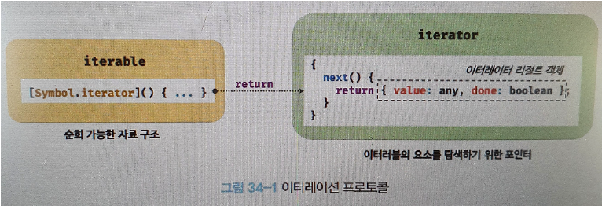
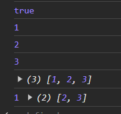
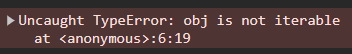
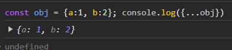
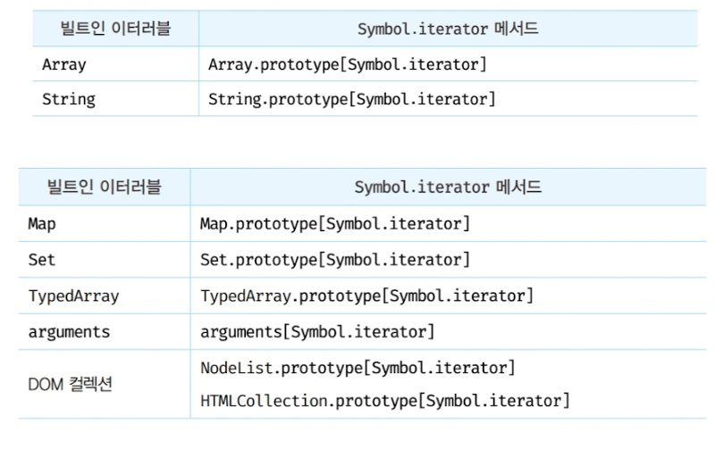
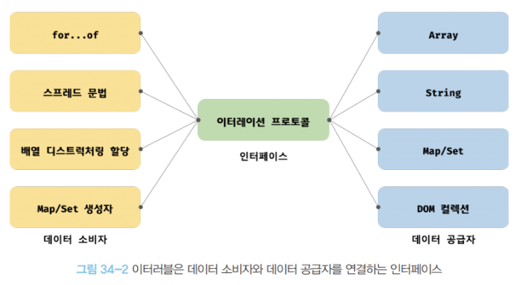
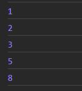

# 이터러블
es6에 도입된 이터레이션 프로토콜은 순회가능한 데이터 컬렉션을 만들기위해 
ECMAScript 사양에 정의하여 미리 약속한 규칙이다.

## ES6
es6 이전 순회가능한 데이터컬렉션 (배열, 문자열, 유사배열객체) 등은 통일한 규약없이 각가 나름의 구조를 가지고 
다양한 방법(for, forEach)등등 으로 순회할 수 있었다.

es6에서는 순회가능한 데이터컬렉션을 이터레이션 프로토콜을 준수하는 이터러블로 통일하여 
for..of, 스프레드, 배열 디스트럭처링 할당의 대상으로 일원화 했다.

## 이터러블 프로토콜
Symbol.iterator 메서드를 호출하면 이터레이터 프로토콜을 준수한 이터레이터를 반환하는데
이러한 규약을 이터러블 프로토콜이라고 부르며 이터러블 프로토콜을 준수한 객체를 **이터러블**이라 칭한다.
이터러블은 
1. **for...of 문으로 순회**할 수 있으며 
2. **스프레드 문법과 배열 디스트럭처링 할당**의 대상
으로 사용할 수 있다.

## 이터레이터 프로토콜
이터러블의 Symbol.iterator 메서드를 호출하면 이터레이터 프로토콜을 준수한 이터레이터를 반환한다. <br> 
**이터레이터**는 
**next 메서드**를 소유하며 next 메서드를 호출하면 이터러블을 순회하며 value 와 done 프로퍼티를 갖는 **이터레이터 리절트 객체**를 반환한다. <br> 
이러한 규약을 이터레이터 프로토콜이라 하며, <br>
이터레이터 프로토콜을 준수한 객체를 **이터레이터**라 한다.  
이터레이터는 **이터버블의 요소를 탐색하기 위한 포인터 역할**을 한다.



## 이터러블
Symbol.iterator 를 프로퍼티 키로 사용한 메서드를 직접 구현하거나 프로토타입 체인을 통해 상속받은 객체 <br>

특징
1. **for...of 문**으로 순회 가능
2. **스프레드 문법**의 대상
3. **디스트럭처링 할당**의 대상

```javascript
const array = [1, 2, 3];

// 배열은 Array.prototype의 Symbol.iterator 메서드를 상속받는 이터러블이다.
console.log(Symbol.iterator in array); // true

// for...of 문으로 순회 가능
for (const item of array) {
  console.log(item);
}

//스프레드 문법의 대상
console.log([...array]); // [1, 2, 3]

//디스트럭처링 할당의 대상
const [a, ...rest] = array;
console.log(a, rest); // 1, [2, 3]
```


일반객체는 for..of 문으로 순회할 수 없으며 배열디스트럭처링 할당의 대상으로 사용 불가하다.

```javascript
//일반 객체 선언
const obj = {a:1, b:2};

console.log(Symbol.iterator in obj); // false

for(const item of obj){ // obj is not iterable
    console.log(item);
}

const [a , b] = obj // obj is not iterable

// 단 스프레드 문법은 허용
console.log({...obj}) // {a: 1, b: 2}
```
 <br>


## 이터러블 객체


## 이터레이션 프로토콜의 필요성
es6 이전의 데이터 컬렉션은 각자의 순회방식을 가지고있었다.
<br> 다양한 데이터 공급자가 각자의 순회방식을 갖는다면 데이터소비자는 다양한 데이터 공급자의 순회방식을 모두 지원해야하므로 비효율적이다.
<br> 하지만 다양한 데이터 공급자가 이터레이션 프로토콜을 준수하게된다면 이터레이션 프로토콜만을 지원하도록 구현하면된다.
고로 **데이터 소비자와 데이터 공급자를 연결하는 인터페이스 역할**을 **이터레이션 프로토콜**이 수행한다.


## 사용자 정의 이터러블
일반객체도 이터레이션 프로토콜을 준수하도록 구현하면 사용자 정의 이터러블이 된다.
```javascript
const useIterable = {

    [Symbol.iterator]() {
        let [pre, cur] = [0, 1];
        const max = 10; //max를 지정하지 않는다면 무한히 증가한다

        return {
            next(){
                [pre, cur] = [cur, pre + cur];
                return {value : cur, done: cur >= max};
            }
        }
    }

}

for (const num of useIterable ){
    console.log(num);
    //1 2 3 5 8
}
```


## 참조
- https://ghost4551.tistory.com/215
- https://velog.io/@qkrtofha94/%EB%AA%A8%EB%8D%98-%EC%9E%90%EB%B0%94%EC%8A%A4%ED%81%AC%EB%A6%BD%ED%8A%B8-Deep-Dive-34%EC%9E%A5-%EC%9D%B4%ED%84%B0%EB%9F%AC%EB%B8%94