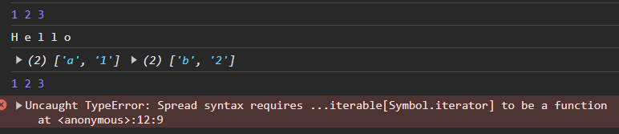
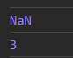
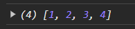
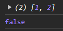
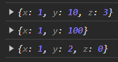

# 스프레드 문법
## 스프레드 문법
<br> ES6에서 도입된 스프레드 문법(전개 문법) ...은 하나로 뭉쳐 있는 여러 값들의 집합을 펼쳐서(전개, 분산하여, spread) 개별적인 값들의 목록으로 만든다. 
<br> 스프레드 문법을 사용할 수 있는 대상은 
<br> Array, String, Map, Set, DOM 컬렉션(NodeList, HTMLCollection), arguments와 같이  
<br> for...of 문으로 순회할 수 있는 이터러블에 한정된다.

```javascript
// ...[1, 2, 3]은 [1, 2, 3]을 개별 요소로 분리한다(→ 1, 2, 3)
console.log(...[1, 2, 3]); // 1 2 3

// 문자열은 이터러블이다.
console.log(...'Hello'); // H e l l o

// Map과 Set은 이터러블이다.
console.log(...new Map([['a', '1'], ['b', '2']])); // [ 'a', '1' ] [ 'b', '2' ]
console.log(...new Set([1, 2, 3])); // 1 2 3

// 이터러블이 아닌 일반 객체는 스프레드 문법의 대상이 될 수 없다.
console.log(...{ a: 1, b: 2 });
// TypeError: Found non-callable @@iterator
```



```javascript
// 스프레드 문법의 결과는 값이 아니다.
const list = ...[1, 2, 3];
```
스프레드 문법의 결과물은 값으로 사용할 수 없고,
<br> 쉼표로 구분한 값의 목록을 사용하는 문맥에서만 사용할 수 있다.
- 함수 호출문의 인수 목록
- 배열 리터럴의 요소 목록
- 객체 리터럴의 프로퍼티 목록

### 함수 호출문의 인수 목록
```javascript
const arr = [1, 2, 3];
console.log(Math.max(arr))
// 스프레드 문법을 사용하여 배열 arr을 1, 2, 3으로 펼쳐서 Math.max에 전달한다.
// Math.max(...[1, 2, 3])은 Math.max(1, 2, 3)과 같다.
console.log(Math.max(...arr))
```


#### REST 파라미터 vs 스프레드 문법
스프레드 문법은 앞에서 살펴본 Rest 파라미터와 형태가 동일하여 혼동할 수 있으므로 주의할 필요가 있다.
- Rest 파라미터 : **인수의 목록을 배열**로 반환 
- Spread 문법 :  **배열을 값들의 목록**으로 반환 <br>
**서로 반대개념**.

### 배열 리터럴 내부에서 사용하는 경우
1. 2개의 배열을 1개로 합치는 경우
   - 기존
     ```javascript
     // ES5에서는 concat 메서드 활용
     var arr = [1, 2].concat([3, 4]);
     console.log(arr); // [1, 2, 3, 4]
     ```
   - Spread 문법 적용
     ```javascript
     // ES6
     const arr = [...[1, 2], ...[3, 4]];
     console.log(arr); // [1, 2, 3, 4]
     ```
     
2. 배열 복사
   - 기존
      ```javascript
      // ES5 에서는 slice 메서드 활용
      var origin = [1, 2];
      var copy = origin.slice();
      console.log(copy); // [1, 2]
      console.log(copy === origin); // false
      ```
   - Spread 문법 적용
      ```javascript
      // ES6
      const origin = [1, 2];
      const copy = [...origin];
      console.log(copy); // [1, 2]
      console.log(copy === origin); // false
      ```
     
### 객체 리터럴 내부에서 사용하는 경우
스프레드 문법의 대상은 이터러블이어야 하지만 스프레드 프로퍼티 제안은 
<br>일반 객체를 대상으로도 스프레드 문법의 사용을 허용한다.
 - 일반 객체의 Spread 문법 적용
    ```javascript
       // 스프레드 프로퍼티
       // 객체 복사(얕은 복사)
       const obj = { x: 1, y: 2 };
       const copy = { ...obj };
       console.log(copy); // { x: 1, y: 2 }
       console.log(obj === copy); // false
       // 객체 병합
       const merged = { x: 1, y: 2, ...{ a: 3, b: 4 } };
       console.log(merged); // { x: 1, y: 2, a: 3, b: 4 }
     ```
1. 객체 병합 , 변경 , 추가
    - 기존
    ```javascript
    // 객체 병합. 프로퍼티가 중복되는 경우, 뒤에 위치한 프로퍼티가 우선권을 갖는다.
    const merged = Object.assign({}, { x: 1, y: 2 }, { y: 10, z: 3 });
    console.log(merged); // { x: 1, y: 10, z: 3 }
    
    // 특정 프로퍼티 변경
    const changed = Object.assign({}, { x: 1, y: 2 }, { y: 100 });
    console.log(changed); // { x: 1, y: 100 }
    
    // 프로퍼티 추가
    const added = Object.assign({}, { x: 1, y: 2 }, { z: 0 });
    console.log(added); // { x: 1, y: 2, z: 0 }
    ```
    - Spread 문법 적용
    ```javascript
    // 객체 병합. 프로퍼티가 중복되는 경우, 뒤에 위치한 프로퍼티가 우선권을 갖는다.
    const merged = { ...{ x: 1, y: 2 }, ...{ y: 10, z: 3 } };
    console.log(merged); // { x: 1, y: 10, z: 3 }
    
    // 특정 프로퍼티 변경
    const changed = { ...{ x: 1, y: 2 }, y: 100 };
    // changed = { ...{ x: 1, y: 2 }, ...{ y: 100 } }
    console.log(changed); // { x: 1, y: 100 }
    
    // 프로퍼티 추가
    const added = { ...{ x: 1, y: 2 }, z: 0 };
    // added = { ...{ x: 1, y: 2 }, ...{ z: 0 } }
    console.log(added); // { x: 1, y: 2, z: 0 }
    ```
    
# 참조
- https://ghost4551.tistory.com/216
- https://evan6-6.tistory.com/64