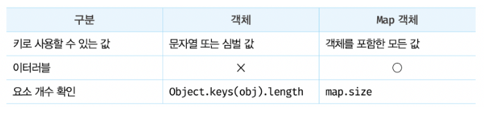

# Map
- Map 객체는 키와 값의 쌍으로 이루어진 컬렉션이다.


## Map 객체 생성
- Map 객체는 Map 생성자 함수로 생성한다.
```javascript
const map = new Map();
console.log(map); // Map(0) {}
```

## Map 요소 개수 확인
- Map 객체의 요소 개수를 확인할 때는 Map.prototype.size 프로퍼티를 사용한다.
```javascript
const { size } = new Map([['key1', 'value1'], ['key2', 'value2']]);
console.log(size); // 2
```

## Map 요소 추가
- Map 객체에 요소를 추가할 때는 Map.prototype.set 메서드를 사용한다.
```javascript
const map = new Map();
console.log(map); // Map(0) {}

map.set('key1', 'value1');

console.log(map) // Map(1) { 'key1' => 'value1' }
```
- 객체와의 차이는 객체는 **문자열 또는 심벌값** 만 키로 사용 가능하다
- Map 객체는 키타입에 제한이 없으므로 **객체를 포함한 모든값**을 키로 사용할수 있다
```javascript
const map = new Map();

const lee = { name: 'Lee' };
const kim = { name: 'Kim' };

// 객체도 키로 사용할 수 있다.
map
    .set(lee, 'developer')
    .set(kim, 'designer');

console.log(map);
// Map(2) { { name: 'Lee' } => 'developer', { name: 'Kim' } => 'designer'}
```
## Map 요소 취득
- Map 객체에서 특정 요소를 취득하려면 Map.prototype.get 메서드를 사용한다.
```javascript
const map = new Map();

const lee = { name: 'Lee' };
const kim = { name: 'Kim' };

map
    .set(lee, 'developer')
    .set(kim, 'designer');

console.log(map.get(lee)); // developer
console.log(map.get('key')); // undefined
```

## Map 요소 존재 여부 확인
- Map 객체에서 특정 요소가 존재하는지 확인하려면 Map.prototype.has 메서드를 사용한다.
```javascript
const lee = { name: 'Lee' };
const kim = { name: 'Kim' };

const map = new Map([[lee, 'developer'], [kim, 'designer']]);

console.log(map.has(lee)); // true
console.log(map.has('key')); // false
```

## Map 요소 삭제
- Map 객체에서 요소를 삭제하려면 Map.prototype.delete 메서드를 사용한다.
```javascript
const lee = { name: 'Lee' };
const kim = { name: 'Kim' };

const map = new Map([[lee, 'developer'], [kim, 'designer']]);

map.delete(kim);
console.log(map); // Map(1) { { name: 'Lee' } => 'designer' }
```

## Map 요소 일괄 삭제
- Map 객체에서 요소를 일괄 삭제하려면 Map.prototype.clear 메서드를 사용한다.
```javascript
const lee = { name: 'Lee' };
const kim = { name: 'Kim' };

const map = new Map([[lee, 'developer'], [kim, 'designer']]);

map.clear();
console.log(map); // Map(0) {}
```

## Map 요소 순회
- Map 객체에 요소를 일괄 순회하려면 Map.prototype.forEach 메서드를 사용한다.
```javascript
const lee = { name: 'Lee' };
const kim = { name: 'Kim' };

const map = new Map([[lee, 'developer'], [kim, 'designer']]);

map.forEach((v, k, map) => console.log(v, k, map));
/*
    developer { name: 'Lee' } Map(2) {
      { name: 'Lee' } => 'developer',
      { name: 'Kim' } => 'designer'
    }
    designer { name: 'Kim' } Map(2) {
      { name: 'Lee' } => 'developer',
      { name: 'Kim' } => 'designer'
    }
*/
```
- Map 객체 또한 **이터러블**이다

## Map 객체와 일반객체의 차이점
1. The construction is of course different
   ( 구조적인 차이 )
    ```js
    const gamesObj = { 
        1: '시타델',
        2: '촐킨'   
    };
    
   const gamesMap = new Map([ 
        [1, 'Citadels'],
        [2, 'Tzolkin']
    ]);
    ```
2. Keys on objects are strings, on maps keys are of any type
   ( 객체의 키값은 문자열, 맵의 키는 모든 데이터 타입이 된다. )
    ```js
    console.log(gamesObj[1]);
    console.log(gamesObj['1']);
    
    console.log(gamesMap.get(1)); 
    console.log(gamesMap.get('1'));
    ```
3. Object maps inherit unwanted keys from the prototype
   (  맵 객체는 프로토타입으로부터 원치 않는 키를 상속 받는다. )
    ```js
    console.log(Object.prototype);
    const mapObject = {};
    console.log(mapObject['toString']);
    //ƒ toString() { [native code] }
    const mapObject = Object.create(null);
    console.log(mapObject['toString']);
    //undefined
    ```
4. Maps preserve the order of their keys, objects do not
   (  키 값의 순서 보존하고, 객체는 순서가 없다. )
    ```js
    const gamesObj = {
        2: 'Tzolkin',
        1: 'Citadels',
    };
    const keys = Object.keys(gamesObj);
    console.log(keys);
    //["1", "2"];
    const keyValuePairs = Object.entries(gamesObj);
    console.log(keyValuePairs);
    //["1", "Citadels"]
    //["2", "Tzolkin"]
   
   const gamesMap = new Map([
        [2, 'Tzolkin'],
        [1, 'Citadels']
    ])
    const keys = gamesMap.keys();
    console.log(keys);
    //MapIterator {2, 1}
    const keyValuePairs = gamesMap.entries();
    console.log(keyValuePairs);
    //MapIterator {2 => "Tzolkin", 1 => "Citadels"}
    ```
5. Maps offer a nicer interface for accessing entries
   ( 엔트리 접근하기 위한 훨씬 인터페이스가  좋다. )
    ```js
    const gamesObj = {
        2: 'Tzolkin',
        1: 'Citadels',
    };
    //값 접근시
    //1
    gamesObj[1];
    //'Citadels'
   
    //2
    const anotherGamesObj = {
    id1: 'Citadels',
    id2: 'Tzolkin'  
    };
    console.log(anotherGamesObj.id1);
    //'Citadels'
   
    //3
    gamesMap.get(1);
    //'Citadels'
    
    // 키의 존재 확인
    gamesMap.has(1);
    //true
    gamesMap.get(3);
    //false
    ```
6. Objects require helpers functions for accessing the key-values pairs
   ( 객체는 key-values 쌍에 접근하기 위한 보조 함수가 필요하다. )
    ```js
    const gamesMap = new Map([
        [1, 'Citadels'],
        [2, 'Tzolkin']
    ]);
    gamesMap.forEach((value, key)=>{
    console.log(`${key} - ${value}`)
    });
    //1 - Citadels
    //2 - Tzolkin
   
    //객체인경우 Object.entries를 사용해야함
    const gamesObj = {
        1: 'Citadels',
        2: 'Tzolkin'  
    };
    Object
    .entries(gamesObj)
    .forEach(([key, value])=>{
    console.log(`${key} - ${value}`)
    });
    //1 - Citadels
    //2 - Tzolkin
    ```
7. JSON offers support for objects but not for maps
   ( JSON은 객체를 지원하지만 맵은 안함 )
    ```js
    const gamesMap = new Map([
        [1, 'Citadels'],
        [2, 'Tzolkin']
    ]);
    const json = JSON.stringify(gamesMap);
    console.log(json);
    //{}
    ```
### 참조
- https://velog.io/@jjinichoi/%EB%AA%A8%EB%8D%98-%EC%9E%90%EB%B0%94%EC%8A%A4%ED%81%AC%EB%A6%BD%ED%8A%B8-Deep-Dive-Set%EA%B3%BC-Map
- https://medium.com/dailyjs/7-differences-between-objects-and-maps-in-javascript-bc901dfa9350