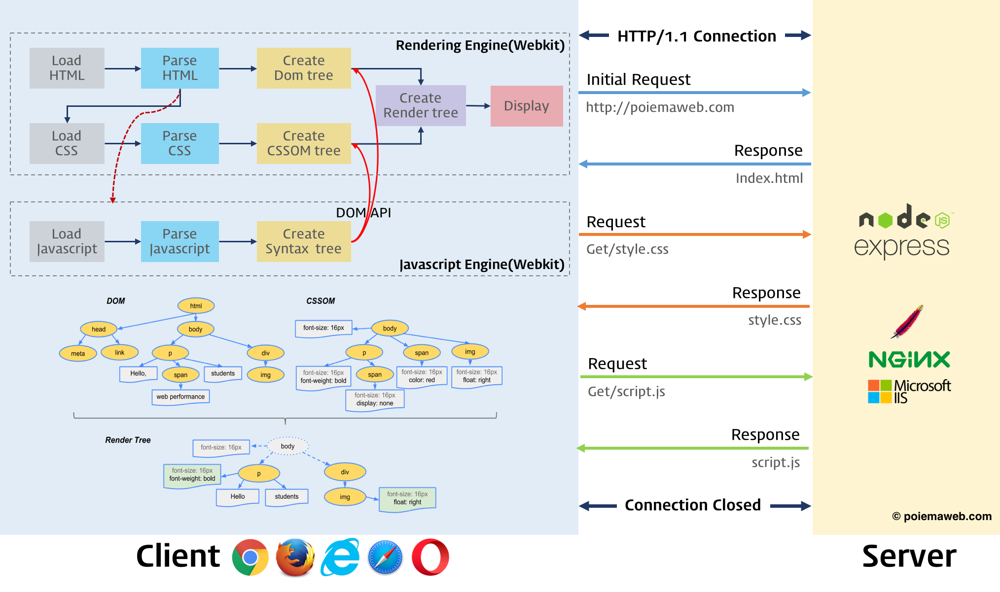
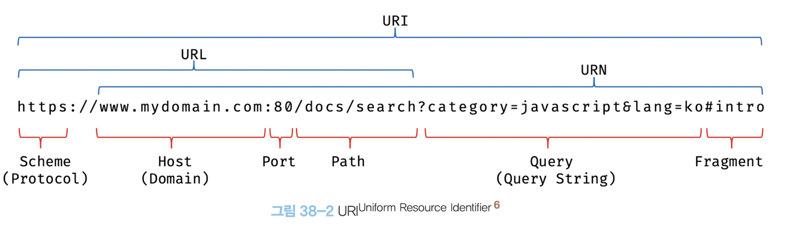
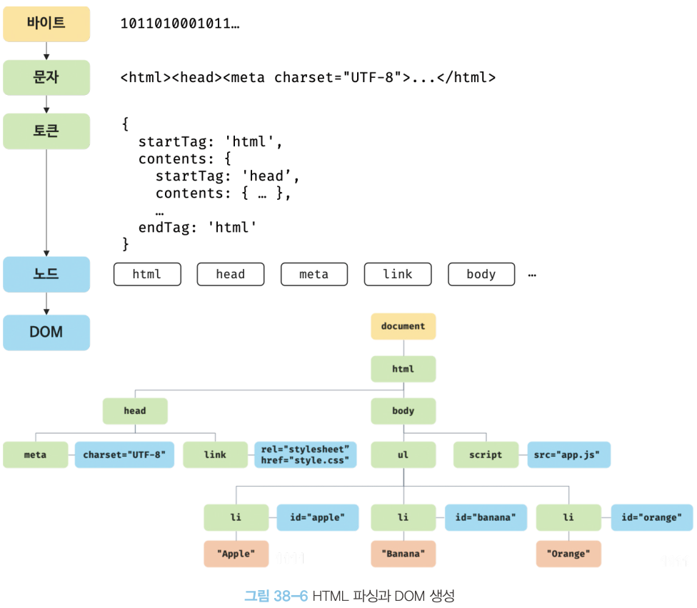
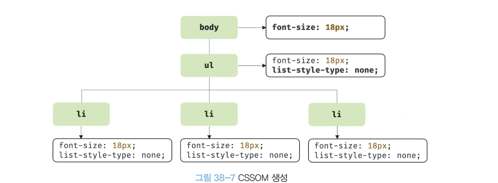
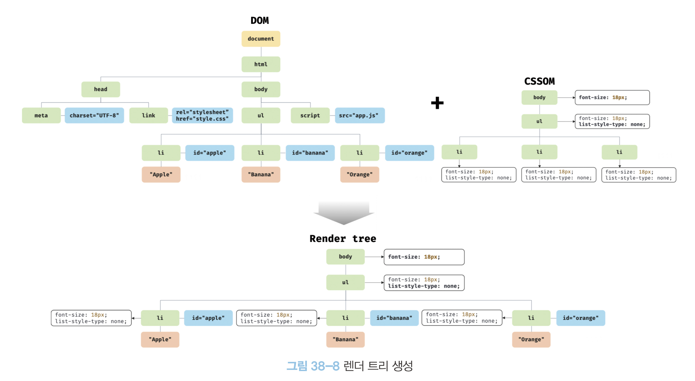
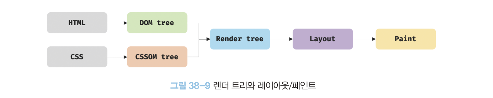
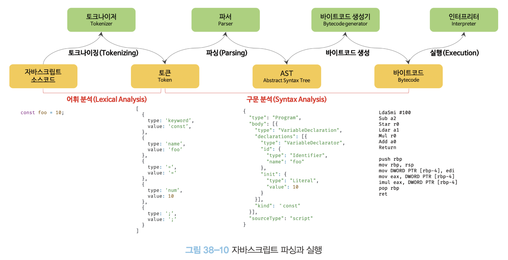
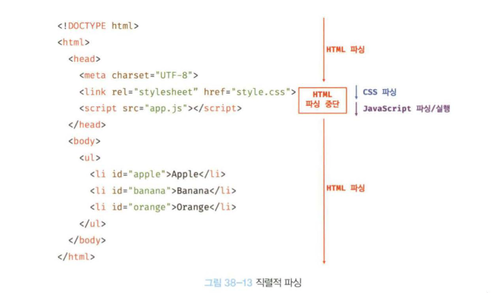
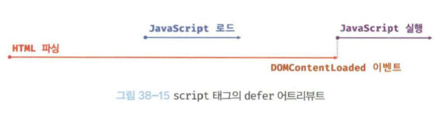

# `38` 브라우저 랜더링 과정
- 대부분의 프로그래밍 언어는 OS나 VM 위에서 실행되지만 자바스크립트는 `브라우저` 에서 실행된다.
- 브라우저는 `HTML`, `CSS`, `JavaScript` 를 해석(parsing)하고 렌더링한다.

> ### Paring (구문분석, Syntax Analysis)
> - 파싱은 프로그래밍 언어의 문법에 맞게 텍스트 문서의 문자열을 토큰으로 분해
> - 토큰의 문법적 의미와 구조를 반영하여 트리 구조의 자료 구조인 `Parse Tree`를 생성하는 과정.
> - Parsing이 완료되면 Parse Tree를 기반으로 중간 언어인 `Byte Code`를 생성하고 실행.

> ### Rendering (렌더링)
> - `HTML`, `CSS`, `JavaScript` 를 Parsing하여 화면에 출력하는 과정.
>   - 브라우저 랜더링 과정
>   
>   1. HTML, CSS, JS, images 등 랜더링에 필요한 리소스를 요청하고 서버로 응답을 받는다.
>   2. 서버로부터 응답된 HTML과 CSS를 parsing하여 `DOM`과 `CSSOM`을 생성, 결합해 `Render Tree`를 생성한다.
>   3. 서버로부터 응답된 JS를 Parsing하여 AST(Abstract Syntax Tree)를 생성하고 실행한다.   
>   이 때 JS는 DOM API를 통해 DOM을 조작할 수 있으며 변경된 DOM은 `Render Tree`로 결합된다.
>   4. `Render Tree`를 기반으로 HTML요소의 레이아웃을 계산하고 HTML 요소를 화면에 `Painting`한다.

<br/>

## `38.1` 요청과 응답
- 브라우저는 필요한 리소스(HTML, CSS, JS, images 등)를 요청하고 서버로부터 응답을 받는다.
- 브라우저는 서버로부터 응답된 리소스를 parsing하여 화면에 시각적으로 렌더링한다.
- 렌더링에 필요한 소스는 모두 서버에 존재
- 서버에 요청을 전송하기 위해 브라우저는 주소창을 제공.
- 브라우저의 주소창에 `URL`을 입력하면 URL의 호스트 이름이 `DNS(Domain Name System)` 서버에 의해 `IP` 주소로 변환되고, 해당 `IP` 주소로 `HTTP` 요청 전송.   



- 서버는 루트 요청에 의해 정적 파일 `index.html` 을 클라이언트(browser)로 응답.
- index가 아닌 다른 정적 파일을 서버에 요청하려면 해당 파일의 경로와 파일명을 URI의 호스트 뒤에 있는 Path에 기술하여 서버에 요청.
- `ajax`, `Rest Api` 등의 라이브러리를 사용하여 JS를 통해 정적/동적 데이터를 서버에 요청하는 것도 가능.
- 요청과 응답은 개발자 도구의 `Network` 탭에서 확인 가능.

<br/>

## `38.2` HTTP 1.1과 HTTP 2.0
- `HTTP(HyperText Transfer Protocol)`는 웹 브라우저와 웹 서버 간의 통신을 위한 프로토콜(규약).
- `HTTP 1.1`은 기본적으로 커넥션 당 하나의 요청과 응답만 처리. 여러개의 요청, 응답 처리가 불가능하므로 요청할 리소스에 따라 응답 시간이 증가하는 단점.
- `HTTP 2.0`은 하나의 커넥션으로 여러개의 요청, 응답 동시에 전송 가능. `HTTP 1.1`보다 페이지 로드 속도 50% 정도 향상됨.

<br/>

## `38.3` HTML Parsing & DOM
- 브라우저는 서버로부터 응답된 HTML을 parsing하여 `DOM(Document Object Model)`을 생성.
- `DOM`은 브라우저가 이해할 수 있는 Tree 객체형 자료구조   

> 
> ### DOM은 HTML 문서를 Parsing한 결과물
> 1. 서버에 존재하던 HTML 파일을 읽어 들여 메모리에 저장하고 메모리에 저장된 Byte(2진수)를 인터넷을 경유하여 응답.
> 2. 브라우저는 응답된 Byte를 지정된 인코딩 방식을 기준으로 문자열로 변환.(예: UTF-8)
> 3. 문자열로 변환된 HTML 문서를 문법적 의미를 갖는 코드의 최소 단위인 Token으로 분해.
> 4. 각 Token을 객체로 변환하여 `Node`들을 생성. `Node`는 이 후 `DOM`을 구성하는 기본 요소가 됨.
> 5. HTML요소는 중첩관계를 가지며 부자 관계를형성. 이러한 Node들을 반영한 트리 자료구조를 `DOM(Document Object Model)`이라고 함.

  <br/>

## `38.4` CSS Parsing 과 CSSOM 생성

- 렌더링 엔진은 HTML을 처음부터 한 줄씩 순차적으로 Parsing하며 `link`태그나 `style`태그를 만나면 DOM 생성 중단하고 CSS를 Parsing.
- CSS도 HTML과 동일한 Parsing(Byte -> 문자열 -> Token -> Node) 과정을 거쳐 `CSSOM(CSS Object Model)`을 생성.
- CSS Parsing이 완료되면 중단된 시점부터 HTML Parsing 재개.
- `CSSOM`은 CSS의 상속을 반영하여 생성됨.

<br/>

## `38.5` Render Tree 생성
> - 렌더링 엔진은 서버로부터 응답된 HTML과 CSS 각각 DOM과 CSSOM을 생성하고 렌더링을 위해 `Render Tree`로 결합됨.
> - `Render Tree`는 렌더링을 위한 트리구조의 자료구조로 화면에 렌더링되는 노드만으로 구성됨.
>   

<br/>

> ### ReRendering은 성능에 악영향을 미치니 주의!
> - 완성된 RenterTree는 각 HTML 요소의 레이아웃(위치와 크기)을 계산하는 데 사용되며 브라우저 화면에 Pixel을 렌더링하는 Painting 처리에 입력됨.
>   
>   - JS에 의한 노드 추가, 삭제
>   - 브라우저 리사이징에 의한 Viewport 변경
>   - HTML요소의 레이아웃에 변경 발생(width, height, margin, padding, border, display, position ...)

<br/>

## `38.6` 자바스크립트 파싱과 실행
- JS 코드에서 DOM API를 사용하면 이미 생성된 DOM을 동적으로 조작 가능.
- JS 파싱과 실행은 브라우저의 렌더링 엔진이 아닌 JS 엔진이 처리함.
- JS 엔진은 JS코드를 파싱하여 CPU가 이해할 수 있는 Low-Level 언어로 변환하고 실행하는 역할.
- JS 엔진은 `V8`, `SpiderMonkey`, `JavaScriptCore` 등이 있으며 ECMPScript 사양을 준수.
- JS 엔진은 JS를 해석하여 AST(Abstract Syntax Tree)를 생성하고 인터프리터가 실행할 수 있는 중간 코드(Intermidiate Code)인 Byte Code를 생성하여 실행.

> ### JS 파싱과 실행
>  - **토크나이징**   
> 단순한 문자열인 JS 소스코드를 어휘 분석(lexical analysis)하여 Token으로 분해. (=렉싱)
>
> - **파싱**   
> Token을 AST(Abstract Syntax Tree)로 변환하여 문법적 의미를 갖는 구조로 변환.   
> AST는 인터프리터나 컴파일러만 사용하는 것이 아니라 `TypeScript`, `Babel` 등의 트랜스파일러 구현도 가능.
>
> - **바이트 코드 생성과 실행**   
> AST를 기반으로 중간 언어인 Byte Code를 생성하고 실행.   
> V8엔진은 자주 사용되는 코드는 `터보팬`이라는 최적화 엔진을 통해 더 빠르게 실행.   
> 코드의 사용 빈도가 적어지면 다시 디옵티마이징하기도 함.
> 

<br/>

## `38.7` 리플로우와 리페인트
- JS 코드에서 DOM API를 사용하면 DOM이나 CSSOM이 변경되며 렌더트리로 결합되고 변경된 렌더트리를 기반으로 레이아웃과 페인트 과정을 거쳐 화면에 리랜더링.
- 리플로우(Reflow)는 렌더트리의 레이아웃을 재계산하는 과정으로 노드 추가, 삭제, 요소의 크기 변경, 브라우저 리사이징 등에 의해 발생.
- 리페인트(Repaint)는 렌더트리의 레이아웃을 기반으로 화면에 Pixel을 그리는 과정으로 색상, 배경색, 텍스트 등의 변경에 의해 발생.

<br/>

## `38.8` 자바스크립트 파싱에 의한 HTML 파싱 중단

- 브라우저는 동기적(Synchronous)으로 HTML, CSS, JS를 파싱하고 실행.
- DOM API를 사용할 때 DOM의 생성이 완료되지 않은 상태라면 문제가 발생할 수 있음.
- body요소의 가장 아래에 JS를 위치시키면 실행될 시점에 HTML 요소를 모두 파싱하여 DOM 생성을 완료한 이후이기 때문에 문제를 방지할 수 있고, 페이지 로딩 시간도 단축됨.

<br/>

## `38.9` script 태그의 async/defer 어트리뷰트
- `src`속성이 있는 $script 태그에 `async`나 `defer` 어트리뷰트를 사용하면 HTML 파싱 중단을 방지할 수 있음.

  ```js
  // async 어트리뷰트
  <script async src="async.js"/>

  // defer 어트리뷰트
  <script defer src="defer.js"/>
  ``` 

> ### async
>   
> - HTML 파싱과 외부JS파일의 로드가 비동기적으로 동시에 진행.
> - JS의 파싱과 실행은 JS파일의 로드가 완료된 직후 진행되며, 이때 HTML파싱은 중단.
> - 로드가 완료된 JS먼저 실행되며 순서가 보장되지 않으므로 주의.

> ### defer
>   
> - HTML 파싱과 외부JS파일의 로드가 비동기적으로 동시에 진행.
> - JS 파싱과 실행은 HTML 파싱이 완료된 직후 진행됨.
> - DOM 생성이 완료된 이후 실행되어야 할 스크립트에 유용함.