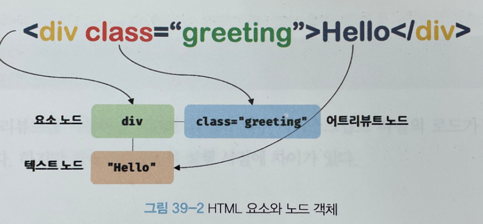
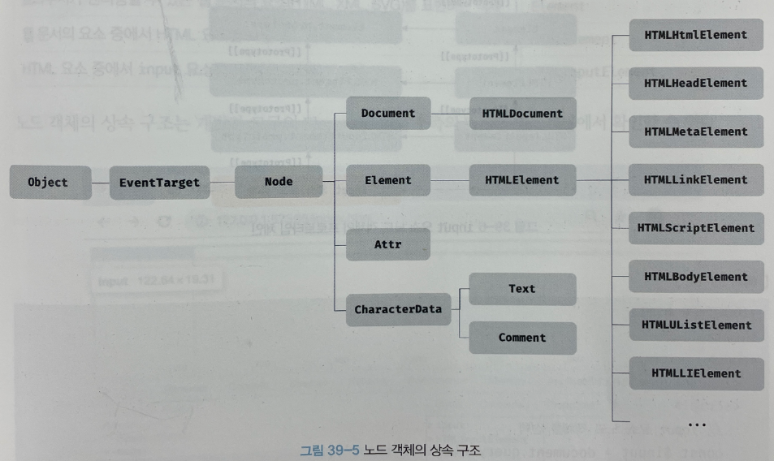
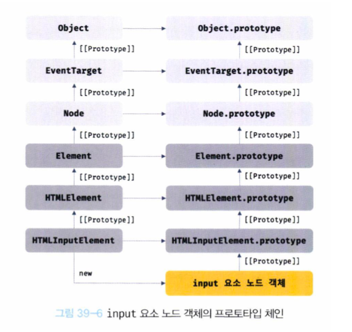
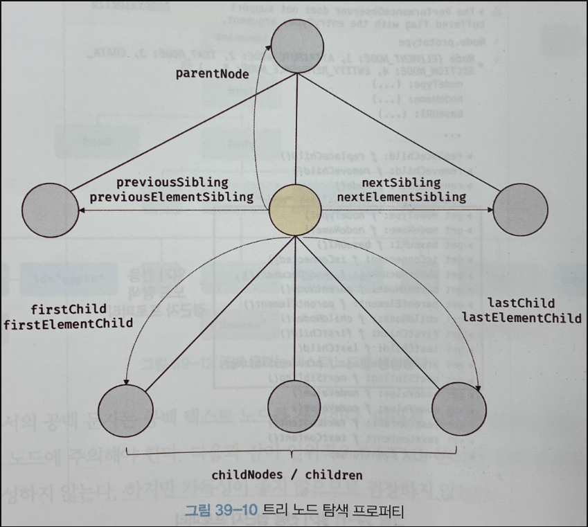
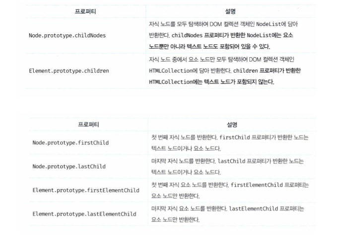
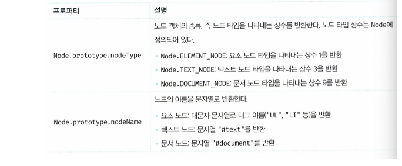
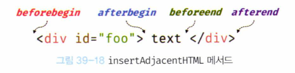
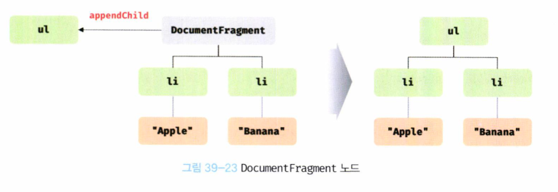

# DOM

## DOM
HTML 문서의 계층적 구조와 정보를 표현하며 이를 제어할 수 있는 API를 제공하는 트리 자료구조를 뜻한다

## 노드
### HTML 요소와 노드 객체

HTML 요소는 렌더링 엔진에 의해 파싱되어 DOM을 구성하는 **요소 노드 객체**로 변환된다<br>
태그사이에 다른 태그가 있을 수 있으므로 각각의 요소들은 **중첩관계**를 갖는다<br>
이때 html 요소 간에 **계층적인 부자 관계**가 형성된다<br>
요소 간의 계층적인 부자 관계를 반영하여 **트리 자료 구조**를 구성한다<br>
**노드 객체들로 구성된 트리 자료구조**를 **DOM**이라 한다


### 노드 객체의 타입


- 문서 노드 (document node)
  - DOM 트리의 최상단에 존재하는 루트노드, **document 객체**를 가르킨다
  - document 객체는 브라우저가 렌더링한 HTML 문서 전체를 가르킴, 전역 객체의 document프로퍼티에 바인딩되어 있다-> document로 참조 가능
  - 최상단에 있기 때문에 DOM 트리의 노드들에 접근하기 위한 진입점 역할을 함

- 요소 노드 (element node)
  - **HTML 요소**를 가르키는 객체
  - HTML 요소들의 중첩관계를 통해 문서의 구조를 표현한다

- 어트리뷰트 노드 (attribute node)
  - **HTML 요소의 어트리뷰트**를 가르키는 객체
  - 어트리뷰트 노드는 해당 요소 노드에만 연결되어 있다

- 텍스트 노드 (text node)
  - **HTML 요소의 텍스트**를 가르키는 객체
  - 해당 요소 노드의 자식 노드이며 말단 노드임

### 노드 객체의 상속 구조
노드객체도 자바스크립트 객체이므로 프로토타입에 의한 상속구조를 갖는다.

- 상속
  - 모든 노드
    - Object , EventTarget , Node 인터페이스
  - 문서 노드
    - Document , HTMLDocumnet 인터페이스 
  - 어트리뷰트 노드
    - Attr
  - 텍스트 노드
    - CharacterData 인터페이스
  
  



## 요소 노드 취득
### id 이용
Document.prototype.getElementById 메서드로 이용
### 태그 이름 이용
Document.prototype.getElementsByTagName 메서드로 이용
### class 이용
Document.getElementsByClassName  , Element.prototype.getElementsByClassName 메서드로 이용
### CSS selector 이용
Document.prototype.querySelector , Element.prototype.querySelector  
메서드로 이용
### HTMLCollection과 NodeList
#### HTMLCollection
노드 객체의 상태 변화를 실시간으로 반영하는 살아 있는 객체 <br>
실시간으로 노드 객체의 상태 변경을 반영하기 때문에 for문 순회시 주의해야한다 <br>
배열로 변환하여 사용하는것을 권장한다.
```html
<html>
  <body>
    <ul>
      <li class="red">pizza</li>
      <li class="red">noddle</li>
      <li class="red">rice</li>
    </ul>
    <script>
      const $elems=document.getElementsByClassName('red');
      for(let i = 0;i<$elems.length;i++){
        $elems[i].className='blue';
      }
    </script>
  </body>
</html>
```

### NodeList
실시간으로 노드 객체의 상태 변경을 반영하지 않는 non-live 객체<br>
하지만 childNodes 프로퍼티가 반환하는 NodeList 객체는 live 객체이다. <br>
아래 예시에서 자식노드를 제거할 때마다 새롭게 갱신되어 모든 자식노드가 삭제되지 않는다 <br>
배열로 변환하여 사용하는것을 권장한다.

```html
<html>
  <body>
    <ul id="fruits">
      <li>pizza</li>
      <li>noddle</li>
    </ul>
    <script>
      const $fruits= document.getElementById('fruits');
      const {childNodes} = $fruits;
      console.log(childNodes);
      for(let i = 0;i<childNodes.length;i++){
        $fruits.removeChild(childNodes[i]);
      }
      console.log(childNodes);
    </script>
  </body>
</html>
```


## 요소 노드 탐색

노드 탐색 프로퍼티는 모두 읽기 전용 접근자 프로퍼티이다

### 공백 텍스트 노드
공백 문자(탭,줄바꿈 등)는 공백 텍스트 노드를 생성한다.
노드를 탐색할 때 공백 문자에 의해 생성된 공백 텍스트 노드 주의해야한다.

### 자식 노드 탐색


### 자식 노드 확인
Node.prototype.hasChildNodes 메서드로 확인

## 요소 노드 정보 취득
노드 정보 취득을 위해 해당 프로퍼티를 사용



## 요소 노드 텍스트 조작
### nodeValue
Node.prototype.nodeValue 프로퍼티 : setter,getter 둘 다 존재하는 접근자 프로퍼티 

### textContent
Node.prototype.textContent 프로퍼티: setter,getter 둘 다 존재하는 접근자 프로퍼티 


## DOM 조작
### innerHTML
- Element.prototype.innerHTML
- getter,setter 모두 있는 접근자 프로퍼티
- 해당 요소의 콘텐츠 영역에 있는 모든 HTML 마크업을 문자열로 반환합니다.
- 문제점
  1. 모든 노드의 자식을 제거하고 새롭게 할당하므로 비효율적
  2. 삽입될 위치를 선택 불가
  3. 크로스 사이트 스크립팅 공격에 취약
- 이러한 문제점들로 인해 사용을 권장하지 않습니다.

### insertAdjacentHTML
- Element.prototype.insertAdjacentHTML(position,DOMString)
- 기존 요소를 제거하지 않고 위치를 지정해 새로운 요소를 삽입
- position은 총 4 가지 : 'beforebegin', 'afterbegin', 'beforeend', 'afterend'
  
- 크로스 사이트 스크립팅 공격에 취약한건 동일합니다.

### 노드 생성과 추가
- DOM 이 제공하는 노드를 직접 생성/삽입/삭제/치환할 수 있는 메서드
  - 요소 노드 생성 : document.prototype.createElement(tagName)
  - 텍스트 노드 생성 : document.prototype.createTextNode(text)
  - 마지막 자식 노드로 추가 : Node.prototype.appendChild(childNode)

### 복수의 노드 생성과 추가
- DocumentFragment 
  - DocumentFragment를 DOM에 추가하면 자신은 제거되고 자식 노드만 DOM에 추가된다
  - Document.prototype.createDocumentFragment 메서드로 생성
  - 복수의 노드 의 생성과 추가시 사용하여 리플로우,리페인트는 한번만 발생하게 할 수 있다
```HTML
<html>
  <body>
    <ul>
      <li id="1">1번</li>
      <li id="2">2번</li>
    </ul>
    <script>
      const table =document.querySelector('ul');
      const container = document.createElement('div'); // 컨테이너 요소 생성
  
      ['3번','4번','5번'].forEach(text=>{
        const newNode=document.createElement('li');
        newNode.textContent=text;
        container.appendChild(newNode); // 컨테이너 요소에 추가 
      });
      table.appendChild(container); // 리플로우,리페인트 1번만 발생
    </script>
  </body>
</html>
```

### 노드 삽입
- Node.prototype.appendChild(newNode) : Node를 마지막 자식 노드로 추가
- Node.prototype.insertBefore(newNode,childNode) : childNode 앞에 Node 삽입

### 노드 이동
- DOM에 이미 존재하는 노드를 appendChild,insertBefore 메서드로 DOM에 추가시
-  원래 있던 위치의 노드는 제거되고 새로운 위치로 노드를 추가한다.

### 노드 복사
- Node.prototype.cloneNode(true | false)
- true : 깊은 복사
- false : 얕은 복사

### 노드 교체
- Node.prototype.replaceChild(newChild,oldChild)
### 노드 삭제
- Node.prototype.removeChild(child)


## 어트리뷰트
### 어트리뷰트 노드와 attributes 프로퍼티
- HTML 요소의 시작 태그에 어트리뷰트 이름 = "어트리뷰트 값" 형식으로 정의한다.
- HTML 문서가 파싱될 때 각각의 어트리뷰트는 각각의 어트리뷰트 노드로 변환된다
- 모든 어트리뷰트 노드의 참조는 NamedNodeMap 객체에 담겨 요소 노드의 attributes 프로퍼티에 저장된다

### HTML 어트리뷰트 조작
- Element.prototype.getAttribute(attributeName)
- Element.prototype.setAttribute(attributeName,attributeValue)
- Element.prototype.hasAttribute(attributeName)
- Element.prototype.removeAttribute(attributeName)

### HTML 어트리뷰트 vs DOM 프로퍼티
- HTML 어트리뷰트 : HTML 요소의 초기 상태
- DOM 프로퍼티 : 요소 노드의 최신 상태

단 모든 DOM 프로퍼티가 사용자 입력에 의해 변경된 최신 상태를 관리하지는 않는다
```HTML
<input type="text" id="name" value="Aj">
```
id 프로퍼티는 사용자 입력과 아무런 관계가 없다<br>
id 어트리뷰트와 id 프로퍼티는 항상 동일한 값을 유지한다<br>

사용자 입력에 의한 상태변화와 관계있는 DOM 프로퍼티만 최신 상태 값을 관리한다<br>
그 외의 사용자 입력과 관계없는 어트리뷰트와 DOM 프로퍼티는 항상 동일한 값으로 연동된다<br>

### data 어트리뷰트와 dataset 프로퍼티
- data-사용자정의 어트리뷰트 이름 = "값" 형식으로 선언
- HTMLElement.dataset 프로퍼티는 모든 data 어트리뷰트를 담은 DOMStringMap 객체 반환한다
- DOMStringMap 객체는 사용자정의 어트리뷰트 이름을 카멜케이스로 변환한 프로퍼티를 가진다

## 스타일
### 인라인 스타일 조작
- HTMLElement.prototype.style
### 클래스 조작
- 요소의 class 어트리뷰트를 조작하여 다른 스타일을 적용한다
- class 어트리뷰트에 대응하는 DOM 프로퍼티인 className,classList를 통해 적용한다

## DOM 표준
HTML과 DOM 표준은 W3C와 WHATWG가 협력으로 공통된 표준을 만들어 왔으나
2018년부터 구글, 애플, 마이크로소프트, 모질라로 구성된 WHATWG가 단일 표준을 제공하기로 두 단체가 합의하였다.

# 참조
- https://velog.io/@hustlekang/%EB%AA%A8%EB%8D%98-%EC%9E%90%EB%B0%94%EC%8A%A4%ED%81%AC%EB%A6%BD%ED%8A%B8-Deep-Dive-39%EC%9E%A5-DOM
- https://daniel-park.tistory.com/93