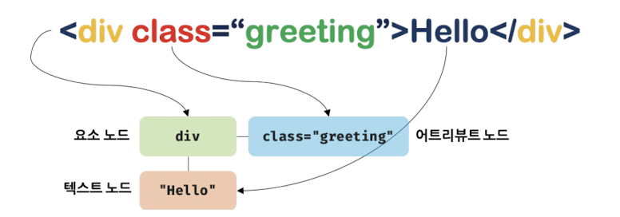

# `39.1` 노드
## `39.1.1` HTML 요소와 노드 객체
- HTML요소는 HTML을 구성하는 요소 노드 객체로 변환된다. 이 때 HTML 요소의 어트리뷰트는 `어트리뷰트 노드`로, HTML 요소의 텍스트는 `텍스트 노드`로 변환된다.
- HTML 요소 간에는 중첩 관계에 의해 계층적인 `부자`관계가 형성되며 모든 노드 객체들은 트리자료 구조로 구성된다.

  
  

### 트리 자료구조
- `Tree data Structure`는 `부모 노드`와 `자식 노드`로 구성되어 관계(부자, 형제)를 표현하는 비선형 자료구조.
- 트리 자료구조의 최상위 노드는 부모가 없는 `Root Node`, 최하위 노드는 자식이 없는 `Leaf Node`이다.

# `39.1.2` 노드 객체의 타입
- DOM은 노드 객체의 계층적인 구조로 구성되어 있으며, 노드 객체는 `Node` 객체를 상속받는다.
- 12개의 노드타입이 있으며 중요한 노드 타입은 `문서 노드`, `요소 노드`, `어트리뷰트 노드`, `텍스트 노드` 4가지 이다.
``` html
<!DOCTYPE html>
<html>
  <head>
    <meta charset="UTF-8">
    <link rel="stylesheet" href="style.css">
  </head>
  <body>
    <ul>
      <li id="apple">Apple</li>
      <li id="banana">Banana</li>
      <li id="orange">Orange</li>
    </ul>
    <script src="app.js"></script>
  </body>
</html>
```


### 문서 노드(Document Node)
- DOM의 최상위 노드.
- 브라우저가 랜더링한 `document` 객체, `HTML`문서 전체를 가리킨다.
- 모든 JS는 script 태그에 의해 분리되어 있어도 하나의 전역객체 `window`의, `document`프로퍼티에 바인딩 되어있는 하나의 `document`객체를 공유.
- DOM 트리의 `루트노드`이자 진입점 역할.
  ``` js
    // 문서노드 참조
    window.Document
    document
  ```

  <br/>

### 요소 노드(Element Node)
- HTML 요소를 가리키는 객체.
- HTML 요소 부자 관계를 통해 정보를 구조화, 문서의 구조를 표현.
  ``` js
    // 요소 노드 참조
    document.querySelector('#id')
  ```

  <br/>

### 어트리뷰트 노드(Attribute Node)
- HTML요소의 어트리뷰트를 가리키는 객체.
- 어트리뷰트가 지정된 HTML 요소의 노드와 연결.
- 요소 노드는 부모 노드와 연결되어 있지만 어트리뷰트 노드는 부모가 아닌 요소노드에만 연결.
- 어트리뷰트 노드에 접근하여 참조하거나 변경을 실행하려면 먼저 요소 노드에 접근해야 한다.
  ``` js
    // 어트리뷰트 노드 참조
    document.querySelector('#id').getAttributeNode('href')
  ```

  <br/>

### 텍스트 노드(Text Node)
- HTML 요소의 텍스트를 가리키는 객체.
- 요소 노드의 자식 노드로, 자식을 가질 수 없는 DOM 트리의 최종단 `Leaf Node`.
- 텍스트 노드에 접근하려면 먼저 부모 요소인 요소 노드에 접근해야 한다.
  ``` js
    // 텍스트 노드 참조
    document.querySelector('#id').firstChild
  ```

  <br/>

## `39.1.3` 노드 객체의 상속 구조
- DOM은 HTML의 문서적 계층과 구조를 표현하며, 이를 제어할 수 있는 `API` (Property, Method)를 제공한다.
- DOM을 구성하는 노드 객체는 `DOM API`를 통해 자신의 구조와 정보를 제어할 수 있으며 부모, 형제, 자식을 탐색할 수도 있다.
- 노드 객체는 표준 빌트인 객체가 아니라 브라우저 환경에서 추가로 제공하는 호스트 객체로, 프로토 타입에 의한 상속 구조를 갖는다.
- 모든 노드 객체는 `Object`, `EventTarget`, `Node` 객체를 상속받는다.
- 문서 노드는 `Document`, `HTMLDocument`, 요소 노드는`Element`, 어트리뷰트 노드는 `Attr`, 텍스트 노드는 `CharacterData` 객체를 상속받는다.

  <br/>
### html요소 노드 객체도 다양한 특성을 갖는 객체
- 상속을 통해 다양한 프로퍼티와 메서드를 제공 받는다.

  ``` html
  <!DOCTYPE html>
  <html>
    <body>
      <input type="text">
      <script>
        // input 요소 노드 객체를 선택
        const input = document.querySelector('input');

        // input 요소 노드 객체의 프로토타입 체인
        console.log(
          Object.getPrototypeOf(input) === HTMLInputElement.prototype,
          Object.getPrototypeOf(HTMLInputElement.prototype) === HTMLElement.prototype,
          Object.getPrototypeOf(HTMLElement.prototype) === Element.prototype,
          Object.getPrototypeOf(Element.prototype) === Node.prototype,
          Object.getPrototypeOf(Node.prototype) === EventTarget.prototype,
          Object.getPrototypeOf(EventTarget.prototype) === Object.prototype,
        ); // 모두 true
      </script>
    </body>
  </html>
  ```
  | input 요소 노드 객체의 특성 | 프로토타입을 제공하는 객체 |
  |:---:|:---:|
  | 객체 | Object |
  | 이벤트 타겟 | EventTarget |
  | 노드 | Node |
  | 브라우저가 렌더링할 수 있는 웹 요소 | Element |
  | HTML 요소 | HTMLElement |
  | HTML 입력 요소 | HTMLInputElement |

  <br/>

### 모든 노드 객체는 공통적으로 이벤트를 발생시킬 수 있다.
- 이벤트에 관련된 기능(`EventTarget`, `addEventListener`, `EventTarget.removeEventListener` ...)은 `EventTarget` 인터페이스가 제공
- 모든 노드 객체는 트리 탐색 기능(`Node.parentNode`, `Node.childNodes`, `Node.previousSibling`, `Node.nextSibling` ...)이나 노드 정보 제공 기능(`Node.nodeName`, `Node.nodeType` ...)이 필요하다.
- HTML 요소가 갖는 공통적인 기능은 `Html Element` 인터페이스가 제공한다.
- 노드 객체는 공통된 기능일수록 프로토타입 체인의 상위에, 개별적인 고유 기능일수록 프로토타입 체인 하위에 위치한다.

> ⭐️ DOM은 문서의 계층적 구조를 표현하는 것은 물론, 노드 타입에 따라 필요한 기능을 DOM API로 제공하므로 이를 활용하여 HTML의 구조나 내용, 스타일 등을 동적으로 조작할 수 있다.

# `39.2` 요소 노드의 취득
- 요소 노드의 취득은 HTML 요소를 조작하는 시작점.

## `39.2.1` id를 이용한 노드 취득
- `document.getElementById` 메서드를 사용하여 `id` 어트리뷰트 값으로 요소 노드를 취득.
- 중복된 id값을 갖는 요소가 여러개 존재한다면 첫 번째 요소 노드만 반환.
- 인수로 전달된 id값이 없다면 `null`을 반환.

  ``` html
  <!DOCTYPE html>
  <html>
    <body>
      <div id="app">Hello, World!</div>
      <script>
        // id가 'app'인 요소 노드를 취득
        const element = document.getElementById('app');

        // 요소 노드의 프로퍼티 값 변경
        element.style.color = 'red';

        // html요소에 id속성을 부여하면 전역변수로 사용 가능
        console.log(app); // 'Hello, World!'

        // html요소와 동일한 id속성으로 부여된 전역 변수를 삭제해도 노드 객체는 삭제되지 않음.
        delete app;
        console.log(app); // 'Hello, World!'

        // id값과 동일한 전역변수가 이미 선언되어 있으면 노드객체가 재할당되지 않음.
        const app = '123!';
        console.log(app); // '123!'
      </script>
    </body>
  ```
<br/>

## `39.2.2` 태그 이름을 이용한 요소 노드 취득
- `getElementsByTagName` 메서드를 사용하여 태그 이름으로 요소 노드 취득.
- 인수로 전달된 태그 이름을 갖는 모든 요소 노드를 `HTMLCollection` 객체로 반환.
- `HTMLCollection`은 유사 배열 객체이면서 이터러블이며 `length` 프로퍼티와 `item` 메서드를 갖는다.

  ``` js
    // 모든 요소 노드를 취득
    const all = document.getElementsByTagName('*');
    // -> HTMLCollection(10) [html, head, meta, link, body, ul, li, li, li, script]
  ```


  ### getElementsByTagName

    ``` html
    <!DOCTYPE html>
    <html>
      <body>
        <ul id="fruits">
          <li>Apple</li>
          <li>Banana</li>
          <li>Orange</li>
        </ul>
        <ul>
          <li>html</li>
        </ul>
        <script>
          // 태그 이름이 'li'인 요소 노드를 취득
          const li = document.getElementsByTagName('li');
          console.log(li); // HTMLCollection(4) [li, li, li, li]

          // ul#fruits 요소의 자손 노드 중에서 태그 이름이 li인 요소 노드를 모두 취득
          const fruits = document.getElementById('fruits');
          const liFromFruits = fruits.getElementsByTagName('li');
          console.log(liFromFruits); // HTMLCollection(3) [li, li, li]
        </script>
      </body>
    ```

<br/>

## `39.2.3` 클래스를 이용한 요소 노드 취득
- `getElementsByClassName` 메서드를 사용하여 클래스 이름으로 요소 노드를 취득.
- 인수로 전달된 클래스 이름을 갖는 모든 요소 노드를 `HTMLCollection` 객체로 반환.
- `getElementsByTagName`메서드처럼 `Document.prototype`에 정의된 메서드와 `Element.prototype`에 정의된 메서드가 존재.


## `39.2.4` CSS 선택자를 이용한 요소 노드 취득
- `querySelector`메서드는 CSS 선택자를 만족하는 첫 번째 요소 노드만 반환.
- `querySelectorAll` 메서드는 CSS 선택자를 만족하는 모든 요소 노드를 `NodeList` 객체로 반환.
- 인수로 전달된 조건을 만족하는 요소가 없으면 `null`을 반환.
- 인수로 전달된 CSS선택자가 문법에 맞지 않으면 `DOMEException`에러 발생.
- `NodeList`는 유사 배열 객체이면서 이터러블이며 `length` 프로퍼티와 `item` 메서드를 갖는다.

  ``` js
    // id가 'fruits'인 요소 노드를 취득
    const fruits = document.querySelector('#fruits');
    // -> <ul id="fruits">...</ul>

    // class가 'fruits'인 요소 노드를 취득
    const fruits = document.querySelector('.fruits');
    // -> <ul class="fruits">...</ul>

    // class가 'fruits'인 요소 노드를 취득
    const fruits = document.querySelectorAll('.fruits');
    // -> NodeList(2) [ul.fruits, ul.fruits]

    // 모든 요소 노드를 탐색하여 반환
    const all = document.querySelectorAll('*');
    // -> NodeList(10) [html, head, meta, link, body, ul, li, li, li, script]
  ```

## `39.2.5` 특정요소 노드를 취득할 수 있는지 확인
- `Element.prototype.matches` 는 인수로 전달한 CSS 선택자를 통해 특정 요소 노드를 취득할 수 있는지 확인.
- 인수로 전달한 CSS 선택자를 만족하면 `true`, 만족하지 않으면 `false`를 반환.
- 이벤트 위임을 사용할 때 유용.

  ``` html
  <!DOCTYPE html>
  <html>
    <body>
      <ul id="fruits">
        <li class="apple">Apple</li>
        <li class="banana">Banana</li>
        <li class="orange">Orange</li>
      </ul>
      <script>
        const apple = document.querySelector('.apple');

        // apple노드를 #fruits > li.apple 선택자로 취득할 수 있는지 확인
        console.log(apple.matches('#fruits > li.apple')); // true

        // apple노드를 #fruits > li.banana 선택자로 취득할 수 있는지 확인
        console.log(apple.matches('#fruits > li.banana')); // false
      </script>
    </body>
  ```

<Br/>

## `39.2.6` HTMLCollection과 NodeList
- `HTMLCollection`과 `NodeList`는 유사 배열 객체이면서 이터러블이다.
- `for...of`순회 및 스프레드 문법 사용 가능.
- `NoteList`는 대부분의 경우 과거의 정적 상태를 유지하는 non-live 객체로 동작하지만 경우에 따라 live 객체로 동작.

### HTMLCollection
- `getElementsByTagName`, `getElementsByClassName` 메서드가 반환하는 객체.
- `HTMLCollection`은 노드 객체의 상태 변화를 실시간으로 반영하는 live 객체.

  ``` html
  <!DOCTYPE html>
  <html>
    <head>
      <style>
        .red {color:red};
        .blue {color:blue};
      </style>
    </head>
    <body>
      <ul id="fruits">
        <li class="red">Apple</li>
        <li class="blue">Banana</li>
        <li class="blue">Orange</li>
      </ul>
      <script>
      // .red인 요소를 모두 취득
      const blues = document.getElementsByClassName('blue');
        const reds = document.getElementsByClassName('red');
      console.log(blues); // HTMLCollection(2) [li.blue, li.blue]
      console.log(reds); // HTMLCollection(1) [li.red]

      // forEach를 사용해 htmlCollection 객체 속성 변경
      [...reds].forEach(v => v.className = 'blue');
      console.log(reds); // HTMLCollection(0) []
      console.log(blues); // HTMLCollection(3) [li.blue, li.blue, li.blue]
      </script>
    </body>
  ```

### NodeList
- `querySelectorAll` 메서드가 반환하는 객체는 DOM 컬렉션 객체인 `NodeList`객체를 반환.
- `NodeList`는 대부분의 경우 과거의 정적 상태를 유지하는 non-live 객체로 동작.

  ``` js
      const reds = document.querySelectorAll('.red');
      const blues = document.querySelectorAll('.blue');

      // NodeList.prototype.forEach 메서드를 상속받아 속성 변경
      reds.forEach(v => v.className = 'blue');
      console.log(reds); // NodeList(0) []
      console.log(blues); // NodeList(3) [li.blue, li.blue, li.blue]

      // for..of를 사용해 htmlCollection 객체 속성 변경
      for (const blue of blues) { blue.className = 'red'; }
      console.log(reds); // NodeList(3) [li.red, li.red, li.red]
      console.log(blues); // NodeList(0) []

      // childNodes 프로퍼티는 live 객체를 반환하므로 주의!
      const fruits = document.getElementById('fruits');
      const {childNodes} = fruits;
      console.log(childNodes instanceof NodeList); // true

      for (let i = 0; i<childNodes.length; i++) {
        fruits.removeChild(childNodes[i]);
      }

      // ChildNodes는 live 객체이므로 자식 노드가 삭제되지 않음.
      console.log(childNodes); // NodeList(2) [li, li]


      // ChildNodes를 배열로 변환하여 자식 노드 삭제
      [...childNodes].forEach(v => fruits.removeChild(v));
      console.log(childNodes); // NodeList(0) []
  ```

# `39.3` 노드 탐색
- DOM은 트리 구조로 구성되어 있으며, 노드 객체는 부모, 형제, 자식 노드를 탐색할 수 있는 `트리 탐색 프로퍼티`를 제공한다.
- `parentNode`, `childNodes`, `firstChild`, `lastChild`, 프로퍼티는 `Node.prototype`이 제공.
- `previousSibling`, `nextSibling`, `child` 프로퍼티는 `Element.prototype`이 제공.
- 노드 탐색 프로퍼티는 모두 `setter` 없이 `getter`만 존재하는 읽기 전용 접근자 프로퍼티.

## `39.3.1` 공백 텍스트 노드
- HTML 요소 사이의 스페이스, 탭, 줄바꿈(개행) 등의 공백(whitespace)는 `텍스트 노드`를 생성한다.
- HTML 요소 사이의 공백은 `텍스트 노드`로 변환되어 DOM 트리에 삽입된다.

## `39.3.2` 자식 노드 탐색
- `Node.prototype`은 자식 노드를 탐색하는 프로퍼티를 제공.
  | 프로퍼티 | 설명 |
  |:---:|:---|
  | `Node.prototype.childNodes` | 자식 노드를 모두 탐색하여 NodeList에 담아 반환 <br/> 텍스트 노드도 포함될 수 있음 |
  | `Node.prototype.children` | 자식 노드 중 요소 노드만 HTMLCollection에 담아 반환 <br/> 텍스트 노드 포함되지 않음 |
  | `Node.prototype.firstChild` | 첫 번째 자식 노드를 반환 <br/> 텍스트 노드 포함될 수 있음 |
  | `Node.prototype.lastChild` | 마지막 자식 노드를 반환 <br/> 텍스트 노드 포함될 수 있음 |
  | `Node.prototype.firstElementChild` | 첫 번째 자식 요소 노드를 반환 <br/> 텍스트 노드 포함되지 않음 |
  | `Node.prototype.lastElementChild` | 마지막 자식 요소 노드를 반환 <br/> 텍스트 노드 포함되지 않음 |

  ``` html
  <!DOCTYPE html>
  <html>
    <body>
      <ul id="fruits">
        <li class="apple">Apple</li>
        <li class="banana">Banana</li>
        <li class="orange">Orange</li>
      </ul>
      <script>
        const fruits = document.getElementById('fruits');

        // 자식 노드를 모두 탐색하여 NodeList에 담아 반환
        console.log(fruits.childNodes); // NodeList(7) [#text, li, #text, li, #text, li, #text]

        // 자식 노드 중 요소 노드만 HTMLCollection에 담아 반환
        console.log(fruits.children); // HTMLCollection(3) [li, li, li]

        // 첫 번째 자식 노드를 반환
        console.log(fruits.firstChild); // #text

        // 마지막 자식 노드를 반환
        console.log(fruits.lastChild); // #text

        // 첫 번째 자식 요소 노드를 반환
        console.log(fruits.firstElementChild); // li.apple

        // 마지막 자식 요소 노드를 반환
        console.log(fruits.lastElementChild); // li.orange
      </script>
    </body>
  </html>
  ```

## `39.3.3` 자식 노드 존재 확인
- `Node.prototype.hasChildNodes` 메서드는 자식 노드의 존재 여부를 확인.
- 자식 노드가 존재하면 `true`, 존재하지 않으면 `false`를 반환.

  ``` html
  <!DOCTYPE html>
  <html>
    <body>
      <ul id="fruits">
        <li class="apple">Apple</li>
        <li class="banana">Banana</li>
        <li class="orange">Orange</li>
      </ul>
      <script>
          const fruits = document.getElementById('fruits')

          // 자식 노드의 존재 확인
          console.log(fruits.hasChildNodes()); // true

          // 자식 노드 중 텍스트 노드가 아닌 요소 노드가 존재하는지 확인
          console.log(!!fruits.children.length); // 0 -> false
          console.log(!!fruits.childElementCount); // 0 -> false
      </script>
    </body>
  </html>
  ```

## `39.3.4` 요소 노드의 텍스트 노드 탐색
- 요소 노드의 텍스트 노드는 요소 노드의 자식 노드
- 요소 노드의 텍스트 노드는 `firstChild`, `lastChild` 프로퍼티로 탐색 가능.
- `firstChild` 프로퍼티가 반환한 노드는 텍스트 노드이거나 요소 노드.

  ``` html
  <!DOCTYPE html>
  <html>
    <body>
      <div id="foo">Hello</div>
      <script>
        // 요소 노드의 텍스트 노드는 firstChild 프로퍼티로 접근 가능
        console.log(document.getElementById('foo').firstChild); // #text
      </script>
    </body>
  </html>
  ```

<br/>

## `39.3.5` 부모 노드 탐색
- `Node.prototype.parentNode` 프로퍼티는 부모 노드를 반환.
- 텍스트 노드는 `leaf node`이므로 부모 노드가 될 수 없다.

  ``` html
  <!DOCTYPE html>
  <html>
    <ul id="fruits">
      <li class="apple">Apple</li>
      <li class="banana">Banana</li>
      <li class="orange">Orange</li>
    </ul>
    <script>
      const banana = document.querySelector('.banana');
      console.log(banana.parentNode); // ul#fruits
    </script>
  </html>
  ```

## `39.3.6` 형제 노드 탐색
- 부모 노드가 같은 형제 노드를 탐색하려면 노드 탐색 프로퍼티 사용.
- 어트리뷰트 노드는 요소 노드와 연결되어 있지만 부모 노드가 형제 노드가 아니므로 탐색 불가.
- 텍스트 노드 또는 요소 노드만 형제 노드가 될 수 있다.

| 프로퍼티 | 설명 |
|:---:|:---|
| `Node.prototype.previousSibling` | 이전 형제 노드를 반환 <br/> 텍스트 노드 포함될 수 있음 |
| `Node.prototype.nextSibling` | 다음 형제 노드를 반환 <br/> 텍스트 노드 포함될 수 있음 |
| `Element.prototype.previousElementSibling` | 이전 형제 요소 노드를 반환 <br/> 텍스트 노드 포함되지 않음 |
| `Element.prototype.nextElementSibling` | 다음 형제 요소 노드를 반환 <br/> 텍스트 노드 포함되지 않음 |

  ``` js
    const fruits = document.getElementById('fruits');

    // #fruits의 첫 번째 자식 노드
    const firstChild = fruits.firstChild; // #text

    // #fruits의 첫 번째 자식 요소 노드
    const firstElementChild = fruits.firstElementChild; // li.apple

    // #fruits의 마지막 자식 노드
    const lastChild = fruits.lastChild; // #text

    // #fruits의 마지막 자식 요소 노드
    const lastElementChild = fruits.lastElementChild; // li.orange
  ```

# `39.4` 노드 정보 취득
- 노드 객체는 `Node` 객체를 상속받으며, 노드 객체의 타입과 이름을 취득할 수 있다.

  | 프로퍼티 | 설명 |
  |:---:|:---|
  | `Node.prototype.nodeType` | 노드의 타입을 반환 <br/> `Node.ELEMENT_NODE` 요소 노드 타입을 나타내는 **상수 1** <br/> `Node.TEXT_NODE` 텍스트 노드 타입을 나타내는 **상수 3** <br/> `Node.DOCUMENT_NODE` 문서 노드 타입을 나타내는 **상수 9** |
  | `Node.prototype.nodeName` | 노드의 이름을 반환 <br/> `요소 노드` 대문자 문자열로 태그(`UL` `LI`...) 반환 <br/> `텍스트 노드` 문자열 **"#text"** 반환 <br/> `문서 노드` 문자열 **"document"** 반환|

  ```  html
  <!DOCTYPE html>
  <html>
    <body>
      <div id="foo">Hello</div>
      <script>
        console.log(document.nodeType); // 9
        console.log(document.nodeName); // #document

        // 요소 노드의 타입과 이름
        const foo = document.getElementById('foo');
        console.log(foo.nodeType) // 1
        console.log(foo.nodeName) // DIV

      // 텍스트 노드의 타입과 이름
      console.log(foo.firstChild.nodeType); // 3
      console.log(foo.firstChild.nodeName); // #text
      </script>
    </body>
  </html>
  ```

# `39.5` 요소 노드의 텍스트 조작
## `39.5.1` NodeValue
- `Node.prototype.nodeValue`는 `setter` `getter`가 존재하는 접근자 프로퍼티.
- `NodeValue` 프로퍼티는 참조와 할당 모두 가능.
- `NodeValue` 프로퍼티를 참조하면 노드 객체의 값, 텍스트 노드의 텍스트를 반환.
- 텍스트 노드가 아닌, 문서 노드나 요소 노드의 `nodeValue` 프로퍼티를 참조하면 `null`을 반환.

  ``` html
  <!DOCTYPE html>
  <html>
    <body>
      <div id="target">Hello</div>
      <script>
        // 문서 노드의 nodeValue 프로퍼티를 참조하면 null을 반환
        console.log(document.nodeValue); // null

        // 요소 노드의 nodeValue 프로퍼티를 참조하면 null을 반환
        const target = document.getElementById('target');
        console.log(target.nodeValue); // null

        // 텍스트 노드의 nodeValue 프로퍼티를 참조하면 텍스트 노드의 텍스트를 정상 반환
        console.log(target.firstChild.nodeValue); // Hello
      </script>
    </body>
  </html>
  ```

  > ### `nodeValue` 프로퍼티에 값을 할당하면 텍스트 노드의 텍스트를 변경할 수 있다.
  > 1. `firstChild` 프로퍼티를 사용하여 변경할 타겟 노드의 텍스트 노드를 탐색한다.
  > 2. 탐색한 텍스트 노드의 `nodeValue` 프로퍼티에 값을 할당한다.
  >
  >    ``` html
  >    <!DOCTYPE html>
  >    <html>
  >      <body>
  >        <div id="target">Hello</div>
  >        <script>
  >          // 1. target 요소의 자식 노드 중 첫 번째 자식 노드를 참조
  >          const target = document.getElementById('target');
  >          const textNode = target.firstChild;
  >
  >          // 2. nodeValue 프로퍼티에 값을 할당하여 텍스트 노드의 텍스트를 변경
  >          textNode.nodeValue = 'World';
  >
  >          // 텍스트 노드의 텍스트가 변경된 것을 확인
  >          console.log(target.firstChild.nodeValue); // World
  >        </script>
  >      </body>
  >    </html>
  >    ```

## `39.5.2` textContent
- `textContent` 프로퍼티는 `setter` `getter`가 존재하는 접근자 프로퍼티.
- `textContent` 프로퍼티는 요소 노드의 텍스트와 모든 자손 노드의 텍스트를 취득하거나 변경.
- `textContent` 프로퍼티를 참조하면 요소 노드의 `시작`~`종료` 태그 사이의 텍스트 노드의 값을 모두 반환.
- 즉, 요소 노드의 `childNodes`프로퍼티가 반환한 모든 노드들의 텍스트를 모두 반환하는 것이며 이 때 HTML 마크업은 무시된다.
- `innerHTML` 프로퍼티가 비슷하게 동작하지만 CSS 스타일을 고려하므로 `textContent` 프로퍼티를 사용하는 것이 안전하다.

  ``` html
  <!DOCTYPE html>
  <html>
    <body>
      <div id="target">Hello <span>World</span></div>
      <script>
        // target 요소의 textContent 프로퍼티를 참조하면 요소 노드의 텍스트와 모든 자손 노드의 텍스트를 반환
        const target = document.getElementById('target');
        console.log(target.textContent); // Hello World

        // NodeValue 프로퍼티를 참조하면 코드가 더 복잡하다.
        console.log(document,getElementsById('target').nodeValue); // null
        console.log(document,getElementsById('target').firstChild.nodeValue); // Hello
        console.log(document,getElementsById('target').lastChild.firstChild.nodeValue); // World

        // 문자열을 할당하면 노드가 초기화 되며 할당한 텍스트 노드 값이 삽입된다(html 파싱은 무시됨).
        target.textContent = 'Hi <span>Jay</span>';
        console.log(target.textContent); // Hi Jay
      </script>
    </body>
  ```