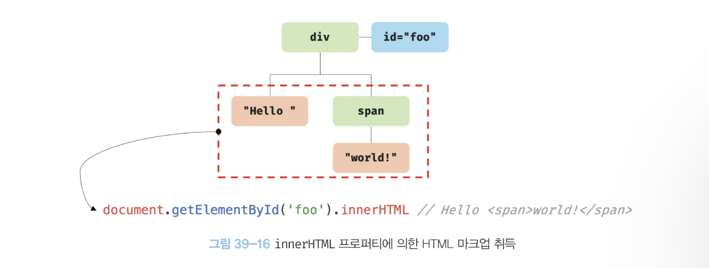
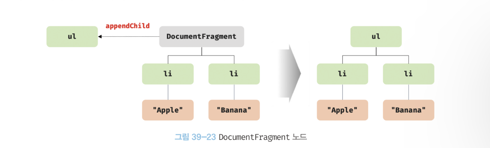
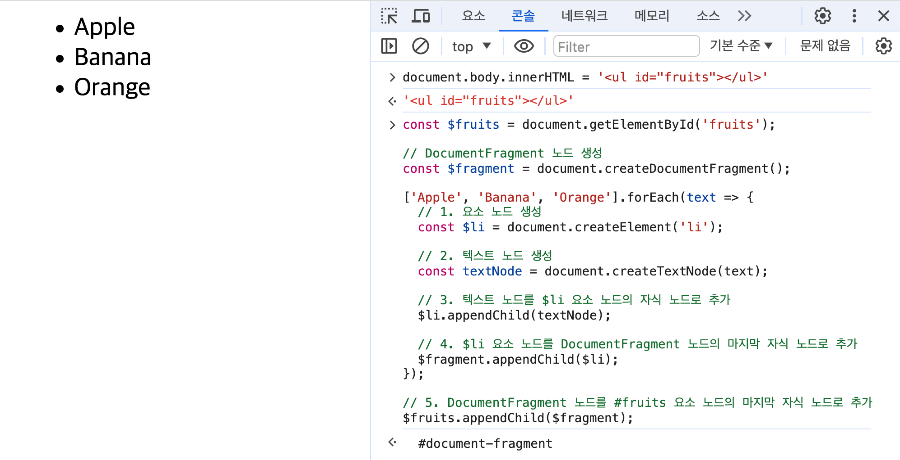
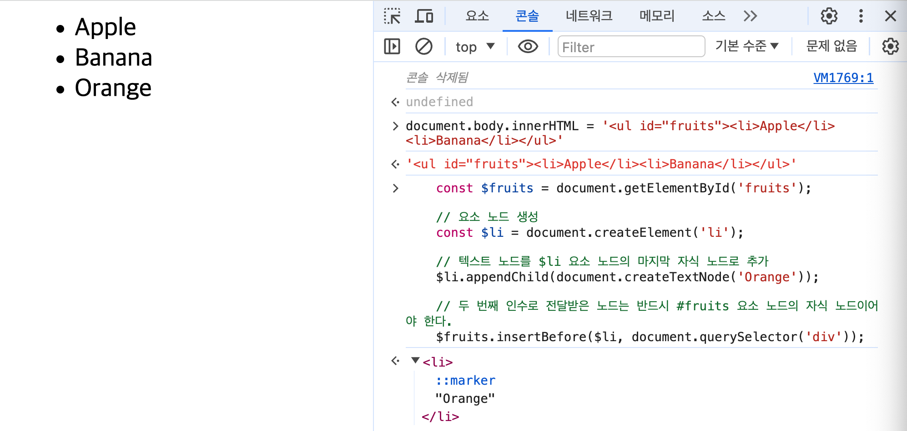
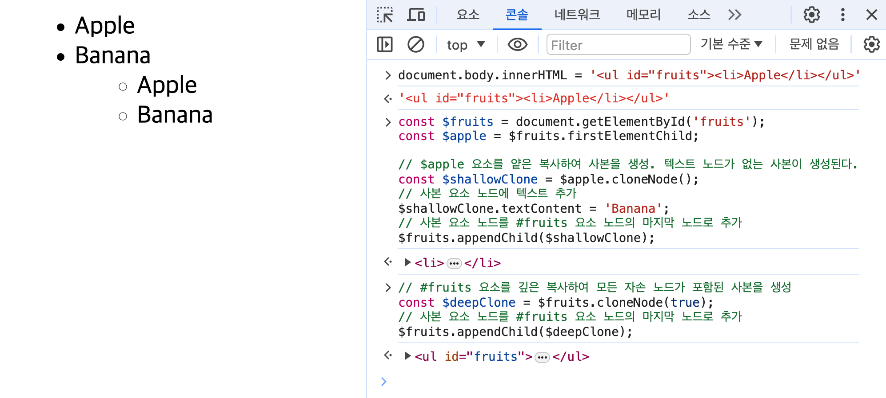
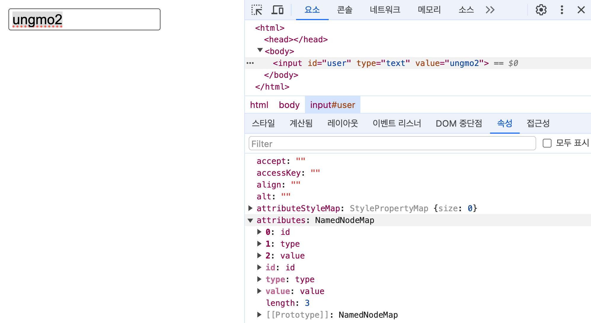
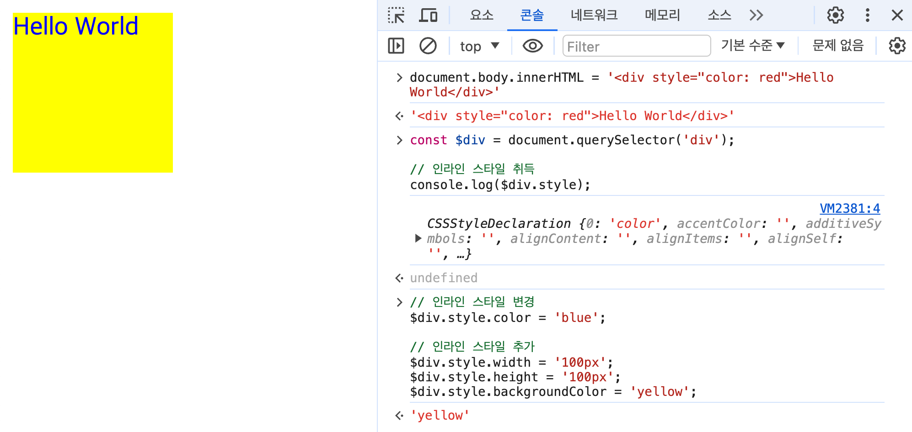

# `39.6` DOM 조작
- DOM 조작(manipulation) 은 새로운 노드를 생성하여 DOM에 추가하거나 기존 노드를 수정, 삭제하는 것을 의미.
- DOM에 새로운 노드가 추가되거나 삭제되면 `리플로우` 와 `리페인트`가 발생하므로 성능에 영향을 주므로 주의.

<br/><br/>

## `39.6.1` innerHTML
- `Element.prototype.innerHTML` 프로퍼티는 `getter` `setter` 모두 존재하는 접근자 프로퍼티
- 요소 노드의 콘텐츠 영역(시작~종료 태그 사이)내에 포함된 HTML 마크업을 문자열로 반환.
  
  

  
  ### `textContent`와 달리 HTML 마크업이 포함된 문자열을 그대로 반환.

    ``` html
    <div id="foo">hello<span>world!</span></div>

    <script>
      const foo = document.getElementById('foo');
      foo.innerHTML = 'Hi<span>there</span>'; // "Hi<span>there</span>"
    </script>
    ```

    ### `innerHTML` 프로퍼티에 값을 할당하면 요소 노드의 콘텐츠 영역을 지정한 HTML 마크업으로 대체.
    ``` html
    <!DOCTYPE html>
    <html>
      <body>
        <ul id="fruits">
          <li class="apple">Apple</li>
        </ul>
      </body>

      <script>
        const fruits = document.getElementById('fruits');

        // 노드 추가
        fruits.innerHTML += '<li class="banana">Banana</li>';

        // 노드 교체
        fruits.innerHTML = '<li class="orange">Orange</li>';

        // 노드 삭제
        fruits.innerHTML = '';
      </script>
    </html>
    ```

    ### `XSS` 크로스사이트 스크립팅 공격에 취약하다는 단점 존재
    - HTML 마크업 문자열은 렌더링 엔진에 의해 파싱되어 요소노드의 자식으로 DOM에 반영된다.
    - 사용자로부터 입력받은 데이터를 그대로 innerHTML에 할당하면 JS 악성코드가 포함되어 파싱되는  `크로스 사이트 스크립팅(XSS)` 공격에 노출될 수 있으므로 주의.
    - HTML5는 innerHTML 프로퍼티로 삽입된 script 요소 내의 자바스크립트 코드를 실행하지 않는다.

      ``` html
      <!DOCTYPE html>
      <html>
        <body>
          <div id="foo">Hello</div>
        </body>

        <script>
          // innerHTML 프로퍼티로 스크립트 태그를 삽입하여 자바스크립트가 실행되도록 한다.
          // HTML5는 innerHTML 프로퍼티로 삽입된 script 요소 내의 자바스크립트 코드를 실행하지 않는다.
          document.getElementById('foo').innerHTML = '<script>alert(document.cookie)</script>';

          // 에러 이벤트를 강제로 발생시켜서 자바스크립트 코드가 실행되도록 한다.
          document.getElementById('foo').innerHTML = ``;
        </script>
      </html>
      ```

      > ### HTML 새니티제이션 `HTML Sanitization`
      > - 사용자로부터 입력받은 데이터에 의해 발생할 수 있는 XSS 공격을 예방하는 기능.
      > - `Sanitization`함수를 직접 사용하거나 `DOMPurify` 같은 라이브러리를 통해 마크업에서 스크립트 태그를 살균하여 잠재적 위험 제거.
      > ``` js
      > DomPurify.sanitize('
      > ```

    ### `innerHTML`프로퍼티에 HTML 마크업 문자열을 할당할 때의 제한사항
    ``` html
    <!DOCTYPE html>
    <html>
      <body>
        <ul id="fruits">
          <li class="apple">Apple</li>
          <li class="orange">Orange</li>
        </ul>

        <script>
          const fruits = document.getElementById('fruits');

          // 노드 추가 축약 표현
          fruits.innerHTML += '<li class="banana">Banana</li>';

          // 사실은 모든 자식 노드를 제거하고 새로운 자식 노드를 추가하는 것이므로 비효율적.
          fruits.innerHTML = fruits.innerHTML + '<li class="banana">Banana</li>';
          // '<li class="apple">Apple</li>' + '<li class="orange">Orange</li>' + '<li class="banana">Banana</li>'

          // 새로운 요소를 삽입할 때 삽입할 위치를 지정할 수 없다는 단점이 있다.
          fruits.innerHTML = '<li class="banana">Banana</li>' + fruits.innerHTML;
        </script>
      </body>
    </html>
    ```

<br/><br/>

## `39.6.2` insertAdjacentHTML 메서드
- `Element.prototype.insertAdjacentHTML`은 삽입 위치를 지정해 새로운 요소 추가하는 메서드.
- `insertAdjacentHTML` 메서드는 첫번째 인수로 전달한 `위치`에 두번째 인수로 전달한 `HTML 마크업 문자열`을 파싱하여 DOM에 반영.
- 기존 요소에 영향을 주지 않고 새롭게 삽입될 요소만 파싱하여 자식요소로 추가하므로 `innerHTML`보다 효율적.
- HTML 마크업 문자열을 파싱하므로 `innerHTML`과 마찬가지로 XSS 공격에 취약하므로 주의.

  
  ```html
  <!DOCTYPE html>
  <html>
    <body>
      <!-- beforebegin -->
      <div id="foo">
        <!-- afterbegin -->
        text
        <!-- beforeend -->
      </div>
      <!-- afterend -->
    </body>
    <script>
      const $foo = document.getElementById('foo');

      $foo.insertAdjacentHTML('beforebegin', '<p>beforebegin</p>');
      $foo.insertAdjacentHTML('afterbegin', '<p>afterbegin</p>');
      $foo.insertAdjacentHTML('beforeend', '<p>beforeend</p>');
      $foo.insertAdjacentHTML('afterend', '<p>afterend</p>');
    </script>
  </html>
  ```

<br/><br/>

## `39.6.3` 노드 생성과 추가
  ### 요소 노드 생성
  - `Document.prototype.createElement(TagName)` 메서드는 지정한 태그명을 가지는 요소 노드를 생성.
  - `createElement`메서드의 매개변수 `tagName`에는 태그명을 인수로 전달.
  - `createElement`로 생성한 요소는 DOM에 추가되지 않고 메모리상에만 존재하며, DOM에 추가해야 화면에 표시된다.
  - 생성된 요소노드는 자식노드(텍스트 노드)를 갖지 않는다.

    
    ``` js
    // 1. 요소 노드 생성
    const $li = document.createElement('li');
    // 생성된 요소 노드는 아무런 자식 노드가 없다.
    console.log($li.childNodes); // NodeList []
    ```

  ### 텍스트 노드 생성
  - `Document.prototype.createTextNode(text)` 메서드는 지정한 텍스트를 가지는 텍스트 노드를 생성.
  - `createTextNode`메서드의 매개변수 `text`에는 텍스트 노드의 문자열을 인수로 전달.
  - 생성된 텍스트 노드는 DOM에 추가되지 않고 메모리상에만 존재하며, DOM에 추가해야 화면에 표시된다.

    ``` js
    // 2. 텍스트 노드 생성
    const textNode = document.createTextNode('Banana');
    ```

  ### 텍스트 노드를 요소 노드의 자식으로 추가
  - `Node.prototype.appendChild(childNode)` 메서드는 인수로 전달받은 `childNode`를 호출한 노드의 마지막 자식 노드로 추가.
  - `appendChild`메서드의 인수로 `createTextNode`메서드로 생성한 텍스트 노드를 전달하면 호출한 노드의 마지막 자식 노드로 추가.
  
    ``` js
    // 3. 텍스트 노드를 요소 노드의 자식으로 추가
    $li.appendChild(textNode);
    ```

  ### 요소 노드를 DOM에 추가
  - `Node.prototype.appendChild(childNode)` 메서드는 인수로 전달받은 `childNode`를 호출한 노드의 마지막 자식 노드로 추가.
  - 기존 DOM에 요소 노드를 한 번 추가하므로 한 번의 리플로우와 리페인트가 실행된다.

    ``` js
    // 4. 요소 노드를 DOM에 추가
    $fruits.appendChild($li);
    ```

<br/><br/>

## `39.6.4` 복수의 노드 생성과 추가
- DOM을 변경하는 것은 비용이 많이 드므로 가급적 횟수를 줄여야 성능에 좋다.
- 컨테이너 요소를 미리 생성한 다음, 컨테이너의 자식으로 노드들을 추가하고 컨테이너를 DOM에 한 번 추가하는 방법이 있다.
- DOM을 한 번만 추가하는 것은 좋지만 불필요한 컨테이너 요소(div)가 추가되므로 `Document Freagment`를 사용하는 것이 좋다.
- `Document Fragment`는 메모리상에 존재하는 빈 컨테이너 요소로, DOM에 추가되지 않고 자식 노드만 추가하기 위한 용도로 사용한다.


  ```html
  <!DOCTYPE html>
  <html>
    <body>
      <ul id="fruits"></ul>
    </body>
    <script>
      const $fruits = document.getElementById('fruits');

      // 컨테이너 요소 노드 생성
      const $container = document.createElement('div');

      ['Apple', 'Banana', 'Orange'].forEach(text => {
        // 1. 요소 노드 생성
        const $li = document.createElement('li');

        // 2. 텍스트 노드 생성
        const textNode = document.createTextNode(text);

        // 3. 텍스트 노드를 $li 요소 노드의 자식 노드로 추가
        $li.appendChild(textNode);

        // 4. $li 요소 노드를 컨테이너 요소의 마지막 자식 노드로 추가
        $container.appendChild($li);
      });

      // 5. 컨테이너 요소 노드를 #fruits 요소 노드의 마지막 자식 노드로 추가
      $fruits.appendChild($container);
    </script>
  </html>
  ```
  

<br/><br/>

## `39.6.5` 노드 삽입
### 마지막 노드로 추가
- `Node.prototype.appendChild(childNode)` 메서드는 인수로 전달받은 노드를 호출한 노드의 마지막 자식 노드로 추가.
  ###
  ```js
    // 요소 노드 생성
    const $li = document.createElement('li');

    // 텍스트 노드를 $li 요소 노드의 마지막 자식 노드로 추가
    $li.appendChild(document.createTextNode('Orange'));

    // $li 요소 노드를 #fruits 요소 노드의 마지막 자식 노드로 추가
    document.getElementById('fruits').appendChild($li);

    // - Apple
    // - Banana
    // - Orange ✅
  ```

### 지정한 위치에 노드 삽입
- `Node.prototype.insertBefore(newNode, referenceNode)` 메서드는 첫번째 인수로 전달받은 `newNode`를 두번째 인수로 전달받은 `referenceNode`의 앞에 삽입.

  ```js
  // 요소 노드 생성
  const $li = document.createElement('li');

  // 텍스트 노드를 $li 요소 노드의 마지막 자식 노드로 추가
  $li.appendChild(document.createTextNode('Orange'));

  // $li 요소 노드를 #fruits 요소 노드의 마지막 자식 요소 앞에 삽입
  $fruits.insertBefore($li, $fruits.lastElementChild);
  // - Apple
  // - Orange ✅
  // - Banana

  // 두 번째 인수로 전달받은 노드는 반드시 #fruits 요소 노드의 자식 노드이어야 한다
  // ⚠️ 자식 노드가 아닌 노드를 전달하면 에러가 발생하지 않고 노드가 치환된다.(하단 이미지 참고)
  $fruits.insertBefore($li, document.querySelector('div'));


  // 두 번째 인수로 전달받은 노드가 null이면 $li 요소 노드를 #fruits 요소 노드의 마지막 자식 노드로 추가
  $fruits.insertBefore($li, null);
  // - Apple
  // - Orange
  // - Banana
  // - Cherry ✅
  ```

  
  

<br/><br/>

## `39.6.6` 노드 이동
- DOM에 이미 존재하는 노드를 `appendChild`, `insertBefore` 메서드를 사용하여 노드를 이동할 수 있다.
- DOM에 다시 추가할 때 이전 위치에서 노드들을 제거되고 새로운 위치에 노드를 추가하는 방식.

<br/><br/>

## `39.6.7` 노드 복사
- `Node.prototype.cloneNode([deep: true | false])` 메서드는 호출한 노드를 복제하여 반환.
- `cloneNode`메서드의 매개변수 `deep`은    
`true`를 전달하면 모든 자손 노드가 포함된 사본(Deep Copy)을 생성하고,   
`false`를 전달하거나 생략하면 호출한 노드 자신만 복제(Shallow Copy)하여 반환.

  ``` html
  <!DOCTYPE html>
  <html>
    <body>
      <ul id="fruits">
        <li>Apple</li>
      </ul>
    </body>

    <script>
      const $fruits = document.getElementById('fruits');
      const $apple = $fruits.firstElementChild;

      // $apple 요소를 얕은 복사하여 사본을 생성. 텍스트 노드가 없는 사본이 생성된다.
      const $shallowClone = $apple.cloneNode();
      // 사본 요소 노드에 텍스트 추가
      $shallowClone.textContent = 'Banana';
      // 사본 요소 노드를 #fruits 요소 노드의 마지막 노드로 추가
      $fruits.appendChild($shallowClone);

      // #fruits 요소를 깊은 복사하여 모든 자손 노드가 포함된 사본을 생성
      const $deepClone = $fruits.cloneNode(true);
      // 사본 요소 노드를 #fruits 요소 노드의 마지막 노드로 추가
      $fruits.appendChild($deepClone);
    </script>
  </html>
  ```

  


<br/><br/>

## `39.6.8` 노드 교체
- `Node.prototype.replaceChild(newChild, oldChild)` 메서드는 첫번째 인수로 전달받은 `newChild`로 두번째 인수로 전달받은 `oldChild`를 교체.
- `replaceChild`의 두번째 매개변수에 인수로 전달한 `oldChild` 노드는 호출한 노드의 자식이어야 하며 DOM에서 제거된다.
  
  ``` js
    const $fruits = document.getElementById('fruits');

    // 기존 노드와 교체할 요소 노드를 생성
    const $newChild = document.createElement('li');
    $newChild.textContent = 'Banana';

    // #fruits 요소 노드의 첫 번째 자식 요소 노드를 $newChild 요소 노드로 교체
    $fruits.replaceChild($newChild, $fruits.firstElementChild);
  ```

<br/><br/>


## `39.6.9` 노드 삭제
- `Node.prototype.removeChild(child)` 메서드는 호출한 노드의 자식 노드 중 인수로 전달받은 `childNode`를 삭제.
- `removeChild`에 인수로 전달한 `childNode`는 호출한 노드의 자식이어야 하며 DOM에서 제거된다.
  
  ``` js
    const $fruits = document.getElementById('fruits');

    // #fruits 요소 노드의 마지막 요소를 DOM에서 삭제
    $fruits.removeChild($fruits.lastElementChild);
  ```

  <br/><br/><br/>

# `39.7` 어트리뷰트
## `39.7.1` 어트리뷰트 노드와 attributes 프로퍼티
- `어트리뷰트 노드(Attribute Node)`는 요소 노드의 속성을 나타내는 노드.
- HTML 요소의 동작을 제어하기 위한 추가적인 정보를 제공.
- `어트리뷰트 이름 = "어트리뷰트 값"` 형식으로 구성
- 글로벌 어트리뷰트 `id`, `class`, `style`, `title`, ... 와   
이벤트 핸들러 어트리 뷰트 `onclick`, `onchange`, `onsubmit`, ... 등   
모든 HTML요소에서 공통적으로 사용할 수 있지만 특정 HTML요소에서만 한정적으로 사용 가능한 어트리뷰트도 존재 (ex. `input`)
- HTML 문서가 파싱될 때 HTML 요소의 어트리뷰트는 `어트리뷰트 노드`로 변환되어 DOM에 추가된다.
- 요소 노드의 모든 어트리뷰트 노드는 `Element.prototype.attributes` 프로퍼티를 통해 접근 가능 (getter만 존재하는 읽기 전용).

  ``` html
  // input 요소 노드에 3개의 어트리뷰트 노드가 존재.
  // 유사배열객체이자 이터러블인 NameNodeMap 객체에 담겨서 반환.
  <input id="user" type="text" value="ungmo2">
  ```
  

<br/><br/>

## `39.7.2` HTML 어트리뷰트 조작
- `Element.prototype.getAttribute(attributeName)` 메서드는 인수로 전달받은 `attributeName`에 해당하는 어트리뷰트 값을 반환.
- `Element.prototype.setAttribute(attributeName, value)` 메서드는 첫번째 인수로 전달받은 `attributeName`에 두번째 인수로 전달받은 `value`를 설정.
- `Element.prototype.hasAttribute(attributeName)` 메서드는 인수로 전달받은 `attributeName`에 해당하는 어트리뷰트가 존재하면 `true`를 반환.

  ```html
  <!DOCTYPE html>
  <html>
  <body>
    <input id="user" type="text" value="ungmo2">

    <script>
      const $input = document.getElementById('user');

      // value 어트리뷰트 값을 취득
      const inputValue = $input.getAttribute('value'); // ungmo2

      // value 어트리뷰트 값을 변경
      $input.setAttribute('value', 'foo');
      console.log($input.getAttribute('value')); // foo

      // value 어트리뷰트의 존재하는지 확인
      if ($input.hasAttribute('value')) {
        // value 어트리뷰트 삭제
        $input.removeAttribute('value');
      }

      // value 어트리뷰트가 삭제되었다.
      console.log($input.hasAttribute('value')); // false
    </script>
  </body>
  </html>
  ```

<br/><br/>

## `39.7.3` HTML 어트리뷰트 vs. DOM 프로퍼티
- 요소 노드에는 HTML 어트리뷰트와 별개로 DOM 프로퍼티가 존재한다. (HTML 어트리뷰트 초기값 보유.)
- DOM프로퍼티는 `setter` `getter`모두 존재하는 참조,변경이 가능한 접근자 프로퍼티.

  ```html
  <!DOCTYPE html>
  <html>
  <body>
    <input id="user" type="text" value="ungmo2">
    <script>
      const $input = document.getElementById('user');

      // 요소 노드의 value 프로퍼티(DOM)에 저장된 value 어트리뷰트 값
      console.log($input.value); // ungmo2

      // attributes 프로퍼티에 저장된 value 어트리뷰트 값
      console.log($input.getAttribute('value')); // ungmo2
    </script>
  </body>
  </html>
  ```

  > ### HTML 어트리뷰트는 DOM에서 중복 관리되고 있을까?
  > 1. 요소 노드의 attributes 프로퍼티에서 관리하는 어트리뷰트 노드
  > 2. 요소 노드의 DOM 프로퍼티   
  > 
  > - ex. `<input id="user" type="text" value="ungmo2">`
  > - input 요소의 요소 노드가 생성되어 첫 렌더링이 끝난 시점까지 HTML 어트리뷰트 값이 DOM 프로퍼티에 반영되어 동일한 초기값으로 사용된다.
  > - 요소 노드는 상태(state)를 가지고 있으므로, 초기 상태는 어트리뷰트 노드가 관리하고 최신 상태는 DOM 프로퍼티가 관리한다.

  ### 어트리뷰트 노드
  - HTML 어트리뷰트로 지정한 HTML요소의 초기 상태를 나타내는 노드.
  - 사용자의 입력에 의해 상태가 변경되어도 초기상태를 그대로 유지

    ``` js
    // attributes 프로퍼티에 저장된 value 어트리뷰트 값을 취득한다. 결과는 언제나 동일하다.
    document.getElementById('user').getAttribute('value'); // ungmo2

    // HTML 요소에 지정한 어트리뷰트 값, 즉 초기 상태 값을 변경한다.
    document.getElementById('user').setAttribute('value', 'foo'); // foo
    ```

  ### DOM 프로퍼티
  - 사용자가 입력한 값으로 상태가 변경되어 언제나 최신 상태를 유지.
  - DOM 프로퍼티에 값을 할당하면 HTML 요소의 최신 상태값을 변경하는 것을 의미.
    
    ```html
    <!DOCTYPE html>
    <html>
    <body>
      <input id="user" type="text" value="ungmo2">
      <script>
        const $input = document.getElementById('user');

        // DOM 프로퍼티에 값을 할당하여 HTML 요소의 최신 상태를 변경한다.
        $input.value = 'foo';
        console.log($input.value); // foo

        // getAttribute 메서드로 취득한 HTML 어트리뷰트 값, 즉 초기 상태 값은 변하지 않고 유지된다.
        console.log($input.getAttribute('value')); // ungmo2
      </script>
    </body>
    </html>
    ```

  ### DOM 프로퍼티 값의 타입
  - `getAttribute` 메서드로 취득한 값은 언제나 문자열.
  - DOM 프로퍼트로 취득한 상태 값은 문자열이 아닐 수 있다. (ex. checkbox 요소의 boolean 타입)


<br/><br/>

## `39.7.4` data 어트리뷰트와 dataset 프로퍼티
- HTML요소에 정의한 사용자 정의 어트리뷰트와 JS간에 데이터 교환을 위해 사용.
- `data-` 접두사에 임의의 이름을 붙여 사용하는 어트리뷰트를 `data 어트리뷰트`라고 한다.
- `data` 어트리뷰트의 값은 `HTMLElement.prototype.dataset` 프로퍼티를 통해 취득.
- `data` 어트리뷰트의 정보를 제공하는 `DOMStringMap` 객체는 `dataset` 프로퍼티를 통해 접근 가능.

  ```html
  <!DOCTYPE html>
  <html>
  <body>
    <ul class="users">
      <li id="1" data-user-id="7621" data-role="admin">Lee</li>
      <li id="2" data-user-id="9524" data-role="subscriber">Kim</li>
    </ul>
    <script>
      const users = [...document.querySelector('.users').children];

      // user-id가 '7621'인 요소 노드를 취득한다.
      const user = users.find(user => user.dataset.userId === '7621');
      // user-id가 '7621'인 요소 노드에서 data-role의 값을 취득한다.
      console.log(user.dataset.role); // "admin"

      // user-id가 '7621'인 요소 노드의 data-role 값을 변경한다.
      user.dataset.role = 'subscriber';
      // dataset 프로퍼티는 DOMStringMap 객체를 반환한다.
      console.log(user.dataset); // DOMStringMap {userId: "7621", role: "subscriber"}

    // user-id가 '7621'인 요소 노드에 새로운 data 어트리뷰트 "name"을 추가한다.
    user.dataset.name = 'jay';
    console.log(user.dataset);
    /*
    DOMStringMap {userId: "7621", role: "subscriber", name: "jay"}
    <li id="1" data-user-id="7621" data-role="admin" data-name="jay">Lee</li>
    */
    </script>
  </body>
  </html>
  ```

<br/><br/><br/>

# 39.8 스타일
## `39.8.1` 인라인 스타일 조작
- `Element.prototype.style` 프로퍼티는 인라인 스타일을 조작하는데 사용.
- `getter` `setter` 모두 존재하는 접근자 프로퍼티로, `CSSStyleDeclaration` 객체를 반환.

  ```html
  <!DOCTYPE html>
  <html>
  <body>
    <div style="color: red">Hello World</div>
    <script>
      const $div = document.querySelector('div');

      // 인라인 스타일 취득
      console.log($div.style); // CSSStyleDeclaration { 0: "color", ... }

      // 인라인 스타일 변경
      $div.style.color = 'blue';

      // 인라인 스타일 추가
      $div.style.width = '100px';
      $div.style.height = '100px';
      $div.style.backgroundColor = 'yellow';
    </script>
  </body>
  </html>

  ```
  

  > ### css 프로퍼티는 `kebab-case`, CSSStyleDeclaration 객체의 프로퍼티는 `camelCase`
  > ```js 
  > $div.style.backgroundColor = 'yellow'; // css 프로퍼티를 camelCase로 사용
  > ```
  > ```js
  > $div.style['background-color'] = 'yellow'; // kabab-case css프로퍼티를 사용하기 위한 대괄호 표기법
  > ```
  > ```js
  > $div.style.width = '100px'; // 단위지정이 필요한 CSS 프로퍼티 값은 단위를 반드시 지정.
  > ```

<br/><br/>

## `39.8.2` 클래스 조작
- JS에서 `class`는 예약어이므로 `className`과 `classList` 프로퍼티로 클래스를 조작.

  ### className
  - `Element.prototype.className` 프로퍼티는 `class` 어트리뷰트의 값을 취득하거나 설정.
  - `getter` `setter` 모두 존재하는 접근자 프로퍼티.
    
    <br/>
    
    ```html
    <!DOCTYPE html>
    <html>
    <head>
      <style>
        .box {
          width: 100px; height: 100px;
          background-color: aqua;
        }
        .red { color: red; }
        .blue { color: blue; }
      </style>
    </head>
    <body>
      <div class="box red">Hello World</div>
      <script>
        const $box = document.querySelector('.box');

        // .box 요소의 class 어트리뷰트 값을 취득
        console.log($box.className); // 'box red'

        // .box 요소의 class 어트리뷰트 값 중에서 'red'만 'blue'로 변경
        $box.className = $box.className.replace('red', 'blue');
      </script>
    </body>
    </html>
    ```

    <br/>

  ### classList
  - `Element.prototype.classList` 프로퍼티는 `DOMTokenList` 객체를 반환.
  - `DOMTokenList`는 class 어트리뷰트의 정보를 나타내는 컬렉션 유사배열객체.
  - `add` `remove` `index` `toggle` `contains` 메서드를 제공하여 클래스를 조작.

    ```html
    <!DOCTYPE html>
    <html>
    <head>
      <style>
        .box {
          width: 100px; height: 100px;
          background-color: antiquewhite;
        }
        .red { color: red; }
        .blue { color: blue; }
      </style>
    </head>
    <body>
      <div class="box red blue">Hello World</div>
      <script>
        const $box = document.querySelector('.box');
        // DOMTokenList(2) [length: 2, value: "box blue", 0: "box", 1: "blue"]


        // 1. add(...className) 1개 이상의 문자열을 인수로 전달받아 class 어트리뷰트에 추가
        $box.classList.add('foo'); // class="box blue foo"

        // 2. remove(...className) 1개 이상의 문자열을 인수로 전달받아 class 어트리뷰트에서 제거
        $box.classList.remove('box'); // class="blue foo"

        // 3. item(index) 인덱스를 전달받아 class 어트리뷰트의 특정 클래스 이름을 반환
        $box.classList.item(0); // blue

        // 4. contains(className) 인수로 전달받은 클래스 이름이 class 어트리뷰트에 존재하면 true, 그렇지 않으면 false를 반환
        $box.classList.contains('blue'); // true

        // 5. replace(oldClassName, newClassName) 인수로 전달받은 클래스 이름을 교체
        $box.classList.replace('blue', 'red'); // class="red foo"

        // 5. toggle(className, force) 인수로 전달받은 클래스 이름이 존재하면 제거, 그렇지 않으면 추가
        $box.classList.toggle('red'); // class="foo"
        $box.classList.toggle('red'); // class="foo red"
        $box.classList.toggle('box', true); // class="foo red box" // 강제로 추가
        $box.classList.toggle('box', false); // class="foo red" // 강제로 제거
      </script>
    </body>
    </html>
    ```

<br/><br/>

## `39.8.3` 요소에 적용되어 있는 CSS 스타일 참조
- `getComputedStyle` 함수는 인수로 전달받은 요소에 적용된 모든 CSS 스타일을 반환.
- 요소 노드에 적용되어 있는 모든 스타일(인라인, 외부, 내부 스타일...)을 객체로 반환.
- 두번째 인수로 `:before`, `:after`와 같은 가상 요소의 스타일을 반환할 수 있다.

  ```html
  <!DOCTYPE html>
  <html>
  <head>
    <style>
      body {
        color: red;
      }
      .box {
        width: 100px;
        height: 50px;
        background-color: cornsilk;
        border: 1px solid black;
      }
      .box:before {
        content: 'Hello';
      }
    </style>
  </head>
  <body>
    <div class="box">Box</div>
    <script>
      const $box = document.querySelector('.box');

      // .box 요소에 적용된 모든 CSS 스타일을 담고 있는 CSSStyleDeclaration 객체를 취득
      const computedStyle = window.getComputedStyle($box);
      console.log(computedStyle); // CSSStyleDeclaration

      // 임베딩 스타일
      console.log(computedStyle.width); // 100px
      console.log(computedStyle.height); // 50px
      console.log(computedStyle.backgroundColor); // rgb(255, 248, 220)
      console.log(computedStyle.border); // 1px solid rgb(0, 0, 0)

      // 상속 스타일(body -> .box)
      console.log(computedStyle.color); // rgb(255, 0, 0)

      // 기본 스타일
      console.log(computedStyle.display); // block

      // 의사 요소 :before의 스타일을 취득한다.
      const computedStyle = window.getComputedStyle($box, ':before');
      console.log(computedStyle.content); // "Hello"
    </script>
  </body>
  </html>
  ```

# `39.9` DOM 표준
- HTML과 DOM 표준은 `WHC`(월드 와이드 웹 컨소시엄)과 `WHATWG`(웹 하이퍼텍스트 애플리케이션 기술 작업 그룹)에 의해 관리되어 왔지만 2018년 4월부터 `google`, `microsoft`, `mozilla`, `apple` 등 주요 브라우저 업체들이 참여하는 `WYATWG`가 단일 표준을 내놓기로 결정.

  | 레벨 | 표준 문서 URL |
  |:---:|:---:|
  | DOM Level 1 | [https://www.w3.org/TR/1998/REC-DOM-Level-1-19981001/](https://www.w3.org/TR/1998/REC-DOM-Level-1-19981001/) |
  | DOM Level 2 | [https://www.w3.org/TR/DOM-Level-2-Core/](https://www.w3.org/TR/DOM-Level-2-Core/) |
  | DOM Level 3 | [https://www.w3.org/TR/DOM-Level-3-Core/](https://www.w3.org/TR/DOM-Level-3-Core/) |
  | DOM Level 4 | [https://dom.spec.whatwg.org/](https://dom.spec.whatwg.org/) |