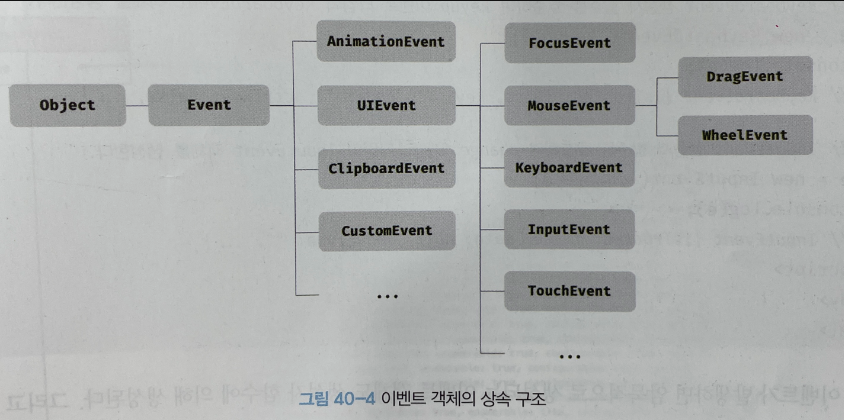
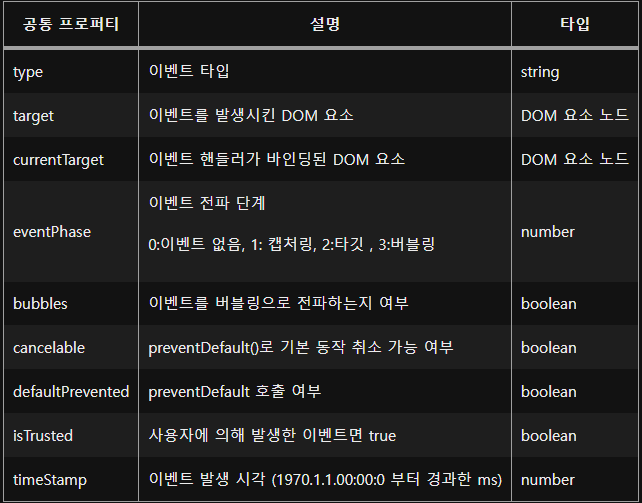
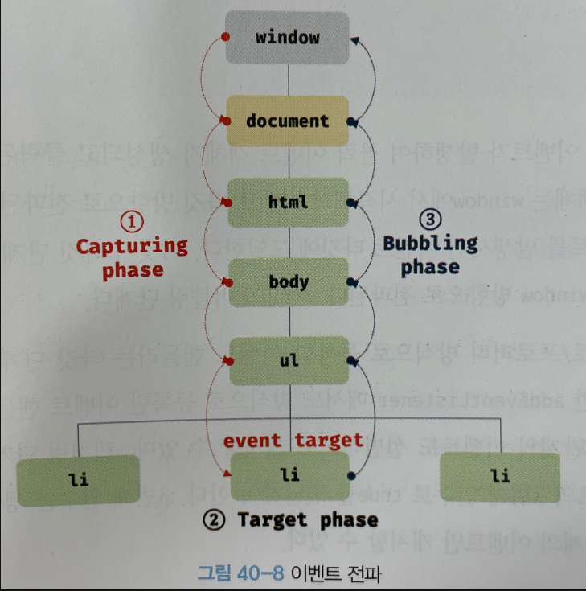

# 40장 이벤트

## 이벤트 드리븐 프로그래밍
이벤트 핸들러 : 이벤트가 발생했을 때 호출될 함수
이벤트 핸들러 등록 : 브라우저에게 이벤트 핸들러의 호출 위임

이벤트 중심으로 제어하는 프로그래밍을 **이벤트 드리븐 프로그램**이라 한다

## 이벤트 타입
이벤트의 종류를 나타내는 문자열 <br>
이벤트 타입은 약 200여가지가 있다.

## 이벤트 핸들러 등록
방식은 총 3가지 이다

1. 이벤트 핸들러 어트리뷰트 방식
   - html 요소 어트리 뷰트인  이벤트 핸들러 어트리뷰트 에 함수 호출문을 할당
   ```js
    <button onclick="handleClick()">버튼</button>
        <script>
        handleClick = () => console.log('Click');
        </script>
   ```
   - 관심사가 다른 HTML과 자바스크립트를 혼용한다는 측면에서 이벤트 핸들러 어트리뷰트 방식을 사용하지 않는 것이 좋다
   - 하지만 CBD 방식의 프레임워크/라이브러리에서는 뷰를 구성하기 위한 구성요소로 보기때문에 관심사가 다르다 생각하지 않기 때문에 사용한다.

2. 이벤트 핸들러 프로퍼티 방식
   - window 객체, Document, HTMLElement 타입의 DOM 노드 객체의 이벤트 핸들러 프로퍼티 사용
    ```js
    <button>버튼</button>
        <script>
        const $btn = document.querySelector('button');
        $btn.onclick = () => console.log('click!');
        </script>
   ```
   - 이벤트 핸들러 프로퍼티에는 단 하나의 이벤트 핸들러만 바인딩 가능
3. addEventListener 메서드 방식
   - DOM Level 2 에서 도입
   - EventTarget.prototype.addEventListener 메서드
   ```js
    <button>버튼</button>
        <script>
        const $btn = document.querySelector('button');
        $btn.addEventListener('click',()=>console.log('click'));
        </script>
   ```

## 이벤트 핸들러 제거
- EventTarget.prototype.removeEventListener 사용
- addEventListener로 등록할 때 전달한 인수를 동일하게 전달해야 제거된다
    ```js
    $btn.addEventListener('click',function handleClick(){
        console.log('handleClick');
        $btn.removeEventListener('click',handleClick);
    })
    ```

## 이벤트 객체
이벤트에 관한 정보를 담고 있는 이벤트 객체
```js
const $p = document.getElementById('coordi');
const printCoordi = (e) => {
    $p.textContent = ` x = ${e.clientX}, y = ${e.clientY}`;
}
document.addEventListener('click',printCoordi);
```
- 이벤트 객체의 상속 구조


- 이벤트 객체의 공통 프로퍼티


## 이벤트 전파
- 캡처링 단계
  - 이벤트 객체가 생성시 window부터 이벤트 타깃까지
- 타깃 단계
  - 이벤트 객체가 이벤트를 발생시킨 이벤트 타깃에 도달
- 버블링 단계
  - 다시 이벤트 타깃부터 window 방향으로 전파

- 해당 단계를 통하기 때문에 이벤트 패스에 있는 모든 DOM요소는 이벤트를 캐치할수 있다
  
## 이벤트 위임
다수의 하위 DOM 요소에 각각 이벤트 핸들러를 등록하지 않고 그 요소들을 포함하는 상위 DOM 요소에 이벤트 핸들러 등록

## DOM 요소의 기본 동작 중단
1. preventDefault 
DOM 요소의 기본 동작 중단
```js
<a href="https://www.naver.com">Naver</a> 
    <script>
     const atag = document.querySelector('a');
     atag.addEventListener('click', e => e.preventDefault());
    </script>
```
2. stopPropagation 
이벤트 전파 중지
```js
<ul>
   <li>1번</li>
   <li>2번</li>
   <li>3번</li>
</ul>
<script>
   const table = document.querySelector('ul');
   table.addEventListener('click',e=>{
      if (! e.target.matches('ul > li')) return
      e.target.style.color = 'red';
   });
   table.firstElementChild.addEventListener('click', e => e.stopPropagation());
</script>
```

## 이벤트 핸들러 내부의 this
1. 이벤트 핸들러 어트리뷰트 방식
   - 일반 함수로 호출되기 때문에 this는 전역 객체
2. 이벤트 핸들러 프로퍼티 방식과 addEventListener 메서드 방식
   - 이벤트 핸들러 내부의 this = 이벤트를 바인딩한 DOM 요소
   - 이벤트 핸들러 내부의 this = 이벤트 객체의 currentTarget 프로퍼티

## 커스텀 이벤트
### 생성
- 생성자 함수를 호출하여 명시적으로 생성한 이벤트 객체는 이벤트 타입 지정
- 커스텀 이벤트 객체는 버블링 단계를 거치지 않는다.
- preventDefault 로 취소할수없다.
### 디스패치
- 디스패치 = 이벤트를 발생시키는 행위
- dispatchEvent(이벤트 객체) 메서드로 커스텀 이벤트를 발생시킨다.
- 일반적인 이벤트 핸들러는 비동기 처리 방식이지만 dispatchEvent는 동기적이다

# 참조
- https://velog.io/@hustlekang/%EB%AA%A8%EB%8D%98-%EC%9E%90%EB%B0%94%EC%8A%A4%ED%81%AC%EB%A6%BD%ED%8A%B8-Deep-Dive-40%EC%9E%A5-%EC%9D%B4%EB%B2%A4%ED%8A%B8#%EC%9D%B4%EB%B2%A4%ED%8A%B8-%ED%95%B8%EB%93%A4%EB%9F%AC-%EB%93%B1%EB%A1%9D
- https://grasinnong-developer.tistory.com/106
- https://serzhul.io/javascript/40.%EC%9D%B4%EB%B2%A4%ED%8A%B8/