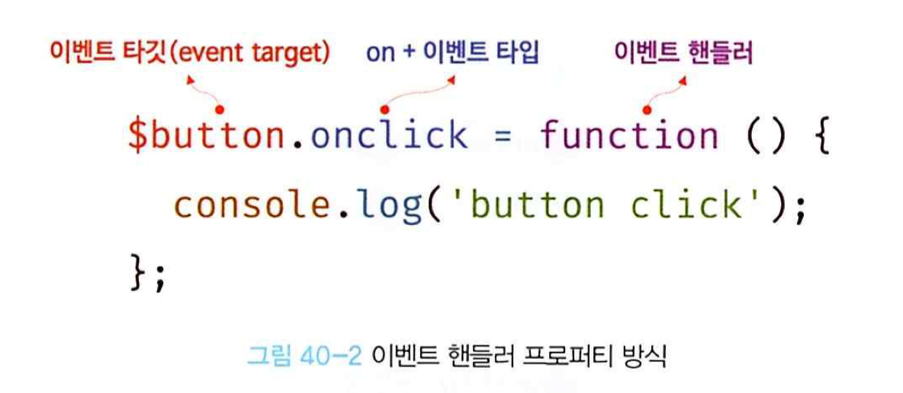
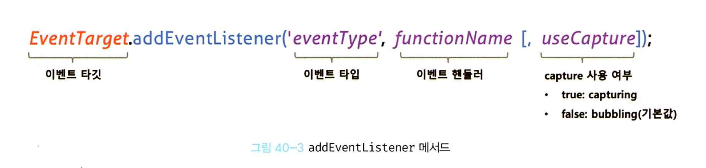
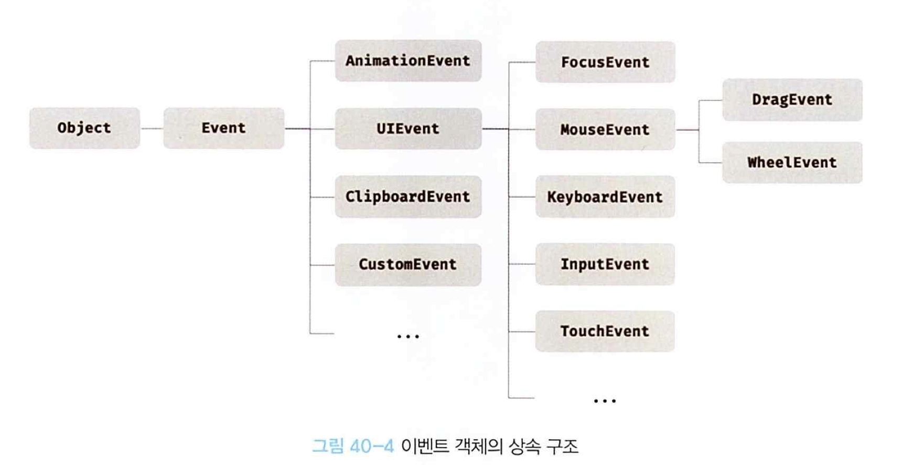
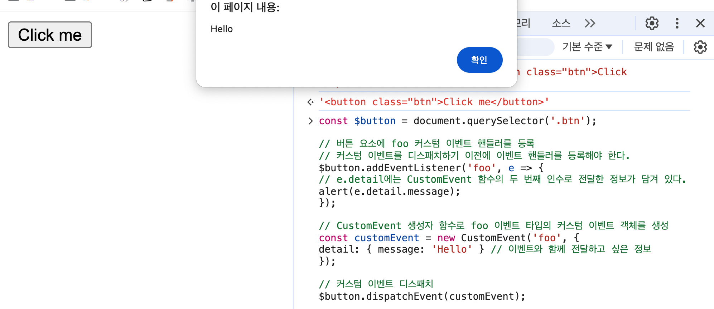

# `40.1` 이벤트 드리븐 프로그래밍
- 클릭, 마우스 오버, 키보드 입력, 네트워크 요청 완료 등이 일어나면 브라우저는 이를 감지해 이벤트를 발생(trigger)시킨다.
- 이벤트가 발생했을 때 호출될 함수를 이벤트 핸들러(event handler)라 하고, 이벤트가 발생했을 때 호출을 위임하는 것을 이벤트 핸들러 등록이라 한다.
- 특정 버튼 요소에서 클릭 이벤트가 발생하면 브라우저에게 이벤트 핸들러를 호출하도록 위임하는 것.
- 이벤트와 그에 대응하는 함수(event handler)를 통해 상호작용하는 것을 중심으로 프로그래밍 하는 방식을 이벤트 드리븐 `프로그래밍(event-driven programming)`이라 한다.

  ```html
  <!DOCTYPE html>
  <html>
  <body>
    <button>Click me!</button>
    <script>
      const $button = document.querySelector('button');

      // 사용자가 버튼을 클릭하면 함수를 호출하도록 요청
      $button.onclick = () => { alert('button click'); };
    </script>
  </body>
  </html>
  ```

<br/>
<br/>

# `40.2` 이벤트 객체
- 이벤트 타입(event type)은 이벤트 종류를 나타내는 문자열.

## `40.2.1` 마우스 이벤트

| 이벤트 타입 | 이벤트 발생 시점 |
|:---:|:---:|
| click | 사용자가 마우스로 요소를 클릭했을 때 |
| dblclick | 사용자가 마우스로 요소를 더블 클릭했을 때 |
| mousedown | 사용자가 마우스로 요소를 누르기 시작했을 때 |
| mouseup | 사용자가 마우스로 요소를 누르기를 끝냈을 때 |
| mousemove | 사용자가 마우스 커서를 움직였을 때 |
| mouseenter | 마우스 커서가 요소 안으로 들어왔을 때(버블링X) |
| mouseover | 마우스 커서가 요소 위로 올라갔을 때(버블링) |
| mouseleave | 마우스 커서가 요소 밖으로 나갔을 때(버블링X) |
| mouseout | 마우스 커서가 요소 밖으로 나갔을 때(버블링) |

## `40.2.2` 키보드 이벤트
| 이벤트 타입 | 이벤트 발생 시점 |
|:---:|:---:|
| keydown | 사용자가 키보드의 키를 눌렀을 때 |
| keypress | 사용자가 키보드의 키를 눌렀을 때(문자 입력) |
| keyup | 사용자가 키보드의 키를 눌렀다 뗐을 때 한 번 |


## `40.2.3` 포커스 이벤트
| 이벤트 타입 | 이벤트 발생 시점 |
|:---:|:---:|
| focus | 요소가 포커스를 받았을 때 (버블링X) |
| blur | 요소가 포커스를 잃었을 때 (버블링X) |
| focusin | 요소가 포커스를 받았을 때 (버블링) |
| focusout | 요소가 포커스를 잃었을 때 (버블링) |

## `40.2.4` 폼 이벤트
| 이벤트 타입 | 이벤트 발생 시점 |
|:---:|:---|
| submit | 1. 폼을 제출할 때 `text` `checkbox` `radio` `select` <br/> 2. form 요소 내의 `submit`버튼 클릭 |
| reset | 폼을 초기화할 때 `reset` 버튼 클릭 (최근 사용X) |

## `40.2.5` 값 변경 이벤트
| 이벤트 타입 | 이벤트 발생 시점 |
|:---:|:---|
| input | 사용자가 입력한 값이 변경되었을 때 `input` `select` `textarea` |
| change | 요소의 값이 변경되었을 때 `input` `select` `textarea` <br/> (포커스를 잃었을 때 입력을 종료로 인식하여 발생)|
| readyStateChange | `document`의 `readyState`가 변경되었을 때 `interactive` `complete` |

## `40.2.6` DOM 뮤테이션 이벤트
| 이벤트 타입 | 이벤트 발생 시점 |
|:---:|:---|
| DOMCOntentLoaded | HTML 문서의 로드와 파싱이 완료되어 DOM 생성이 완료되었을 때 |

## `40.2.7` 뷰 이벤트
| 이벤트 타입 | 이벤트 발생 시점 |
|:---:|:---|
| resize | 브라우저 윈도우(window)의 크기를 변경했을 때 |
| scroll | 요소가 스크롤되었을 때 |

## `40.2.8` 리소스 이벤트
| 이벤트 타입 | 이벤트 발생 시점 |
|:---:|:---|
| load | 리소스(이미지, 비디오, 스크립트, 스타일시트 등)가 로드되었을 때 `DomContentLoaded` |
| unload | 리소스가 언로드될 때 (새로운 웹페이지 요청) |
| abort | 리소스 로드가 실패했을 때 |
| error | 리소스 로드 중 에러가 발생했을 때 |

<br/>
<br/>

# `40.3` 이벤트 핸들러 등록
- 이벤트가 발생하면 브라우저에 의해 호출될 함수가 이벤트 핸들러 함수.
- 이벤트가 발생했을 때 브라우저에게 이벤트 핸들러의 호출을 위임하는 것을 이벤트 핸들러 등록이라 한다.

  ### 이벤트 핸들러 어트리뷰트 방식
    ```html
    <!DOCTYPE html>
    <html>
    <body>
      <button onclick="sayHi('Lee')">Click me!</button>
      <script>
        // 이벤트 핸들러 함수
        function sayHi(name) {
          console.log(`Hi! ${name}.`);
        }

        // 이벤트 핸들러 어트리뷰트 값으로 함수 호출문 할당 (사용 권장X)
        function onClick(event) {
          sayHi('Jay');
        }


      </script>
    </body>
    </html>
    ```

    ### 라이브러리별 이벤트 핸들러 어트리뷰트
    ```html
    <!-- Angular -->
    <button (click)="handleClick($event)">Save</button>

    <!-- React -->
    <button onClick={handleClick}>Save</button>

    <!-- Svelte -->
    <button on:click={handleClick}>Save</button>

    <!-- Vue.js -->
    <button v-on:click="handleClick($event)">Save</button>
    ```


## `40.3.2` 이벤트 핸들러 프로퍼티 방식
- `window 객체`와 `DOM노드 객체`는 이벤트에 대응하는 이벤트 핸들러 프로퍼티를 가지고 있다.
- `on` 접두사와 이벤트의 종류를 나타내는 이벤트 타입으로 구성
- 이벤트를 발생시킬 객체인 `eventTarget`과 이벤트 종류를 나타내는 문자열 `eventType`과 `eventHandler`를 지정한다.
- 이벤트 핸들러 프로퍼티에 하나의 이벤트 핸들러만을 바인딩할 수 있다.

  
  ```html
  <!DOCTYPE html>
  <html>
      <body>
        <button>Click me!</button>
        <script>
          const $button = document.querySelector('button');

          // 이벤트 핸들러 프로퍼티 방식은 하나의 이벤트에 하나의 이벤트 핸들러만을 바인딩할 수 있다.
          // 첫 번째로 바인딩된 이벤트 핸들러는 두 번째 바인딩된 이벤트 핸들러에 의해 재할당되어
          // 실행되지 않는다.
          $button.onclick = function () {
            console.log('Button clicked 1');
          };

          // 두 번째로 바인딩된 이벤트 핸들러
          $button.onclick = function () {
            console.log('Button clicked 2');
          };
        </script>
      </body>
  </html>
  ```

## `40.3.3` addEventListener 메서드
- `addEventListener` 메서드를 사용하면 하나의 이벤트에 여러 개의 이벤트 핸들러를 등록할 수 있다.
- `addEventListener` 메서드의 첫 번째 매개변수는 `이벤트 타입`, 두 번째 매개변수는 `이벤트 핸들러 함수`.
- 마지막 매개변수에는 이벤트를 캐치할 `이벤트 전파 단계` (버블링, 캡처링)를 설정할 수 있다.

  
  ```html
  <!DOCTYPE html>
  <html>
  <body>
    <button>Click me!</button>
    <script>
      const $button = document.querySelector('button');

      // addEventListener 메서드는 동일한 요소에서 발생한 동일한 이벤트에 대해
      // 하나 이상의 이벤트 핸들러를 등록할 수 있다.
      $button.addEventListener('click', function () {
        console.log('[1]button click');
      });

      $button.addEventListener('click', function () {
        console.log('[2]button click');
      });


      // 참조가 동일한 중복된 이벤트 핸들러를 중복 등록하면 하나의 핸들러만 등록된다.
      const handleClick = () => console.log('button click');
      $button.addEventListener('click', handleClick);
      $button.addEventListener('click', handleClick);
    </script>
  </body>
  </html>
  ```

<br/>
<br/>

# `40.4` 이벤트 핸들러 제거
- `removeEventListener` 메서드를 사용하여 이벤트 핸들러를 제거할 수 있다.
- `removeEventListener` 메서드의 첫 번째 매개변수는 `이벤트 타입`, 두 번째 매개변수는 `이벤트 핸들러 함수`.
- 이벤트 핸들러를 제거할 때는 `addEventListener` 메서드에 전달한 인수와 동일한 인수를 전달해야 한다.

  ```html
  <!DOCTYPE html>
  <html>
  <body>
    <button>Click me!</button>
    <script>
      const $button = document.querySelector('button');

      const handleClick = () => console.log('button click');

      // 이벤트 핸들러 등록
      $button.addEventListener('click', handleClick);

      // 이벤트 핸들러 제거
      // addEventListener 메서드에 전달한 인수와 removeEventListener 메서드에
      // 전달한 인수가 일치하지 않으면 이벤트 핸들러가 제거되지 않는다.
      $button.removeEventListener('click', handleClick, true); // 실패
      $button.removeEventListener('click', handleClick); // 성공


      // 기명 함수를 이벤트 핸들러로 등록
      $button.addEventListener('click', function foo() {
        console.log('button click');
        // 이벤트 핸들러를 제거한다. 따라서 이벤트 핸들러는 단 한 번만 호출된다.
        $button.removeEventListener('click', foo);
      });
    </script>
  </body>
  </html>
  ```

<br/>
<br/>

# `40.5` 이벤트 객체
- 이벤트가 발생할 때 이벤트에 관련된 다양한 정보를 담고 있는 `이벤트 객체(event object)`가 동적으로 생성된다.
- 이벤트 객체는 이벤트 핸들러의 첫 번째 매개변수로 전달된다.

  ```html
  <!DOCTYPE html>
  <html>
  <body>
    <p>클릭하세요. 클릭한 곳의 좌표가 표시됩니다.</p>
    <em class="message"></em>
    <script>
      const $msg = document.querySelector('.message');

      // 클릭 이벤트에 의해 생성된 이벤트 객체는 이벤트 핸들러의 첫 번째 인수로 전달된다.
      function showCoords(e) {
        $msg.textContent = `clientX: ${e.clientX}, clientY: ${e.clientY}`;
      }

      document.onclick = showCoords;

      // 이벤트 핸들러 어트리뷰트 방식은 첫번째 매개변수 이름이 반드시 event여야 한다.
      function onclick(event) {
        showCoords(event);
      }
    </script>
  </body>
  </html>
  ```

## `40.5.1` 이벤트 객체의 상속 구조
- `Event` `UIEvent` `MouseEvent` 등 모두는 생성자 함수.

  

  ### 이벤트 객체의 생성자 함수
  ```html
  <!DOCTYPE html>
  <html>
  <body>
    <script>
      // Event 생성자 함수를 호출하여 foo 이벤트 타입의 Event 객체를 생성한다.
      let e = new Event('foo');
      console.log(e);
      // Event {isTrusted: false, type: "foo", target: null, ...}
      console.log(e.type); // "foo"
      console.log(e instanceof Event); // true
      console.log(e instanceof Object); // true

      // FocusEvent 생성자 함수를 호출하여 focus 이벤트 타입의 FocusEvent 객체를 생성한다.
      e = new FocusEvent('focus');
      console.log(e);
      // FocusEvent {isTrusted: false, relatedTarget: null, view: null, ...}

      // MouseEvent 생성자 함수를 호출하여 click 이벤트 타입의 MouseEvent 객체를 생성한다.
      e = new MouseEvent('click');
      console.log(e);
      // MouseEvent {isTrusted: false, screenX: 0, screenY: 0, clientX: 0, ... }

      // KeyboardEvent 생성자 함수를 호출하여 keyup 이벤트 타입의 KeyboardEvent 객체를
      // 생성한다.
      e = new KeyboardEvent('keyup');
      console.log(e);
      // KeyboardEvent {isTrusted: false, key: "", code: "", ctrlKey: false, ...}

      // InputEvent 생성자 함수를 호출하여 change 이벤트 타입의 InputEvent 객체를 생성한다.
      e = new InputEvent('change');
      console.log(e);
      // InputEvent {isTrusted: false, data: null, inputType: "", ...}
    </script>
  </body>
  </html>
  ```

  ### 이벤트 객체 생성
  ```html
  <!DOCTYPE html>
  <html>
  <body>
    <input type="text">
    <input type="checkbox">
    <button>Click me!</button>
    <script>
      const $input = document.querySelector('input[type=text]');
      const $checkbox = document.querySelector('input[type=checkbox]');
      const $button = document.querySelector('button');

      // load 이벤트가 발생하면 Event 타입의 이벤트 객체가 생성된다.
      window.onload = console.log;

      // change 이벤트가 발생하면 Event 타입의 이벤트 객체가 생성된다.
      $checkbox.onchange = console.log;

      // focus 이벤트가 발생하면 FocusEvent 타입의 이벤트 객체가 생성된다.
      $input.onfocus = console.log;

      // input 이벤트가 발생하면 InputEvent 타입의 이벤트 객체가 생성된다.
      $input.oninput = console.log;

      // keyup 이벤트가 발생하면 KeyboardEvent 타입의 이벤트 객체가 생성된다.
      $input.onkeyup = console.log;

      // click 이벤트가 발생하면 MouseEvent 타입의 이벤트 객체가 생성된다.
      $button.onclick = console.log;
    </script>
  </body>
  </html>
  ```


## `40.5.2` 이벤트 객체의 공통 프로퍼티
- `Event` 인터페이스, 즉 `Event.prototype`에 정의되어 있는 프로퍼티는 `UIEvent` `CustomEvent` `MouseEvent` 등 모든 파생이벤트 객체에 상속된다.
- Event 인터페이스 이벤트 관련 프로퍼티는 모든 이벤트 객체가 상속받는 공통 프로퍼티.

  | 공통 프로퍼티 | 설명 | 타입 |
  |:---:|:---|:---|
  | type | 이벤트 타입을 나타내는 문자열 | string |
  | target | 이벤트를 발생시킨 이벤트 타겟 | DOM 요소 노드 |
  | currentTarget | 이벤트가 바인딩된 타겟 | DOM 요소 노드 |
  | eventPhase | 이벤트 전파 단계를 나타내는 상수<br/> `0:이벤트 없음` <br/> `1: 캡쳐링` <br/> `2: 타깃` <br/> `3: 버블링` | number |
  | bubbles | 이벤트가 버블링되는지 여부. <br/> 포커스 이벤트 `focus/blur` <br/> 리소스 이벤트 `load/unload/abort/error` <br/> 마우스 이벤트 `mouseenter/mouseleave` | boolean |
  | cancelable | 이벤트가 취소 가능한지 여부. <br/> `true`: 이벤트 취소 가능 <br/> `false`: 이벤트 취소 불가능 | boolean |
  | defaultPrevented | 이벤트가 취소되었는지 여부. <br/> `true`: 이벤트가 취소됨 <br/> `false`: 이벤트가 취소되지 않음 | boolean |
  | isTrusted | 사용자 동작에 의해 생성된 이벤트인지 여부. <br/> `true`: 사용자 동작에 의해 생성된 이벤트 <br/> `false`: 스크립트에 의해 생성된 이벤트 | boolean |
  | timeStamp | 이벤트가 발생한 시각을 나타내는 밀리초 단위의 숫자 | number |


  ### 체크박스 요소의 상태가 변경되는 상태 출력
  ```html
  <!DOCTYPE html>
  <html>
  <body>
    <input type="checkbox">
    <em class="message">off</em>
    <script>
      const $checkbox = document.querySelector('input[type=checkbox]');
      const $msg = document.querySelector('.message');

      // change 이벤트가 발생하면 Event 타입의 이벤트 객체가 생성된다.
      $checkbox.onchange = e => {
        console.log(Object.getPrototypeOf(e) === Event.prototype); // true

        // e.target은 change 이벤트를 발생시킨 DOM 요소 $checkbox를 가리키고
        // e.target.checked는 체크박스 요소의 현재 체크 상태를 나타낸다.
        $msg.textContent = e.target.checked ? 'on' : 'off';
      };
    </script>
  </body>
  </html>
  ```

  ### 이벤트 객체의 `currentTarget` 프로퍼티
  ```javascript
  $checkbox.onchange = e => {
    // e.target은 change 이벤트를 발생시킨 DOM 요소 $checkbox를 가리키고
    // e.currentTarget은 이벤트 핸들러가 바인딩된 DOM 요소 $checkbox를 가리킨다.
    console.log(e.target === e.currentTarget); // true

    $msg.textContent = e.target.checked ? 'on' : 'off';
  };
  ```


## `40.5.3` 마우스 정보 취득
- `MouseEvent` 인터페이스는 마우스 이벤트 객체의 프로퍼티를 정의한다.

  > - 마우스 포인터의 좌표 정보를 나타내는 프로퍼티 `clientX` `clientY` `screenX` `screenY` `pageX` `pageY` `offsetX` `offsetY`
  > - 버튼 정보를 나타내는 프로퍼티 `altKey` `ctrlKey` `shiftKey` `metaKey` `button` `buttons`

  ### 마우스 드래그 이동 예제
  ```html
  <!DOCTYPE html>
  <html>
  <head>
    <style>
      .box {
        width: 100px;
        height: 100px;
        background-color: #fff700;
        border: 5px solid orange;
        cursor: pointer;
      }
    </style>
  </head>
  <body>
    <div class="box"></div>
    <script>
      // 드래그 대상 요소
      const $box = document.querySelector('.box');

      // 드래그 시작 시점의 마우스 포인터 위치
      const initialMousePos = { x: 0, y: 0 };
      // 오프셋: 이동할 거리
      const offset = { x: 0, y: 0 };

      // mousemove 이벤트 핸들러
      const move = e => {
        // 오프셋 = 현재(드래그하고 있는 시점) 마우스 포인터 위치 - 드래그 시작 시점의 마우스 포인터 위치
        offset.x = e.clientX - initialMousePos.x;
        offset.y = e.clientY - initialMousePos.y;

        // translate3d는 GPU를 사용하므로 absolute의 top, left를 사용하는 것보다 빠르다.
        // top, left는 레이아웃에 영향을 준다.
        $box.style.transform = `translate3d(${offset.x}px, ${offset.y}px, 0)`;
      };

      // mousedown 이벤트가 발생하면 드래그 시작 시점의 마우스 포인터 좌표를 저장한다.
      $box.addEventListener('mousedown', e => {
        // 이동 거리를 계산하기 위해 mousedown 이벤트가 발생(드래그를 시작)하면
        // 드래그 시작 시점의 마우스 포인터 좌표(e.clientX/e.clientY: 뷰포트 상에서 현재
        // 마우스의 포인터 좌표)를 저장해 둔다. 한번 이상 드래그로 이동한 경우 move에서
        // translate3d(${offset.x}px, ${offset.y}px, 0)으로 이동한 상태이므로
        // offset.x와 offset.y를 빼주어야 한다.
        initialMousePos.x = e.clientX - offset.x;
        initialMousePos.y = e.clientY - offset.y;

        // mousedown 이벤트가 발생한 상태에서 mousemove 이벤트가 발생하면
        // box 요소를 이동시킨다.
        document.addEventListener('mousemove', move);
      });

      // mouseup 이벤트가 발생하면 mousemove 이벤트를 제거해 이동을 멈춘다.
      document.addEventListener('mouseup', () => {
        document.removeEventListener('mousemove', move);
      });
    </script>
  </body>
  </html>
  ```

  <br/>
  <br/>


## `40.5.4` 키보드 정보 취득
- `KeyboardEvent` 인터페이스는 키보드 이벤트 객체의 프로퍼티를 정의한다.

  > - 키 정보를 나타내는 프로퍼티 `key` `code` `location`
  > - 키보드 이벤트가 발생할 때의 상태를 나타내는 프로퍼티 `altKey` `ctrlKey` `shiftKey` `metaKey`

  ### input 요소의 입력 필드에 엔터 키가 입력되면 입력 필드의 값 출력
  - 한글을 입력하면 `keyup`이벤트가 2번 호출하는 문제 발생하므로 `keydown` 이벤트로 대체한다.
  ```html
  <!DOCTYPE html>
  <html>
  <body>
    <input type="text" />
    <em class="message"></em>
    <script>
      const $input = document.querySelector('input[type=text]');
      const $msg = document.querySelector('.message');

      $input.onkeyup = e => {
        // e.key는 입력한 키 값을 문자열로 반환한다.
        // 입력한 키가 'Enter', 즉 엔터 키가 아니면 무시한다.
        if (e.key !== 'Enter') return;

        // 엔터키가 입력되면 현재까지 입력 필드에 입력된 값을 출력한다.
        $msg.textContent = e.target.value;

        // 입력 필드의 값 초기화.
        e.target.value = '';
      };
    </script>
  </body>
  </html>
  ```

  <br/>
  <br/>
  
## `40.6` 이벤트 전파
- DOM트리 상에 존재하는 DOM 요소 노드에서 발생한 이벤트는 DOM 트리를 통해 전파된다. `event propagation`

  > ### 이벤트 전파 3단계
  > 1. **캡쳐링 단계** : 상위요소에서 하위요소 방향으로 이벤트 전파   
  > 2. **버블링 단계** : 하위요소에서 상위요소 방향으로 이벤트 전파   
  > 3. **타깃 단계** : 이벤트가 이벤트 타깃에 도달.

  
  
  ```html
  <!DOCTYPE html>
  <html>
  <body>
    <ul id="fruits">
      <li id="apple">Apple</li>
      <li id="banana">Banana</li>
      <li id="orange">Orange</li>
    </ul>
    <script>
      const $fruits = document.getElementById('fruits');
      const $banana = document.getElementById('banana');

      // #fruits 요소의 하위 요소인 li 요소를 클릭한 경우
      // 캡처링 단계의 이벤트를 캐치한다.
      $fruits.addEventListener('click', e => {
        console.log(`이벤트 단계: ${e.eventPhase}`); // 1: 캡처링 단계
        console.log(`이벤트 타깃: ${e.target}`); // [object HTMLLIElement]
        console.log(`커런트 타깃: ${e.currentTarget}`); // [object HTMLUListElement]
      }, true);

      // 타깃 단계의 이벤트를 캐치한다.
      $banana.addEventListener('click', e => {
        console.log(`이벤트 단계: ${e.eventPhase}`); // 2: 타깃 단계
        console.log(`이벤트 타깃: ${e.target}`); // [object HTMLLIElement]
        console.log(`커런트 타깃: ${e.currentTarget}`); // [object HTMLLIElement]
      });

      // 버블링 단계의 이벤트를 캐치한다.
      $fruits.addEventListener('click', e => {
        console.log(`이벤트 단계: ${e.eventPhase}`); // 3: 버블링 단계
        console.log(`이벤트 타깃: ${e.target}`); // [object HTMLLIElement]
        console.log(`커런트 타깃: ${e.currentTarget}`); // [object HTMLUListElement]
      });
    </script>
  </body>
  </html>
  ```

  <br/>

  ### 이벤트 타깃은 물론 상위 DOM 요소에서도 이벤트를 캐치할 수 있다.
  - 이벤트 버블링을 통해 전파되지 않는 이벤트
    1. 포커스 이벤트 `focus` `blur`
    2. 리소스 이벤트 `load` `unload` `abort` `error`
    3. 마우스 이벤트 `mouseenter` `mouseleave`

  ### 캡쳐링 이벤트와 버블링 이벤트가 혼용되는 경우
  - `body` 요소는 버블링단계의 이벤트만 캐치
  - `p` 요소는 캡쳐링단계의 이벤트만 캐치
  - `button` 요소는 타깃단계의 이벤트만 캐치
  - 이벤트는 캡처링 > 타깃 > 버블링 단계로 전파되므로 다음과 같이 출력된다.   
    `Handler for paragraph`   
    `Handler for button`      
    `Handler for body`

  ```html
  <!DOCTYPE html>
  <html>
  <head>
    <style>
      html, body { height: 100%; }
    </style>
  <body>
    <p>버블링과 캡처링 이벤트 <button>버튼</button></p>
    <script>
      // 버블링 단계의 이벤트를 캐치
      document.body.addEventListener('click', () => {
        console.log('Handler for body.');
      });

      // 캡처링 단계의 이벤트를 캐치
      document.querySelector('p').addEventListener('click', () => {
        console.log('Handler for paragraph.');
      }, true);

      // 타깃 단계의 이벤트를 캐치
      document.querySelector('button').addEventListener('click', () => {
        console.log('Handler for button.');
      });
    </script>
  </body>
  </html>
  ```

<br/>
<br/>

## `40.7` 이벤트 위임
- 이벤트 위임은 이벤트 버블링을 활용한 이벤트 처리 방법.
- 이벤트 위임은 여러 개의 요소가 아닌 하나의 부모 요소에 이벤트 핸들러를 등록하는 방법.

  ```html
  <!DOCTYPE html>
  <html>
  <body>
    <nav>
      <ul id="fruits">
        <li id="apple" class="active">Apple</li>
        <li id="banana">Banana</li>
        <li id="orange">Orange</li>
      </ul>
    </nav>
    <div>선택된 내비게이션 아이템: <em class="msg">apple</em></div>
    <script>
      const $fruits = document.getElementById('fruits');
      const $msg = document.querySelector('.msg');

      // ❌ 이벤트 핸들러를 각각의 내비게이션 아이템(li 요소) 등록.
      function activate({ target }) {
        [...$fruits.children].forEach($fruit => {
          $fruit.classList.toggle('active', $fruit === target);
          $msg.textContent = target.id;
        });
      }
      // 모든 내비게이션 아이템(li 요소)에 이벤트 핸들러를 등록한다.
      document.getElementById('apple').onclick = activate;
      document.getElementById('banana').onclick = activate;
      document.getElementById('orange').onclick = activate;


      // ✅ 이벤트 위임
      function activate({ target }) {
        // 이벤트를 발생시킨 요소(target)가 ul#fruits의 자식 요소가 아니라면 무시한다.
        if (!target.matches('#fruits > li')) return;

        [...$fruits.children].forEach($fruit => {
          $fruit.classList.toggle('active', $fruit === target);
          $msg.textContent = target.id;
        });
      }
      // 이벤트 위임: 상위 요소(ul#fruits)는 하위 요소의 이벤트를 캐치할 수 있다.
      $fruits.onclick = activate;
    </script>
  </body>
  </html>
  ```

## `40.8` DOM 요소의 기본 동작 조작
  ### `40.8.1` DOM 요소의 기본 동작 중단 `preventDefault`

    ```html
    <!DOCTYPE html>
    <html>
    <body>
      <a href="https://www.google.com">go</a>
      <input type="checkbox">
      <script>
        document.querySelector('a').onclick = e => {
          // a 요소의 기본 동작을 중단한다.
          e.preventDefault();
        };

        document.querySelector('input[type=checkbox]').onclick = e => {
          // checkbox 요소의 기본 동작을 중단한다.
          e.preventDefault();
        };
      </script>
    </body>
    </html>
    ```

  ### `40.8.2` 이벤트 전파 방지 `stopPropagation`

    ```html
    <!DOCTYPE html>
    <html>
    <body>
      <div>
        <button>Click me!</button>
      </div>
      <script>
        document.querySelector('button').onclick = e => {
          // 버튼 요소의 클릭 이벤트가 상위 요소로 전파되는 것을 중단한다.
          e.stopPropagation();
        };
      </script>
    </body>
    </html>
    ```

<br/>
<br/>

## `40.9` 이벤트 핸들러 내부의 this
  
  ### `40.9.1` 이벤트 핸들러 어트리뷰트 방식

  - **일반 함수로서 호출되는 함수 내부의 this는 전역 객체**
    ```html
    <!DOCTYPE html>
    <html>
    <body>
      <button onclick="handleClick()">Click me</button>
      <script>
        // haldeClick 함수 내부의 this는 window 객체를 가리킨다.
        function handleClick() {
          console.log(this); // window
        }
      </script>
    </body>
    </html>
    ```

    <br/>

  - **이벤트 핸들러를 호출할 때 인수로 전달한 this는 바인딩한 DOM 요소**

    ```html
    <!DOCTYPE html>
    <html>
    <body>
      <button onclick="handleClick(this)">Click me</button>
      <script>
        function handleClick(button) {
          console.log(button); // 이벤트를 바인딩한 button 요소
          console.log(this);   // window
        }
      </script>
    </body>
    </html>
    ```

  ### `40.9.2` 이벤트 핸들러 프로퍼티 방식과 addEventListener 메서드 방식
  - this는 이벤트를 바인딩한 DOM 요소를 가리킨다.
  - 즉 이벤트 핸들러 내부의 this는 이벤트 객체의 `currentTarget 프로퍼티`와 동일
  - 화살표 함수로 정의한 이벤트 핸들러 내부의 this는 상위 스코프의 this를 가리킨다.
    
    ```html
    <!DOCTYPE html>
    <html>
    <body>
      <button class="btn1">0</button>
      <button class="btn2">0</button>
      <script>
        const $button1 = document.querySelector('.btn1');
        const $button2 = document.querySelector('.btn2');

        // ✅ 일반 함수의 this 바인딩
        // 이벤트 핸들러 프로퍼티 방식
        $button1.onclick = function (e) {
          // this는 이벤트를 바인딩한 DOM 요소를 가리킨다.
          console.log(this); // $button1
          console.log(e.currentTarget); // $button1
          console.log(this === e.currentTarget); // true

          // $button1의 textContent를 1 증가시킨다.
          ++this.textContent;
        };


        // addEventListener 메서드 방식
        $button2.addEventListener('click', function (e) {
          // this는 이벤트를 바인딩한 DOM 요소를 가리킨다.
          console.log(this); // $button2
          console.log(e.currentTarget); // $button2
          console.log(this === e.currentTarget); // true

          // $button2의 textContent를 1 증가시킨다.
          ++this.textContent;
        });


        // ✅ 화살표 함수의 this
        // 이벤트 핸들러 프로퍼티 방식
        $button1.onclick = e => {
          // 화살표 함수 내부의 this는 상위 스코프의 this를 가리킨다.
          console.log(this); // window
          console.log(e.currentTarget); // $button1
          console.log(this === e.currentTarget); // false

          // this는 window를 가리키므로 window.textContent에 NaN(undefined + 1)을 할당한다.
          ++this.textContent;
        };

        // addEventListener 메서드 방식
        $button2.addEventListener('click', e => {
          // 화살표 함수 내부의 this는 상위 스코프의 this를 가리킨다.
          console.log(this); // window
          console.log(e.currentTarget); // $button2
          console.log(this === e.currentTarget); // false

          // this는 window를 가리키므로 window.textContent에 NaN(undefined + 1)을 할당한다.
          ++this.textContent;
        });

      </script>
    </body>
    </html>
    ```

## `40.10` 이벤트 핸들러에 인수 전달
- 이벤트 핸들러에 인수를 전달하려면 이벤트 핸들러를 호출할 때 인수를 전달하면 된다.

  ```html
  <!DOCTYPE html>
  <html>
  <body>
    <label>User name <input type='text'></label>
    <em class="message"></em>
    <script>
      const MIN_USER_NAME_LENGTH = 5; // 이름 최소 길이
      const $input = document.querySelector('input[type=text]');
      const $msg = document.querySelector('.message');

      // ✅ 이벤트 핸들러 내부에서 함수를 호출하면서 인수를 전달.
      const checkUserNameLength_1 = min => {
        $msg.textContent
          = $input.value.length < min ? `이름은 ${min}자 이상 입력해 주세요` : '';
      };

      // 이벤트 핸들러 내부에서 함수를 호출하여 인수 전달
      $input.onblur = () => {
        checkUserNameLength_1(MIN_USER_NAME_LENGTH);
      };

      // ✅ 이벤트 핸들러를 반환하는 함수
      const checkUserNameLength_2 = min => e => {
        $msg.textContent
          = $input.value.length < min ? `이름은 ${min}자 이상 입력해 주세요` : '';
      };

      // 이벤트 핸들러를 반환하는 함수를 호출하면서 인수를 전달.
      $input.onblur = checkUserNameLength_2(MIN_USER_NAME_LENGTH);
    </script>
  </body>
  </html>
  ```


## `40.11` 커스텀 이벤트
  ### `40.11.1` 커스텀 이벤트 생성
  - `CustomEvent` 생성자 함수를 사용하여 커스텀 이벤트 객체를 생성한다.
  - `CustomEvent` 생성자 함수의 첫 번째 매개변수는 `이벤트 타입`, 두 번째 매개변수는 `이벤트 객체의 초기화 옵션`이다.

    ```javascript
    // KeyboardEvent 생성자 함수로 keyup 이벤트 타입의 커스텀 이벤트 객체를 생성
    const keyboardEvent = new KeyboardEvent('keyup');
    console.log(keyboardEvent.type); // keyup

    // CustomEvent 생성자 함수로 foo 이벤트 타입의 커스텀 이벤트 객체를 생성
    const customEvent = new CustomEvent('foo');
    console.log(customEvent.type); // foo

    // 커스텀 이벤트 객체는 버블링 되지 않음!
    const customEvent = new MouseEvent('click');
    console.log(customEvent.type); // click
    console.log(customEvent.bubbles); // false
    console.log(customEvent.cancelable); // false
    ```
    ```javascript
    // MouseEvent 생성자 함수로 click 이벤트 타입의 커스텀 이벤트 객체를 생성
    const mouseEvent = new MouseEvent('click', {
      bubbles: true,
      cancelable: true,
      clientX: 50,
      clientY: 100
    });
    console.log(mouseEvent.clientX); // 50
    console.log(mouseEvent.clientY); // 100

    // KeyboardEvent 생성자 함수로 keyup 이벤트 타입의 커스텀 이벤트 객체를 생성
    const keyboardEvent = new KeyboardEvent('keyup', { key: 'Enter' });

    console.log(keyboardEvent.key); // Enter
    ```

## `40.11.2` 커스텀 이벤트 디스패치
- `dispatchEvent` 메서드를 사용하여 커스텀 이벤트를 디스패치(이벤트를 발생시키는 행위)한다.
- 이벤트 핸들러는 비동기 처리되지만 `dispatchEvent` 메서드는 동기 처리된다.

  ### 커스텀 이벤트 디스패치(동기 처리)
  ```html
  <!DOCTYPE html>
  <html>
  <body>
    <button class="btn">Click me</button>
    <script>
      const $button = document.querySelector('.btn');

      // 버튼 요소에 click 커스텀 이벤트 핸들러를 등록
      // 커스텀 이벤트를 디스패치하기 이전에 이벤트 핸들러를 등록해야 한다.
      $button.addEventListener('click', e => {
        console.log(e); // MouseEvent {isTrusted: false, screenX: 0, ...}
        alert(`${e} Clicked!`);
      });

      // 커스텀 이벤트 생성
      const customEvent = new MouseEvent('click');

      // 커스텀 이벤트 디스패치(동기 처리). click 이벤트가 발생한다.
      $button.dispatchEvent(customEvent);
    </script>
  </body>
  </html>
  ```

  <br/>

  ### customEvent 생성자 함수 생성
    ```html
    <!DOCTYPE html>
    <html>
    <body>
      <button class="btn">Click me</button>
      <script>
        const $button = document.querySelector('.btn');

        // 버튼 요소에 foo 커스텀 이벤트 핸들러를 등록
        // 커스텀 이벤트를 디스패치하기 이전에 이벤트 핸들러를 등록해야 한다.
        $button.addEventListener('foo', e => {
          // e.detail에는 CustomEvent 함수의 두 번째 인수로 전달한 정보가 담겨 있다.
          alert(e.detail.message);
        });

        // CustomEvent 생성자 함수로 foo 이벤트 타입의 커스텀 이벤트 객체를 생성
        const customEvent = new CustomEvent('foo', {
          detail: { message: 'Hello' } // 이벤트와 함께 전달하고 싶은 정보
        });

        // 커스텀 이벤트 디스패치
        $button.dispatchEvent(customEvent);
      </script>
    </body>
    </html>
    ```
    