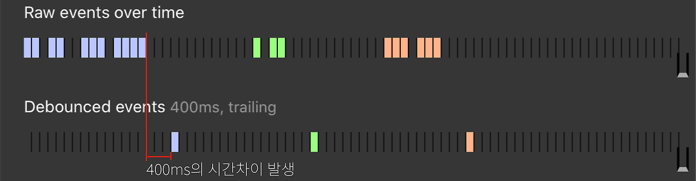

## 41장 타이머

### 41-1 호출 스케줄링
함수 호출을 예약 하려면 타이머 함수를 사용한다.<br>
이를 **호출 스케줄링** 이라 한다

타이머 함수는 ECMAScript 사양에 정의된 빌트인 함수가 아닌 <br> 
브라우저 환경과 Node.js 환경에서 제공되는 **전역개체의 메서드**(호스트 객체)이다

### 41-2 타이머 함수

#### 41.2.1 setTimeout/clearTimeout
setTimeout 함수는 두 번째 인수로 전달받은 시간(ms)으로 단 한 번 동작하는 타이머를 생성한다. <br>
이후 타이머가 만료되면 첫 번째 인수로 전달받은 콜백 함수가 호출된다.

```js
const timerId = setTimeout(() => console.log('Hi'), 1000);
setTimeout((name) => console.log(`Hi ${name}`), 1000, 'min jun');
clearTimeout(timerId);
```


#### 41.2.2 setInterval/clearInterval
setInterval 함수는 두 번째 인수로 전달받은 시간(ms)으로 반복 동작하는 타이머를 생성한다. <br>
이후 타이머가 만료될 때마다 첫 번째 인수로 전달받은 콜백 함수가 반복 호출된다
```js
let count = 1;
const timeoutId = setInterval(()=>{
    console.log(count);	// 1 2 3 4 5 
    if(count++ === 5) clearInterval(timeoutId)
}, 1000);
```


### 41.3 디바운스와 스토틀
디바운스와 스토틀은 짧은 시간 간격으로 연속해서 발생하는 이벤트를 그룹화 해서<br>
과도한 이벤트 핸들러의 호출을 방지하는 프로그래밍 기법이다

#### 41.3.1 디바운스

- 함수를 마지막으로 호출한 후 일정 시간이 경과한 후에만 함수가 실행
- 이벤트를 그룹화하여 특정시간이 지난 후 하나의 이벤트만 발생

#### Trailing Debounce

- 가장 마지막에 실행된 이벤트에 대해서만 실제 함수의 실행을 수행
- 마지막에 발생한 이벤트에 대해서 딜레이 발생
#### Leading Debounce

- 맨 처음의 이벤트에 대해서만 함수를 딱 한 번만 실행, 나머지는 모두 무시

#### 사용
resize 이벤트 처리, input 요소에 입력된 값으로 ajax 요청하는 입력 필드 자동완성 UI 구현, 버튼 중복 클릭 방지 처리 등에 유용하게 사용됨


#### 41.3.1 스로틀

- 연속해서 발생하는 이벤트에 대해서, 특정 시간을 주기로 끊어내는 개념
- 지정된 시간 간격, Time Interval 안에 최대 한 번의 이벤트만 리스닝
- 이벤트를 일정한 주기마다 발생하도록 하는 기술

#### Leading Throttling
- 시스템이 처음 몇 개의 요청이나 이벤트가 제한할때 사용
- 시스템이 초기에 사용자의 처음으로 불러오는 API 요청의 개수를 제한할 수 있다 (예시는 3개로 제한)

#### Trailing Throttling
- 시스템이 일정 시간 동안 특정 작업의 빈도를 제한할때 사용
- 초당 100개의 요청만 처리할 수 있다고 하면, 초과하는 요청은 모두 제한 (예시는 3개로 제한)
#### 사용
scroll 이벤트 처리, 무한 스크롤UI 구현 등에 사용

#### lodash 안의 옵션 선택
