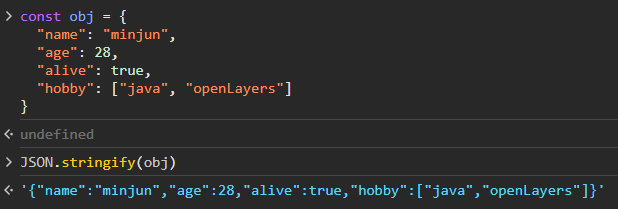

# 43장 Ajax
Ajax 란 자바스크립트를 사용하여 브라우저가 서버에게 비동기 방식으로 데이터를 요청하고 서버가 응답한 데이터를 수신하여 웹페이지를 동적으로 갱신하는 프로그래밍 방식<br>
Ajax 는 web API 인 XMLHttpRequest 객체를 기반으로 동작한다

## JSON
클라이언트와 서버간의 http 통신을 위한 텍스트 데이터 포멧이다.

### JSON 표기 방식
JSON은 자바스크립트의 객체 리터럴과 유사하게 키와 값으로 구성된 순수한 텍스트다.
```json
{
  "name": "minjun",
  "age": 28, 
  "alive": true,
  "hobby": ["java", "openLayers"]
}
```
### JSON.stringify


JSON.stringify 메서드는 객체를 JSON 포맷의 문자열로 변환한다.
### JSON.parse


JSON.parse 메서드는 JSON 포맷의 문자열을 객체로 변환한다.


## XMLHttpRequest
자바스크립트를 사용하여 http 요청을 전송하려면 XMLHttpRequest 객체를 사용한다.
MLHttpRequest 객체는 생성자 함수를 호출하여 생성한다.

```javascript
const xhr = new XMLHttpRequest();
```

## http 요청 전송
1. XMLHttpRequest.prototype.open 메서드로 HTTP 요청을 초기화한다.

2. 필요에 따라 XMLHttpRequest.prototype.setRequestHeader 메서드로 특정 http 요청의 헤더값을 설정한다.
3. XMLHttpRequest.prototype.send 메서드로 http 요청을 전송한다.

```javascript
const xhr = new XMLHttpRequest();

xhr.open('GET', '/user'); //1

xhr.setRequestHeader('content-type', 'application/json'); // 2

xhr.send(); // 3
```

## http 요청 메서드 종류

|요청메서드| 종류      |목적                 | 페이로드 | 
|------ |--------------|---------------------|----|
|GET    |index/retrieve|모든/특정 리소스 취득|x|
|POST   |create        |리소스 생성          |o|
|PUT    |replace       |리소스의 전체 교체   |o|
|PATCH  |modify        |리소스의 일부 수정   |o|
|DELETE |delete        |모든/특정 리소스 삭제|x|


## XMLHttpRequest.prototype.open
서버에 전송할  http 요청을 초기화한다.
```javascript
//method : http 요청메서드
//url : http 요청을 전송할 url
//async : 비동기 요청 여부 , default는 true (비동기로 동작)
xhr.open(method, url[, async]); 
```

## XMLHttpRequest.prototype.send
open 메서드로 초기화된 http 요청을 서버에 전송한다.
- get 
    - 데이터를 url 일부분인 쿼리 문자열(query string)로 전송한다.
- post 
    - 데이터(페이로드)를 요청몸체(body)에 담아 전송한다.

## payload
보내고자 하는 데이터 자체

운송업에서 비롯하였는데, 지급(pay)해야 하는 적화물(load)을 의미합니다. 

유조선 트럭이 20톤의 기름을 운반한다면 트럭의 총 무게는 차체, 운전자 등의 무게 때문에 그것보다 더 될 것이다. 

이 모든 무게를 운송하는데 비용이 들지만, 
고객은 오직 기름의 무게만을 지급(pay)하게 된다.

```json
{
	"status" : 
	"from": "localhost",
	"to": "http://melonicedlatte.com/chatroom/1",
	"method": "GET",
	"data":{ "message" : "There is a cutty dog!" } //pay-load
}
```

send로 페이로드를 전달할때는 반드시 json.stringfy 메서드를 이용하여 직렬화 한 다음 전달해한다.

요청 메소드가 get인 경우 send 메서드에 페이로드로 전달한 인수는 무시되고 요청몸체는 null 로 설정된다.


## XMLHttpRequest.prototype.sendRequestHeader
특정 http 요청의 헤더값을 설정한다.

## content-type
자주 사용하는 요청 헤더
전송할 데이터의 MIME 타입 의 정보를 표현한다.

## http 응답 처리
서버가 전송한 응답을 처리하는경우 XMLHttpRequest 객체가 발생시키는 이벤트를 캐치해야한다.

언제 응답이 클라이언트에 도달할지 알수 없기때문에 readystatechange 이벤트를 통해 http 요청의 현재상태를 확인한다.

readystatechange 이벤트는 readystate 프로퍼티가 변경될때 마다 발생한다.


