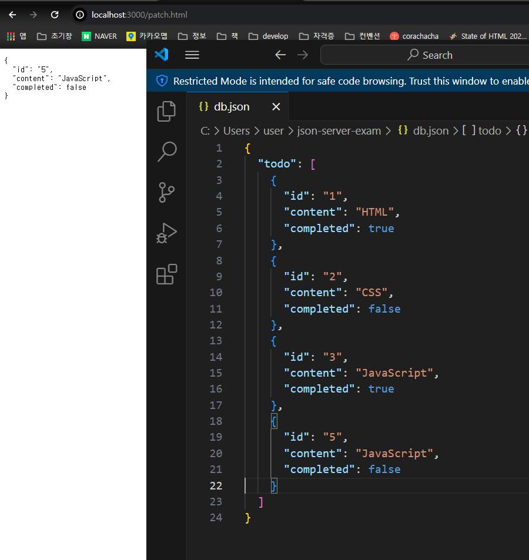

# 44장 REST API

## REST
Http 를 기반으로 클라이언트가 서버의 리소스에 접근하는 방식을 규정한 아키텍처

## REST API
REST를 기반으로 서비스 API 를 구현한 것

### 44.1 REST API 구성
| 구성 요소 | 내용                       | 표현 방법       |
| --- |--------------------------|-------------|
| 자원 | 자원                       | URI(엔드포인트)  |
| 행위 | 자원에 다한 행위                | HTTP 요청 메서드 |
| 표현 | 자원에 대한 행위의 결과 | 페이로드        |

### 44.2 REST API 설계원칙
1. URI는 리소스를 표현해야 한다.
```markdown
#bad
 GET /getTodos/1
 
#good
GET /todos/1
```
2. 리소스에 대한 행위는 HTTP 요청 메서드로 표현한다.
```markdown
# bad
GET /todos/delete/1

#good
DELETE /todos/1
```

### 44.3 JSON Server를 이용한 REST API 실습

### 환경 설정
```shell
# Node.js 프로젝트를 기본 설정으로 초기화
npm init -y   
# 가짜 REST API 서버
npm install json-server --save-dev
# 전역 설치
npm install -g json-server
# db.json 파일을 기반으로 JSON 서버를 실행
json-server--watch db.json
 
```

### GET
todos 리소스에서 id를 사용하여 특정 todo를 취득
```html
<!DOCTYPE html>
<html>
<body>
<pre></pre>
<script defer>
    // XMLHTTPREQuest 객체 생성
    const xhr = new XMLHttpRequest();

    // HTTP 요청 초기화
    // todos리소스에서 id를 사용하여 특정 todo를 취득(retrieve)
    xhr.open('GET', '/todo/1');

    //HTTP 요청 전송
    xhr.send();

    //load 이벤트는 요청이 성공적으로 완료된 경우 발생한다.
    xhr.onload =()=> {
        //status 프로퍼티 값이 200이면 정상적으로 응답된 상태다.
        if(xhr.status ===200){
            document.querySelector('pre').textContent = xhr.response;
        } else{
            console.error('Error', xhr.status, xhr.statusText);
        }
    };
</script>
</body>
</html>
```


### POST
todos 리소스에 새로운 todo(id = 5)를 생성
```html
<!DOCTYPE html>
<html>
  <body>
    <pre></pre>
    <script defer>
      //XMLHttpRequest 객체 생성
      const xhr = new XMLHttpRequest();

      //HTTP 요청 초기화
      //todos 리소스에 새로운 todo를 생성
      xhr.open('POST', '/todo');

      //요청 몸체에 담아 서버로 전송할 페이로드의 MIME 타입을 지정
      xhr.setRequestHeader('content-type', 'application/json');

      //HTTP 요청 전송
      //새로운 todo를 생성하기 위해 페이로드를 서버에 전송해야 한다.
      xhr.send(JSON.stringify({ id:5, content:'Java', completed: false}));

      //load 이벤트는 요청이 성공적으로 오나료된 경우 발생한다.
      xhr.onload=()=>{
        // status ㅡㅍ로퍼티 값이 200(OK) 또는 201(Created)이면 정상적으로 응답된 상태다.
        if(xhr.status ===200 || xhr.status === 201){
          document.querySelector('pre').textContent = xhr.response;
        } else {
          console.error('Error', xhr.status, xhr.statusText);
        }
      }
    </script>
  </body>
</html>
```

### PUT
특정 리소스 전체를 교체 todo(id = 5) java->javaScript , completed -> true
```html
<!DOCTYPE html>
<html>
  <body>
    <pre></pre>
    <script defer>
      // XMLHttpRequest 객체 생성
      const xhr = new XMLHttpRequest();

      //HTTP 요청 초기화
      // todos 리소스에서 id로 todo를 특정하여 id를 제외한 리소스 전체를 교체
      xhr.open('PUT', '/todo/5');

      //요청 몸체에 담아 서버로 전송할 페이로드의 MIME 타입을 지정
      xhr.setRequestHeader('content-type', 'application/json');

      //HTTP 요청 전송
      // 리소스 전체를 교체하기 위해 페이로드를 서버에 전송해야 한다.
      xhr.send(JSON.stringify({ id: 5, content: 'JavaScript', completed: true}));

      //load 이벤트는 요청이 성공적으로 완료된 경우 발생한다.
      xhr.onload =()=>{
        //status 프로퍼티 값이 200이면 정상적으로 응답된 상태다.
        if(xhr.status === 200){
          document.querySelector('pre').textContent = xhr.response;
        } else {
          console.error('Error', xhr.status, xhr.statusText);
        }
      };
    </script>
  </body>
</html>
```


### PATCH
특정 리소스의 일부를 수정 (id = 5) completed -> false
```html
<!DOCTYPE html>
<html>
  <body>
    <pre></pre>
    <script defer>
      // XMLHttpRequest 객체 생성
      const xhr = new XMLHttpRequest();

      //HTTP 요청 초기화
      // todos 리소스에서 id로 todo를 특정하여 completed만 수정
      xhr.open('PATCH', '/todo/5');

      //요청 몸체에 담아 서버로 전송할 페이로드의 MIME 타입을 지정
      xhr.setRequestHeader('content-type', 'application/json');

      //HTTP 요청 전송
      // 리소스 전체를 교체하기 위해 페이로드를 서버에 전송해야 한다.
      xhr.send(JSON.stringify({completed: false}));

      //load 이벤트는 요청이 성공적으로 완료된 경우 발생한다.
      xhr.onload =()=>{
        //status 프로퍼티 값이 200이면 정상적으로 응답된 상태다.
        if(xhr.status === 200){
          document.querySelector('pre').textContent = xhr.response;
        } else {
          console.error('Error', xhr.status, xhr.statusText);
        }
      };
    </script>
  </body>
</html>
```


### DELETE
id를 사용하여 todo 를 삭제 (id = 5)
```html
<!DOCTYPE html>
<html>
  <body>
    <pre></pre>
    <script defer>
      // XMLHttpRequest 객체 생성
      const xhr = new XMLHttpRequest();

      //HTTP 요청 초기화
      // todos 리소스에서 id로 todo를 특정하여 completed만 수정
      xhr.open('DELETE', '/todo/5');

      // HTTP 요청 전송
      xhr.send();

      //load 이벤트는 요청이 성공적으로 완료된 경우 발생한다.
      xhr.onload =()=>{
        //status 프로퍼티 값이 200이면 정상적으로 응답된 상태다.
        if(xhr.status === 200){
          document.querySelector('pre').textContent = xhr.response;
        } else {
          console.error('Error', xhr.status, xhr.statusText);
        }
      };
    </script>
  </body>
</html>
```
