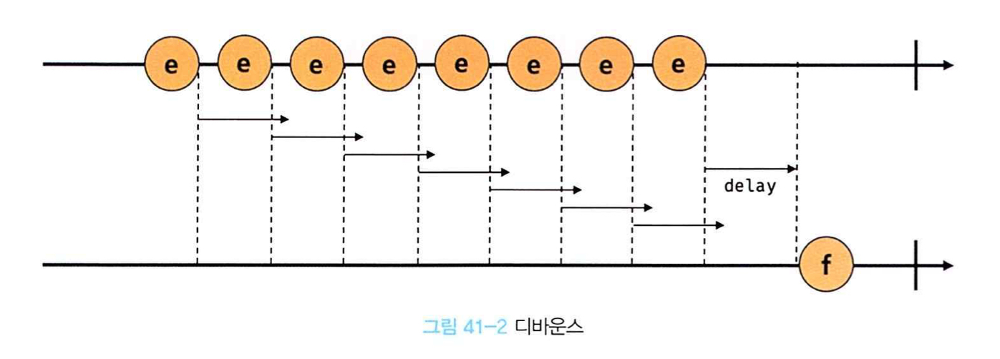

# `41.1` 호출 스케줄링
- 함수를 명시적으로 호출하지 않고 일정 시간이 경과된 이후에 호출 예약.
- 타이머 함수 `setTimeout`과 `setInterval`을 제공하여 콜백 함수를 호출한다.
- `setTimeout`은 일정 시간이 경과된 이후에 한 번만 콜백 함수를 호출하고, `setInterval`은 일정 시간 간격으로 반복 호출.
- JS 엔진은 단 하나의 실행 컨텍스트 스택을 갖기 때문에(싱글 스레드 동작) 비동기 처리 방식으로 동작.

<br/>
<br/>

# `41.2` 타이머 함수
## `41.2.1` setTimeout / clearTimeout
- `setTimeout`은 일정 시간이 경과된 이후에 콜백 함수를 호출.
- `setTimeout`함수의 콜백 함수는 두 번째 인수로 전달받은 시간(밀리초)이 경과한 이후에 한 번 호출된다.

  ```js
  const timeoutId = setTimeout(func|code[, delay, param1, param2, ...]);
  ```

  | 매개변수 | 설명 |
  | --- | --- |
  | func | 타이머가 만료되면 호출할 콜백 함수. |
  | code | 타이머가 만료되면 실행할 코드 문자열. |
  | delay | 타이머가 만료되기 전 대기할 시간(밀리초). 기본값은 0. |
  | param1, param2, ... | 콜백 함수에 전달할 인수. |

  <br/>
  
  ### setTimeout 함수 예제
  ``` js
  // 1초(1000ms) 후 타이머가 만료되면 콜백 함수가 호출된다.
  setTimeout(() => console.log('Hi!'), 1000);

  // 1초(1000ms) 후 타이머가 만료되면 콜백 함수가 호출된다.
  // 이때 콜백 함수에 'Lee'가 인수로 전달된다.
  setTimeout(name => console.log(`Hi! ${name}.`), 1000, 'Lee');

  // 두 번째 인수(delay)를 생략하면 기본값 0이 지정된다.
  setTimeout(() => console.log('Hello!'));
  ```

  <br/>

  ### clearTimeout 함수 예제
  ```javascript
  // 1초(1000ms) 후 타이머가 만료되면 콜백 함수가 호출된다.
  // setTimeout 함수는 생성된 타이머를 식별할 수 있는 고유한 타이머 id를 반환한다.
  const timerId = setTimeout(() => console.log('Hi!'), 1000);

  // setTimeout 함수가 반환한 타이머 id를 clearTimeout 함수의 인수로 전달하여 타이머를
  // 취소한다. 타이머가 취소되면 setTimeout 함수의 콜백 함수가 실행되지 않는다.
  clearTimeout(timerId);
  ```

  <br/>
  <br/>

  ## `41.2.2` setInterval / clearInterval
  - `setInterval`은 두 번째 인수로 전달받은 시간(ms, 1/1000초)으로 반복 동작하는 타이머를 생성.
  - 이후 타이머가 만료될 때마다 첫 번째 인수로 번달받은 콜백 함수를 반복 호출.
  - `setInterval`함수는 생성된 타이머를 식별할 수 있는 고유한 타이머 id를 반환.
  - `setInterval`함수가 반환한 타이머 id는 브라우저 환경인 경우 숫자, Node.js 환경인 경우 객체.
  - `clearInterval`함수는 `setInterval`함수가 반환한 타이머 id를 인수로 전달하여 타이머를 취소.

    ```js
    const intervalId = setInterval(func|code[, delay, param1, param2, ...]);
    ```

    <br/>

    ### setInterval / clearInterval 함수 예제
    ```javascript
    let count = 1;

    // 1초(1000ms) 후 타이머가 만료될 때마다 콜백 함수가 호출된다.
    // setInterval 함수는 생성된 타이머를 식별할 수 있는 고유한 타이머 id를 반환한다.
    const timeoutId = setInterval(() => {
      console.log(count); // 1 2 3 4 5
      // count가 5이면 setInterval 함수가 반환한 타이머 id를 clearInterval 함수의
      // 인수로 전달하여 타이머를 취소한다. 타이머가 취소되면 setInterval 함수의 콜백 함수가
      // 실행되지 않는다.
      if (count++ === 5) clearInterval(timeoutId);
    }, 1000);
    ```

    <br/>
    <br/>

# `41.3` 디바운스와 스로틀
- `scroll`, `resize`, `input`, `mousemove` 등 연속해서 발생하는 이벤트로 인한 성능 문제를 해결하기 위해 사용.

  ```html
  <!DOCTYPE html>
  <html>
  <body>
    <button>click me</button>
    <pre>일반 클릭 이벤트 카운터    <span class="normal-msg">0</span></pre>
    <pre>디바운스 클릭 이벤트 카운터 <span class="debounce-msg">0</span></pre>
    <pre>스로틀 클릭 이벤트 카운터   <span class="throttle-msg">0</span></pre>
    <script>
      const $button = document.querySelector('button');
      const $normalMsg = document.querySelector('.normal-msg');
      const $debounceMsg = document.querySelector('.debounce-msg');
      const $throttleMsg = document.querySelector('.throttle-msg');

      const debounce = (callback, delay) => {
        let timerId;
        return (...args) => {
          if (timerId) clearTimeout(timerId);
          timerId = setTimeout(callback, delay, ...args);
        };
      };

      const throttle = (callback, delay) => {
        let timerId;
        return (...args) => {
          if (timerId) return;
          timerId = setTimeout(() => {
            callback(...args);
            timerId = null;
          }, delay);
        };
      };

      $button.addEventListener('click', () => {
        $normalMsg.textContent = +$normalMsg.textContent + 1;
      });

      $button.addEventListener('click', debounce(() => {
        $debounceMsg.textContent = +$debounceMsg.textContent + 1;
      }, 500));

      $button.addEventListener('click', throttle(() => {
        $throttleMsg.textContent = +$throttleMsg.textContent + 1;
      }, 500));
    </script>
  </body>
  </html>
  ```

  <br/>

## `41.3.1` 디바운스
- 디바운스는 연이어 호출되는 함수 중 마지막 함수 또는 일정 시간이 지난 후 함수를 한 번만 호출.
- 이벤트를 그룹화해서 마지막에 한 번만 이벤트 핸들러가 호출되도록 한다.
- 이벤트 처리나 input요소에 입력된 값으로 ajax 요청하는 입력 필드 자동완성 UI 구현, 버튼 중복 클릭 방지처리 등에 유용하게 사용된다.
- 실무에서는 Underscore.js, Lodash 라이브러리의 `_.debounce` 함수 사용을 권장.

  ```html
  <!DOCTYPE html>
  <html>
  <body>
    <input type="text">
    <div class="msg"></div>
    <script>
      const $input = document.querySelector('input');
      const $msg = document.querySelector('.msg');

      const debounce = (callback, delay) => {
        let timerId;
        // debounce 함수는 timerId를 기억하는 클로저를 반환한다.
        return (...args) => {
          // delay가 경과하기 이전에 이벤트가 발생하면 이전 타이머를 취소하고
          // 새로운 타이머를 재설정한다.
          // 따라서 delay보다 짧은 간격으로 이벤트가 발생하면 callback은 호출되지 않는다.
          if (timerId) clearTimeout(timerId);
          timerId = setTimeout(callback, delay, ...args);
        };
      };

      // debounce 함수가 반환하는 클로저가 이벤트 핸들러로 등록된다.
      // 300ms보다 짧은 간격으로 input 이벤트가 발생하면 debounce 함수의 콜백 함수는
      // 호출되지 않다가 300ms 동안 input 이벤트가 더 이상 발생하면 한 번만 호출된다.
      $input.oninput = debounce(e => {
        $msg.textContent = e.target.value;
      }, 300);
    </script>
  </body>
  </html>
  ```
  
  
  <br/>

## `41.3.2` 스로틀
- 스로틀은 연이어 호출되는 함수 중 일정 시간 간격으로 한 번만 호출.
- 짧은 시간 간격으로 연속해서 발생하는 이벤트를 그룹화해서 일정 시간 간격으로 호출 주기를 만든다.
- throttle 함수에 두 번째 인수로 전달한 시간(delay)이 경과하기 전에 이벤트가 발생하면 아무 것도 하지 않음.
- 이벤트를 그룹화해서 일정 시간 간격으로 핸들러를 호출하는 스로틀은 scroll 이벤트 처리나, 무한스크롤 UI 구현 등에 유용하게 사용.
- 실무에서는 Underscore.js, Lodash 라이브러리의 `_.throttle` 함수 사용을 권장.

  ```html
  <!DOCTYPE html>
  <html>
  <head>
    <style>
      .container {
        width: 300px;
        height: 300px;
        background-color: rebeccapurple;
        overflow: scroll;
      }

      .content {
        width: 300px;
        height: 1000vh;
      }
    </style>
  </head>
  <body>
    <div class="container">
      <div class="content"></div>
    </div>
    <div>
      일반 이벤트 핸들러가 scroll 이벤트를 처리한 횟수:
      <span class="normal-count">0</span>
    </div>
    <div>
      스로틀 이벤트 핸들러가 scroll 이벤트를 처리한 횟수:
      <span class="throttle-count">0</span>
    </div>

    <script>
      const $container = document.querySelector('.container');
      const $normalCount = document.querySelector('.normal-count');
      const $throttleCount = document.querySelector('.throttle-count');

      const throttle = (callback, delay) => {
        let timerId;
        // throttle 함수는 timerId를 기억하는 클로저를 반환한다.
        return (...args) => {
          // delay가 경과하기 이전에 이벤트가 발생하면 아무것도 하지 않다가
          // delay가 경과했을 때 이벤트가 발생하면 새로운 타이머를 재설정한다.
          // 따라서 delay 간격으로 callback이 호출된다.
          if (timerId) return;
          timerId = setTimeout(() => {
            callback(...args);
            timerId = null;
          }, delay);
        };
      };

      let normalCount = 0;
      $container.addEventListener('scroll', () => {
        $normalCount.textContent = ++normalCount;
      });

      let throttleCount = 0;
      // throttle 함수가 반환하는 클로저가 이벤트 핸들러로 등록된다.
      $container.addEventListener('scroll', throttle(() => {
        $throttleCount.textContent = ++throttleCount;
      }, 100));
    </script>
  </body>
  </html>
  ```

  