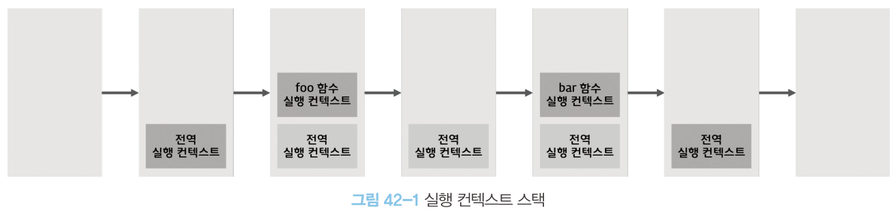
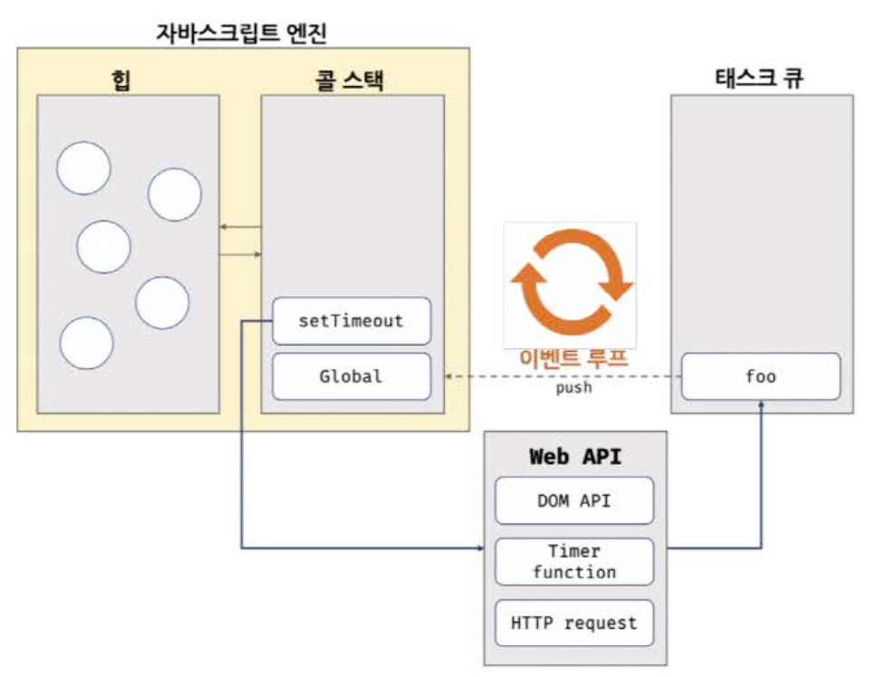

# `42.1` 동기 처리와 비동기 처리
  - 동기 처리(synchronous processing)와 비동기 처리(asynchronous processing)는 프로그램의 실행 순서를 기준으로 구분하는 것.
  
    ```javascript
    const foo = () => {};
    const bar = () => {};

    foo();
    bar();
    ```

    

  <br/>

  - 동기 방식은 실행 순서가 보장된다는 장점이 있지만, 선행 태스크를 종료할 때까지 이후 태스크들이 블로킹 됨.
  - 비동기 방식은 태스크의 실행 순서가 보장되지 않지만, 태스크들이 블로킹 되지 않음.
  - 비동기 함수는 전통적으로 콜백 패턴을 사용.
  - 비동기 처리를 위한 콜백 패턴은 `콜백 헬`을 발생시켜 가독성을 나쁘게 하고, 예외 처리가 곤란하며 여러 개의 비동기 처리를 한 번에 처리하기 어려움.
  - `setTimeout` `setInterval` `HTTP 요청` `이벤트 핸들러` 등이 비동기 처리의 대표적인 예.

<br/>
<br/>

# `42.2` 이벤트 루프와 태스크 큐
- JS 특징 중 하나는 싱글 스레드로 동작한다는 것.
- `이벤트 루프(event loop)`와 `태스크 큐(task queue)`를 통해 비동기 처리를 구현.

  
  
  > ### JS 엔진
  > - **콜 스택(call stack)**
  >   - 실행 컨텐스트가 추가되고 제거되는 스택 자료구조.
  >   - JS 엔진은 단 하나의 콜스택을 사용.
  > - **힙(heap)**
  >   - 객체가 저장되는 메모리 공간. 콜스택의 실행 컨텍스트는 힙에 저장된 객체를 참조.
  >   - 원시값과 달리 객체는 크기가 정해져 있지 않으므로 런타임에 동적 할당.

  <br/>

  > ### 호출 스케줄링
  > - **태스크 큐(task queue/event queue/callback queue)**
  >   - 비동기 함수의 콜백 함수나 이벤트 핸들러가 대기하는 큐.
  > - **이벤트 루프(event loop)**
  >   - 콜 스택이 비어있을 때 태스크 큐의 첫 번째 태스크를 콜 스택으로 이동시키는 역할. (비동기 동작)
  >   - 콜 스택이 비어있지 않으면 대기.

  <br/>
  <br/>

  ```javascript
  function foo() {
    console.log('foo');
  }

  function bar() {
    console.log('bar');
  }

  setTimeout(foo, 0); // 0초(실제는 4ms) 후에 foo 함수가 호출된다.
  bar();
  ```
  
  ## JS 싱글 스레드 동작
  ### 🙌 JS 엔진은 싱글 스레드로 동작하지만, 브라우저는 멀티 스레드로 동작!

    1. 전역 코드가 평가되어 전역 실행 컨택스트가 생성되고 콜 스택에 푸쉬
    2. `setTimeout` 함수가 호출되어 콜 스택에 푸쉬, 함수 실행 컨텍스트 생성
    3.  `setTimeout` 함수가 실행되면 콜 스택에서 팝, `setTimeout` 함수의 콜백 함수가 태스크 큐에 푸쉬
    4. 브라우저가 실행하는 `4-1`과 JS엔진이 실행하는 `4-2` 병행 처리   
        4-1. 브라우저 : 타이머 설정 후 만료되면 태스크 큐에 푸쉬(4ms 후에 콜백함수 태스크 큐에 푸시)
        4-2. JS엔진 : `bar` 함수 호출, 콜 스택에 푸쉬, 함수 실행 컨텍스트 생성 (이 때 foo 함수는 태스크 큐에 대기 중)
    5. 전역 코드 실행이 종료되고 전역 실행 컨텍스트가 콜 스택에서 팝. (콜 스택이 비어있음)
    6. 이벤트 루프가 콜 스택이 비어 있음을 감지하고 태스크 큐의 첫 번째 태스크를 콜 스택으로 이동시킴.(foo 함수 실행 후 종료되면 팝)

