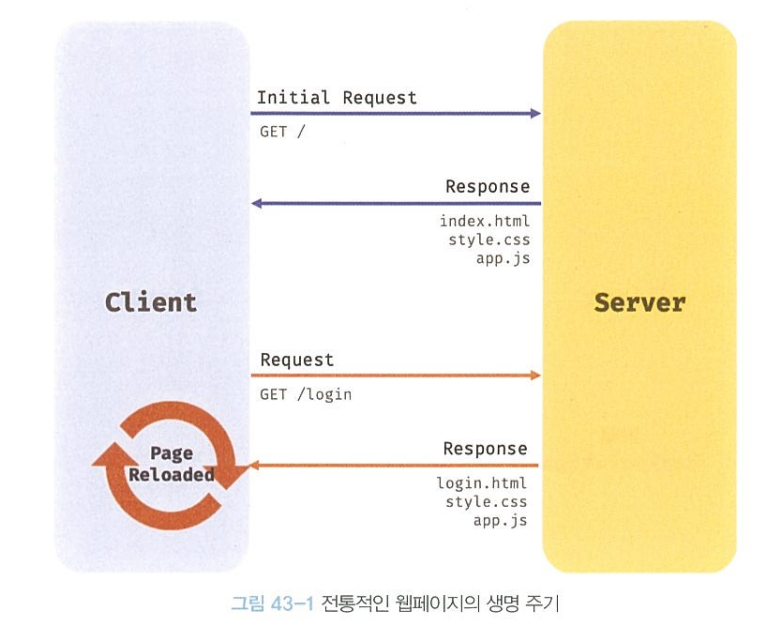
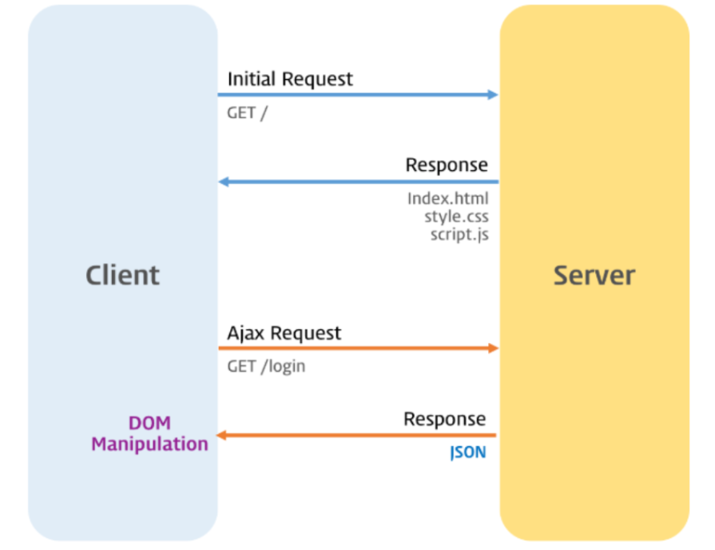

# `43.1` Ajax란?
- `Ajax(Asynchronous JavaScript and XML)`는 비동기 방식으로 서버와 브라우저가 데이터를 교환하는 기술.
- HTML 페이지 이동이나 리렌더링 없이 서버로부터 데이터를 받아와 화면을 갱신할 수 있음.
  ### 기존 웹 페이지의 생명 주기
  
  <br/>

  ### Ajax를 사용한 웹 페이지의 생명 주기
  
  <br/>

# `43.2` JSON
- JSON(JavaScript Object Notation)은 데이터를 효율적으로 교환하기 위한 텍스트 기반의 데이터 교환 포맷.
- JSON은 자바스크립트의 객체 리터럴과 유사하지만 JSON은 문자열로 표현됨.
- JSON은 데이터를 표현하는 데 사용되며, JSON 형식의 문자열을 JSON.stringify 메서드를 사용하여 객체로 변환할 수 있음.

<br/>

## `43.2.1` JSON의 표기 방식
- JSON은 객체, 배열, 문자열, 숫자, 불리언, null을 표현할 수 있음.
- JSON은 반드시 큰 따옴표로 묶어야 함.
  
  ```json
  {
    "name": "Lee",
    "age": 20,
    "alive": true,
    "hobby": ["traveling", "tennis"]
  }
  ```

<br/>

## `43.2.2` JSON.stringify
- JSON.stringify 메서드는 객체나 배열을 JSON 형식의 문자열로 변환.
- client -> server 로 객체를 전송하기 위해 객체를 직렬화(문자열화)하는 데 사용.

  ### 객체 직렬화
  ```javascript
  const obj = {
    name: 'Lee',
    age: 20,
    alive: true,
    hobby: ['traveling', 'tennis']
  };

  // 객체를 JSON 포맷의 문자열로 변환한다.
  const json = JSON.stringify(obj);
  console.log(typeof json, json);
  // string {"name":"Lee","age":20,"alive":true,"hobby":["traveling","tennis"]}

  // 객체를 JSON 포맷의 문자열로 변환하면서 들여쓰기 한다.
  const prettyJson = JSON.stringify(obj, null, 2);
  console.log(typeof prettyJson, prettyJson);
  /*
  string {
    "name": "Lee",
    "age": 20,
    "alive": true,
    "hobby": [
      "traveling",
      "tennis"
    ]
  }
  */

  // replacer 함수. 값의 타입이 Number이면 필터링되어 반환되지 않는다.
  function filter(key, value) {
    // undefined: 반환하지 않음
    return typeof value === 'number' ? undefined : value;
  }

  // JSON.stringify 메서드에 두 번째 인수로 replacer 함수를 전달한다.
  const strFilteredObject = JSON.stringify(obj, filter, 2);
  console.log(typeof strFilteredObject, strFilteredObject);
  /*
  string {
    "name": "Lee",
    "alive": true,
    "hobby": [
      "traveling",
      "tennis"
    ]
  }
  */
  ```
  <br/>

  ### 배열 직렬화
  ```javascript
  const todos = [
    { id: 1, content: 'HTML', completed: false },
    { id: 2, content: 'CSS', completed: true },
    { id: 3, content: 'Javascript', completed: false }
  ];

  // 배열을 JSON 포맷의 문자열로 변환한다.
  const json = JSON.stringify(todos, null, 2);
  console.log(typeof json, json);
  /*
  string [
    {
      "id": 1,
      "content": "HTML",
      "completed": false
    },
    {
      "id": 2,
      "content": "CSS",
      "completed": true
    },
    {
      "id": 3,
      "content": "Javascript",
      "completed": false
    }
  ]
  */
  ```


## `42.2.3` JSON.parse
- JSON.parse 메서드는 JSON 형식의 문자열을 객체로 변환.
- server -> client 로 전송된 JSON 형식의 문자열을 객체로 파싱(역직렬화)하는 데 사용.

  ### JSON 문자열을 객체로 파싱
  ```javascript
  const obj = {
    name: 'Lee',
    age: 20,
    alive: true,
    hobby: ['traveling', 'tennis']
  };

  // 객체를 JSON 포맷의 문자열로 변환한다.
  const json = JSON.stringify(obj);

  // JSON 포맷의 문자열을 객체로 변환한다.
  const parsed = JSON.parse(json);
  console.log(typeof parsed, parsed);
  // object {name: "Lee", age: 20, alive: true, hobby: ["traveling", "tennis"]}
  ```

  ### JSON 배열을 객체로 파싱
  ```javascript
  const todos = [
    { id: 1, content: 'HTML', completed: false },
    { id: 2, content: 'CSS', completed: true },
    { id: 3, content: 'Javascript', completed: false }
  ];

  // 배열을 JSON 포맷의 문자열로 변환한다.
  const json = JSON.stringify(todos);

  // JSON 포맷의 문자열을 배열로 변환한다. 배열의 요소까지 객체로 변환된다.
  const parsed = JSON.parse(json);
  console.log(typeof parsed, parsed);
  /*
  object [
    { id: 1, content: 'HTML', completed: false },
    { id: 2, content: 'CSS', completed: true },
    { id: 3, content: 'Javascript', completed: false }
  ]
  */
  ```

<br/>
<br/>

# `43.3` XMLHttpRequest
- `XMLHttpRequest` 객체는 서버와 상호작용하기 위한 객체.
- `XMLHttpRequest` 객체를 사용하면 서버로부터 데이터를 받아오거나 서버로 데이터를 전송할 수 있음.

  <br/>

  ## `43.3.1` XMLHttpRequest 객체 생성
  - `XMLHttpRequest` 객체는 `new XMLHttpRequest()` 생성자 함수로 생성.
  - Web API이므로 브라우저 환경에서만 사용 가능.

    ```javascript
    // XMLHttpRequest 객체 생성
    const xhr = new XMLHttpRequest();
    ```

  <br/>

  ## `43.3.2` XMLHttpRequest 객체의 프로퍼티와 메서드
  
  ### XMLHttpRequest 객체의 프로토타입 프로퍼티
  | 프로퍼티 | 설명 |
  | --- | --- |
  | `readystate` | HTTP 요청의 현재 상태를 나타내는 정수 |
  | `status` | HTTP 응답 상태 코드 |
  | `statusText` | HTTP 응답 상태 메시지 |
  | `responseType` | 서버로부터 받은 HTTP 응답 데이터의 타입 |
  | `response` | 서버로부터 받은 응답 데이터 |
  | `responseText` | 서버로부터 받은 응답 데이터를 문자열로 반환 |

  ---

  ### XMLHttpRequest 객체의 이벤트 핸들러 프로퍼티
  | 프로퍼티 | 설명 |
  | --- | --- |
  | `onreadystatechange` | readyState 프로퍼티 값이 변경될 때마다 호출되는 이벤트 핸들러 |
  | `onloadstart` | HTTP 요청이 시작될 때 호출되는 이벤트 핸들러 |
  | `onprogress` | HTTP 요청이 진행 중일 때 호출되는 이벤트 핸들러 |
  | `onbort` | HTTP 요청이 중단될 때 호출되는 이벤트 핸들러 |
  | `onerror` | HTTP 요청이 실패할 때 호출되는 이벤트 핸들러 |
  | `onload` | HTTP 요청이 성공적으로 완료될 때 호출되는 이벤트 핸들러 |
  | `ontimeout` | HTTP 요청이 시간 초과될 때 호출되는 이벤트 핸들러 |
  | `onloadend` | HTTP 요청이 완료될 때 호출되는 이벤트 핸들러 |

  ---

  ### XMLHttpRequest 객체의 메서드

  | 메서드 | 설명 |
  | --- | --- |
  | `open` | HTTP 요청 초기화. |
  | `send` | HTTP 요청 전송. |
  | `abort` | HTTP 요청 중단. |
  | `setRequestHeader` | HTTP 요청 헤더 설정. |
  | `getResponseHeader` | HTTP 응답 헤더 반환. |

  ---

  ### XMLHttpRequest 객체의 정적 프로퍼티
  | 프로퍼티 | 값 | 설명 |
  | --- | --- | --- |
  | `UNSENT` | 0 | open()이 호출되지 않은 상태 |
  | `OPENED` | 1 | open()이 호출된 상태 |
  | `HEADERS_RECEIVED` | 2 | send()가 호출되고 응답 헤더를 받은 상태 |
  | `LOADING` | 3 | 응답 데이터를 받는 중인 상태 |
  | `DONE` | 4 | 요청이 완료된 상태 |

  <br/>

## `43.3.3` HTTP 요청 전송
  
  ### HTTP 요청 전송 순서

  ```javascript
  // 1. XMLHttpRequest 객체 생성
  const xhr = new XMLHttpRequest();

  // 2. HTTP 요청 초기화
  xhr.open('GET', '/users');

  // 3. HTTP 요청 헤더 설정
  // 클라이언트가 서버로 전송할 데이터의 MIME 타입 지정: json
  xhr.setRequestHeader('content-type', 'application/json');

  // 4. HTTP 요청 전송
  xhr.send();
  ```

  <br/>

  ### XMLHttpRequest.prototype.open
  
  ``` js
  // 서버에 전송할 HTTP 요청 초기화
    xhr.open(method, url[, async]);
  ```
  - **open 메서드 매개변수**
  
    | 매개변수 | 설명 |
    | --- | --- |
    | `method` | HTTP 요청 메서드. GET, POST, PUT, DELETE 등 |
    | `url` | HTTP 요청을 전송할 URL |
    | `async` | 비동기 방식으로 요청할지 여부. 기본값은 true |

  <br/>

  - **CRUD 메서드**

    | HTTP 요청 메서드 | 종류 | 목적 | 페이로드 |
    | --- | --- | --- | --- |
    | `GET` | index/retrieve | 서버에서 데이터를 가져올 때 사용 | X |
    | `POST` | create | 서버에 데이터를 추가할 때 사용 | O |
    | `PUT` | update | 서버의 데이터를 갱신할 때 사용 | O |
    | `PATCH` | update | 서버의 데이터를 일부만 갱신할 때 사용 | O |
    | `DELETE` | delete | 서버의 데이터를 삭제할 때 사용 | X |

  <br/>

  ### XMLHttpRequest.prototype.send
  - `open` 메서드로 초기화된 HTTP 요청을 서버에 전송
    - `GET` : 데이터를 URL의 일부분인 쿼리 문자열(query string)로 전송.
    - `POST` : HTTP 요청의 데이터(페이로드)를 body에 담아 전송.
  - `send` 메서드는 요청 몸체(body)에 데이터(페이로드)를 인수로 전달할 수 있음.

    ```javascript
    xhr.send(JSON.stringify({ id: 1, content: 'HTML', completed: false }));
    ```

  - HTTP 요청 메서드가 `GET`인 경우 send 메서드에 페이로드로 전달한 인수는 무시되고 body는 null로 설정됨.

  <br/>

  ### XMLHttpRequest.prototype.setRequestHeader
  - `setRequestHeader` 메서드는 HTTP 요청 헤더를 설정.
  - 클라이언트가 서버로 전송할 데이터의 MIME 타입을 지정할 수 있음.

    ```javascript
    // XMLHttpRequest 객체 생성
    const xhr = new XMLHttpRequest();

    // HTTP 요청 초기화
    xhr.open('POST', '/users');

    // HTTP 요청 헤더 설정
    // 클라이언트가 서버로 전송할 데이터의 MIME 타입 지정: json
    xhr.setRequestHeader('content-type', 'application/json');

    // HTTP 요청 전송
    xhr.send(JSON.stringify({ id: 1, content: 'HTML', completed: false }));
    ```

  <br/>

  ## `43.3.4` HTTP 응답 처리
  - 이벤트 핸들러 프로퍼티 중 HTTP 요청의 현재 상태를 나타내는 readyState 프로퍼티 값이 변경될 때마다 호출되는 `onreadystatechange` 이벤트 핸들러를 사용하여 HTTP 응답을 처리.
  - `XMLHttpRequest` 객체는 브라우저에서 제공하는 Web API이므로 브라우저 환경에서만 사용 가능.
  - HTTP 요청을 전송하고 응답을 받으려면 서버가 필요.

    ```javascript
    // XMLHttpRequest 객체 생성
    const xhr = new XMLHttpRequest();

    // HTTP 요청 초기화
    // https://jsonplaceholder.typicode.com은 Fake REST API를 제공하는 서비스다.
    xhr.open('GET', 'https://jsonplaceholder.typicode.com/todos/1');

    // HTTP 요청 전송
    xhr.send();

    // readystatechange 이벤트는 HTTP 요청의 현재 상태를 나타내는 readyState 프로퍼티가
    // 변경될 때마다 발생한다.
    xhr.onreadystatechange = () => {
      // readyState 프로퍼티는 HTTP 요청의 현재 상태를 나타낸다.
      // readyState 프로퍼티 값이 4(XMLHttpRequest.DONE)가 아니면 서버 응답이 완료되지 상태다.
      // 만약 서버 응답이 아직 완료되지 않았다면 아무런 처리를 하지 않는다.
      if (xhr.readyState !== XMLHttpRequest.DONE) return;

      // status 프로퍼티는 응답 상태 코드를 나타낸다.
      // status 프로퍼티 값이 200이면 정상적으로 응답된 상태이고
      // status 프로퍼티 값이 200이 아니면 에러가 발생한 상태다.
      // 정상적으로 응답된 상태라면 response 프로퍼티에 서버의 응답 결과가 담겨 있다.
      if (xhr.status === 200) {
        console.log(JSON.parse(xhr.response));
        // {userId: 1, id: 1, title: "delectus aut autem", completed: false}
      } else {
        console.error('Error', xhr.status, xhr.statusText);
      }
    };
    ```

<br/>
<br/>

---

<br/>
<br/>

### 💡 서버 응답이 완료되면 HTTP응답 상태 코드(xhr.status)가 `200`인지 확인.
- HTTP 응답 상태 코드가 200이면 정상적으로 응답된 상태이고, response 프로퍼티에 서버의 응답 결과가 담겨 있음.
- HTTP 응답 상태 코드가 200이 아니면 에러가 발생한 상태이므로 에러 처리를 한다.
- `readyState`이벤트나 `load` 이벤트를 사용하여 서버 응답이 완료되었는지 확인할 수 있음.

  ```javascript
  // XMLHttpRequest 객체 생성
  const xhr = new XMLHttpRequest();

  // HTTP 요청 초기화
  // https://jsonplaceholder.typicode.com은 Fake REST API를 제공하는 서비스다.
  xhr.open('GET', 'https://jsonplaceholder.typicode.com/todos/1');

  // HTTP 요청 전송
  xhr.send();

  // load 이벤트는 HTTP 요청이 성공적으로 완료된 경우 발생한다.
  xhr.onload = () => {
    // status 프로퍼티는 응답 상태 코드를 나타낸다.
    // status 프로퍼티 값이 200이면 정상적으로 응답된 상태이고
    // status 프로퍼티 값이 200이 아니면 에러가 발생한 상태다.
    // 정상적으로 응답된 상태라면 response 프로퍼티에 서버의 응답 결과가 담겨 있다.
    if (xhr.status === 200) {
      console.log(JSON.parse(xhr.response));
      // {userId: 1, id: 1, title: "delectus aut autem", completed: false}
    } else {
      console.error('Error', xhr.status, xhr.statusText);
    }
  };
  ```
