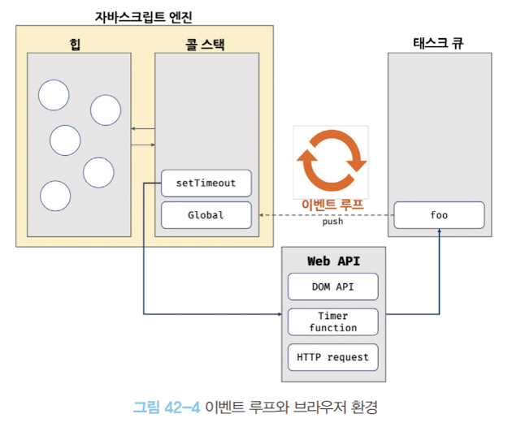
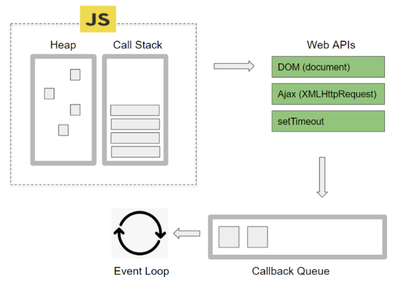
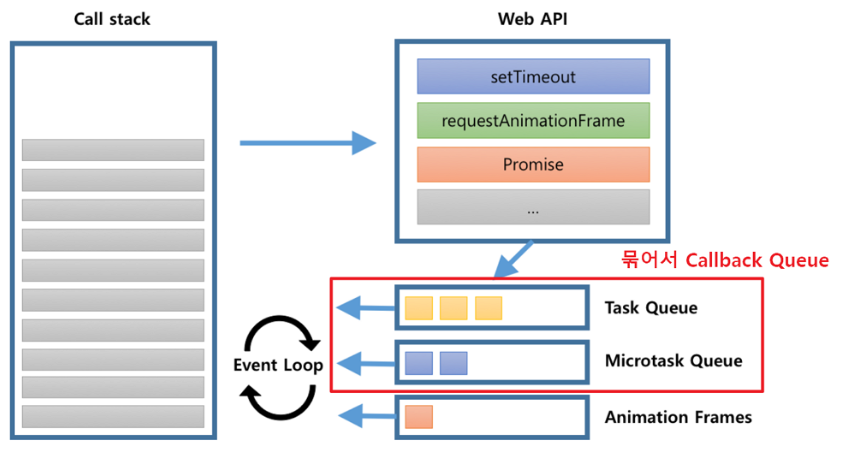
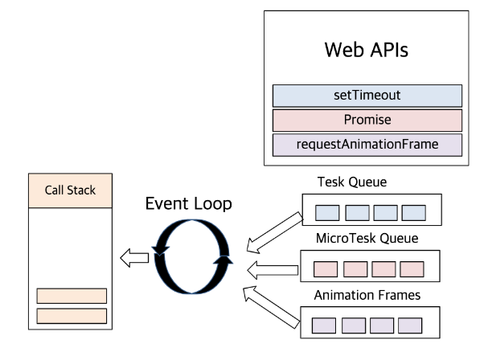

# 42장 비동기 프로그래밍

## 동기 처리와 비동기 처리
### 동기 처리
- 현재 실행 중인 태스크가 종료할 때까지 다음에 실행될 태스크가 대기하는 방식
- 태스크를 순서대로 하나씩 처리하므로 실행 순서가 보장된다는 장점
- 앞선 태스크가 종료할 때까지 이후 태스크들이 블로킹되는 단점
### 비동기 처리
- 반대로 현재 실행 중인 태스크가 종료되지 않은 상태라 해도 다음 태스크를 곧바로 실행하는 방식
- 태스크의 실행 순서가 보장되지 않는 단점

자바스크립트 엔진은 단 하나의 실행 컨텍스트 스택을 갖는다.
- 자바스크립트 엔진은 한 번에 하나의 태스크만 실행할 수 있는 싱글 스레드 방식으로 동작한다.

## 자바스크립트가 싱글 스레드인 이유
자바스크립트는 웹 브라우저에서 간단한 스크립트 동작을 수행하는 데 주로 사용되었기 때문에 복잡한 병렬 처리를 필요로 하지 않아, 
메모리 사용량이 적고, 동기화 문제를 피할 수 있는 싱글 스레드로 구현

## 이벤트 루프와 태스크 큐

자바스크립트의 동시성을 지원하는 것이 바로 이벤트 루프다.
### 구성
- 콜 스택 
  - 소스코드 평가 과정에서 생성된 실행 컨텍스트가 추가되고 제거되는 스택 자료구조인 실행 컨텍스트 스택
- 힙
  - 객체가 저장되는 메모리 공간. 
  - 콜 스택의 요소인 실행 컨텍스트는 힙에 저장된 객체를 참조
- 태스크 큐 
  -  비동기 함수의 콜백 함수 또는 이벤트 핸들러가 일시적으로 보관되는 영역

### 이벤트 루프 동작
  
  - 비동기 콜백 함수는 태스크 큐에 푸시되어 대기하다가 콜 스택이 비게 되면,
    즉, 호출된 함수가 모두 종료하면 그때 콜 스택에 푸시되어 실행 
### 이벤트 루프 가능 이유
  - 자바스크립트 엔진은 싱글 스레드 방식으로 동작하지만.
    브라우저는 멀티 스레드로 동작한다. 고로 비동기적인 실행이 가능하다.

### 이벤트 루프 예제
- http://latentflip.com/loupe/?code=JC5vbignYnV0dG9uJywgJ2NsaWNrJywgZnVuY3Rpb24gb25DbGljaygpIHsKICAgIHNldFRpbWVvdXQoZnVuY3Rpb24gdGltZXIoKSB7CiAgICAgICAgY29uc29sZS5sb2coJ1lvdSBjbGlja2VkIHRoZSBidXR0b24hJyk7ICAgIAogICAgfSwgMjAwMCk7Cn0pOwoKY29uc29sZS5sb2coIkhpISIpOwoKc2V0VGltZW91dChmdW5jdGlvbiB0aW1lb3V0KCkgewogICAgY29uc29sZS5sb2coIkNsaWNrIHRoZSBidXR0b24hIik7Cn0sIDUwMDApOwoKY29uc29sZS5sb2coIldlbGNvbWUgdG8gbG91cGUuIik7!!!PGJ1dHRvbj5DbGljayBtZSE8L2J1dHRvbj4%3D

### webapi
- 브라우저에서 제공하는 다양한 API
- 브라우저(Chrome)에서 멀티 스레드로 구현되어 있어 비동기적 작업 가능
- 종류
  - DOM : HTML 문서의 구조와 내용을 표현하고 조작할 수 있는 객체
  - XMLHttpRequest: 서버와 비동기적으로 데이터를 교환할 수 있는 객체.
  - Timer API: 일정한 시간 간격으로 함수를 실행하거나 지연시키는 메소드들을 제공
  - Console API : 개발자 도구에서 콘솔 기능을 제공
  - Canvas API: "<canvas" 요소를 통해 그래픽을 그리거나 애니메이션을 만들 수 있는 메소드들을 제공
### Callback Queue

- 여러가지 큐를 묶어 총칭하는 개념
- 종류
  - Task Queue (macrotask Queue) :  동기로 처리되는 함수들의 콜백 함수가 들어가는 큐
  - Microtask Queue : 우선적으로 비동기로 처리되는 함수들의 콜백 함수가 들어가는 큐
  - AnimationFrame Queue : 브라우저 애니메이션 작업에 대한 처리 , repaint 직전에 AnimationFrame Queue에 있는 작업들을 전부 처리

### 총칭

## 참조
- https://velog.io/@qkrtofha94/%EB%AA%A8%EB%8D%98-%EC%9E%90%EB%B0%94%EC%8A%A4%ED%81%AC%EB%A6%BD%ED%8A%B8-Deep-Dive-42%EC%9E%A5-%EB%B9%84%EB%8F%99%EA%B8%B0%ED%94%84%EB%A1%9C%EA%B7%B8%EB%9E%98%EB%B0%8D
- https://inpa.tistory.com/entry/%F0%9F%94%84-%EC%9E%90%EB%B0%94%EC%8A%A4%ED%81%AC%EB%A6%BD%ED%8A%B8-%EC%9D%B4%EB%B2%A4%ED%8A%B8-%EB%A3%A8%ED%94%84-%EA%B5%AC%EC%A1%B0-%EB%8F%99%EC%9E%91-%EC%9B%90%EB%A6%AC
- https://iamsjy17.github.io/javascript/2019/07/20/how-to-works-js.html