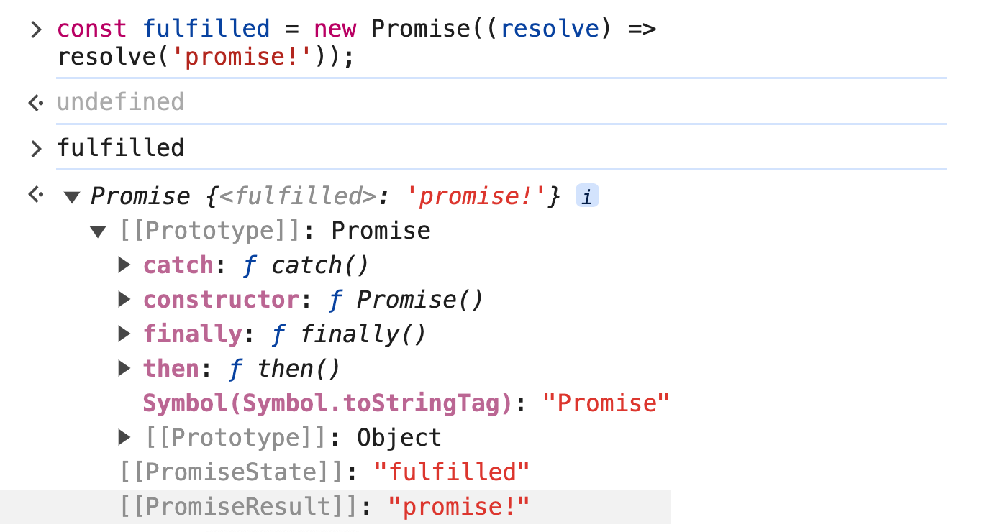
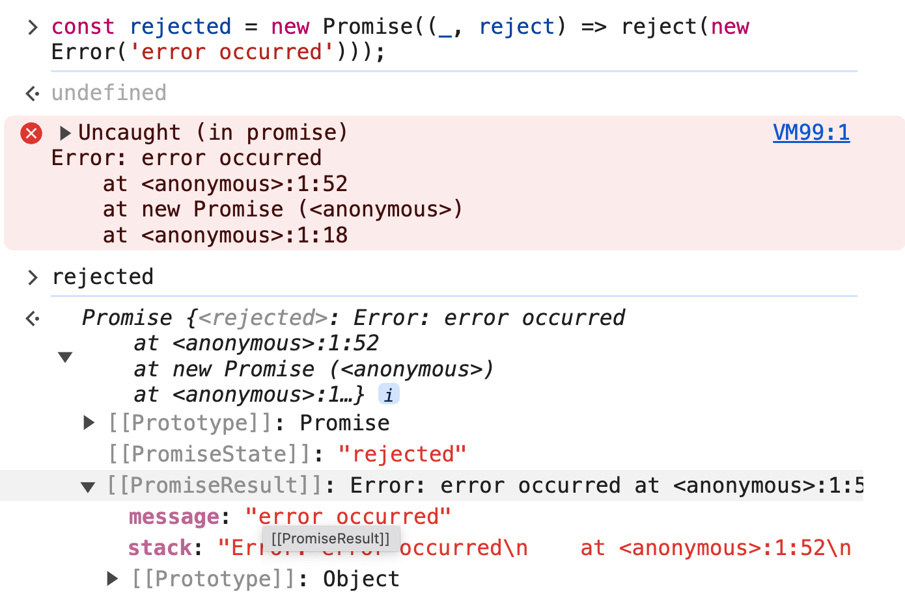

# `45.1` 비동기 처리를 위한 콜백 패턴의 단점

> - 자바스크립트는 비동기 처리를 위한 하나의 패턴으로 콜백 함수를 사용.
> - 전통적인 콜백 패턴은 콜백 헬로 인해 가독성이 나쁘고 비동기 처리 중 발생한 에러의 처리가 곤란함.

<br/>
<br/>

## `45.1.1` 콜백 헬

- `get`함수는 비동기 함수이며, 콜백 함수를 인수로 전달받아 비동기 처리 결과를 콜백 함수에 전달.
- 비동기 함수 내부의 비동기 동작 코드는 비동기 함수가 종료된 이후에 완료됨.
- 비동기 함수 내부의 비동기로 동작하는 코드에서 처리 결과를 외부로 반환하거나 상위 스코프의 변수에 할당하면 기대대로 동작하지 않음.

  ```javascript
  // GET 요청을 위한 비동기 함수
  const get = (url) => {
    const xhr = new XMLHttpRequest();
    xhr.open('GET', url);
    xhr.send();

    xhr.onload = () => {
      if (xhr.status === 200) {
        // 서버의 응답을 콘솔에 출력한다.
        console.log(JSON.parse(xhr.response));
      } else {
        console.error(`${xhr.status} ${xhr.statusText}`);
      }
    };
  };

  // id가 1인 post를 취득
  get('https://jsonplaceholder.typicode.com/posts/1');
  /*
  {
    "userId": 1,
    "id": 1,
    "title": "sunt aut facere ...",
    "body": "quia et suscipit ..."
  }
  */
  ```

<br/>
<br/>

- `setTimeout` 함수는 비동기 함수로서 콜백 함수를 인수로 전달받아 지정된 시간 이후에 콜백 함수를 호출.
- `setTimeout` 함수는 비동기 함수이므로 콜백 함수의 처리 결과를 외부로 반환하거나 상위 스코프의 변수에 할당하지 못함.

  ```javascript
  let g = 0;

  // 비동기 함수인 setTimeout 함수는 콜백 함수의 처리 결과를 외부로 반환하거나
  // 상위 스코프의 변수에 할당하지 못한다.
  setTimeout(() => {
    g = 100;
  }, 0);
  console.log(g); // 0
  ```

<br/>
<br/>

- `get` 함수가 비동기인 이유는 함수 내부의 `onload` 이벤트 핸들러가 비동기로 동작하기 때문.
- `get` 함수를 호출하면 ?

  1. `GET` 요청을 전송
  2. `onload` 이벤트 핸들러를 둥록
  3. `undefined`를 반환하고 즉시 종료.

  ```javascript
  // GET 요청을 위한 비동기 함수
  const get = (url) => {
    const xhr = new XMLHttpRequest();
    xhr.open('GET', url);
    xhr.send();

    xhr.onload = () => {
      if (xhr.status === 200) {
        // ① 서버의 응답을 반환한다.
        return JSON.parse(xhr.response);
      }
      console.error(`${xhr.status} ${xhr.statusText}`);
    };
  };

  // ② id가 1인 post를 취득
  const response = get('https://jsonplaceholder.typicode.com/posts/1');
  console.log(response); // undefined
  ```

  > ### 이벤트 핸들러 실행 과정
  >
  > 1. 이벤트 핸들러의 평가
  > 2. 이벤트 핸들러의 실행 컨텍스트 생성
  > 3. 콜 스택에 푸시
  > 4. 이벤트 핸들러 실행

  > ### 비동기 함수는 처리 결과를 외부에 반환할 수 없고<br/>상위 스코프의 변수에 할당할 수도 없다!
  >
  > 🙌 비동기 함수의 처리 결과(서버의 응답 등)에 대한 후속처리는 비동기 함수 내부에서 수행  
  > 💡 비동기 함수에 비동기 함수처리 결과에 대한 후속처리 콜백 함수를 전달하는 것이 일반적  
  > 🌟 필요에 따라 비동기 처리가 성공, 실패하는 경우에 따른 콜백함수를 전달.

  <br/>
  <br/>

- 콜백 함수를 인수로 전달받아 비동기 처리 결과를 콜백 함수에 전달.
- 콜백 함수 호출이 중첩되어 복잡도가 높아지는 현상을 `콜백 헬(callback hell)`이라 한다.

  ```javascript
  // GET 요청을 위한 비동기 함수
  const get = (url, callback) => {
    const xhr = new XMLHttpRequest();
    xhr.open('GET', url);
    xhr.send();

    xhr.onload = () => {
      if (xhr.status === 200) {
        // 서버의 응답을 콜백 함수에 전달하면서 호출하여 응답에 대한 후속 처리를 한다.
        callback(JSON.parse(xhr.response));
      } else {
        console.error(`${xhr.status} ${xhr.statusText}`);
      }
    };
  };

  const url = 'https://jsonplaceholder.typicode.com';

  // id가 1인 post의 userId를 취득
  get(`${url}/posts/1`, ({ userId }) => {
    console.log(userId); // 1
    // post의 userId를 사용하여 user 정보를 취득
    get(`${url}/users/${userId}`, (userInfo) => {
      console.log(userInfo); // {id: 1, name: "Leanne Graham", username: "Bret",...}
    });
  });
  ```

  ```javascript
  // callback hell의 전형적인 사례 🥵
  get('/step1', (a) => {
    get(`/step2/${a}`, (b) => {
      get(`/step3/${b}`, (c) => {
        get(`/step4/${c}`, (d) => {
          console.log(d);
        });
      });
    });
  });
  ```

<br/>
<br/>

### `45.1.2` 에러 처리의 한계

- 비동기 처리를 위한 콜백 패턴의 가장 심각한 문제는 `에러처리`의 한계.
- 에러는 호출자(caller) 방향으로 전파된다.
- 콜백 함수 내부에서 발생한 에러는 콜백 함수를 호출한 함수가 아닌 호출자 방향으로 전파되어 호출자가 콜백 함수 내부에서 발생한 에러를 캐치하지 못한다.

  ```javascript
  try {
    setTimeout(() => {
      throw new Error('Error!');
    }, 1000);
  } catch (e) {
    // 에러를 캐치하지 못한다
    console.error('캐치한 에러', e);
  }
  ```

<br/>
<br/>
<br/>

# `45.2` 프로미스의 생성

- `promise` 생성자 함수를 `new` 연산자와 함께 호출하면 `promise` 인스턴스 객체를 생성.
- `promise` 인스턴스 객체는 `비동기 처리 상태`와 `비동기 처리 결과`를 관리.
- 콜백 함수는 성공 `resolve`와 실패 `reject`함수를 인수로 전달받음.

  ```javascript
  // GET 요청을 위한 비동기 함수
  const promiseGet = (url) => {
    return new Promise((resolve, reject) => {
      const xhr = new XMLHttpRequest();
      xhr.open('GET', url);
      xhr.send();

      xhr.onload = () => {
        if (xhr.status === 200) {
          // 성공적으로 응답을 전달받으면 resolve 함수를 호출한다.
          resolve(JSON.parse(xhr.response));
        } else {
          // 에러 처리를 위해 reject 함수를 호출한다.
          reject(new Error(xhr.status));
        }
      };
    });
  };

  // promiseGet 함수는 프로미스를 반환한다.
  promiseGet('https://jsonplaceholder.typicode.com/posts/1');
  ```

    <br/>

  ### 프로미스의 상태 정보

  | 프로미스 상태 | 의미                                  | 상태 변경 조건                                                       |
  | ------------- | ------------------------------------- | -------------------------------------------------------------------- |
  | `pending`     | 비동기 처리가 아직 수행되지 않은 상태 | `new Promise` 생성자 함수가 호출되어 프로미스 인스턴스가 생성된 직후 |
  | `fulfilled`   | 비동기 처리가 수행된 상태             | `resolve` 함수가 호출된 상태                                         |
  | `rejected`    | 비동기 처리가 실패한 상태             | `reject` 함수가 호출된 상태                                          |

  <br/>

  ### settled 상태

  - settled 상태는 `fulfilled`또는 `rejected` 상태와 상관없이 `pending`이 아닌 상태로 비동기 처리가 수행된 상태.
  - 프로미스는 `pending`상태에서 `fulfilled` 또는 `rejected` 상태로 전이되어 settled 상태가 됨.

    ```javascript
    // fulfilled된 프로미스
    const fulfilled = new Promise((resolve) => resolve('promise!'));
    ```

    

    ```javascript
    // rejected된 프로미스
    const rejected = new Promise((_, reject) => reject(new Error('error!')));
    ```

    

  <br/>
  <br/>

# `45.3` 프로미스의 후속 처리 메서드

## `45.3.1` Promise.prototype.then

- `then` 메서드는 두개의 콜백 함수를 인수로 전달받음.
- 첫 번째 콜백 함수는 성공 콜백 함수로, 프로미스가 `fulfilled` 상태가 되면 비동기 처리 결과를 인수로 전달 받음.
- 두 번째 콜백 함수는 실패 콜백 함수로, 프로미스가 `rejected` 상태가 되면 에러를 인수로 전달받음.

  ```javascript
  // fulfilled
  new Promise((resolve) => resolve('fulfilled')).then(
    (v) => console.log(v),
    (e) => console.error(e)
  ); // fulfilled

  // rejected
  new Promise((_, reject) => reject(new Error('rejected'))).then(
    (v) => console.log(v),
    (e) => console.error(e)
  ); // Error: rejected
  ```

    <br/>
    <br/>

  ## `45.3.2` Promise.prototype.catch

  - `catch` 메서드는 then(undefined, onRejected)와 동일한 기능을 수행.
  - `catch` 메서드는 `rejected` 상태의 프로미스를 처리하기 위한 메서드.

    ```javascript
    // rejected
    new Promise((_, reject) => reject(new Error('rejected')))
      .then(undefined, e => console.log(e)); // Error: rejected
      .catch(e => console.log(e)); // Error: rejected ✅
    ```

    <br/>
    <br/>

  ## `45.3.3` Promise.prototype.finally

  - `finally` 메서드는 프로미스의 성공 또는 실패와 상관없이 무조건 실행되는 콜백 함수를 등록.
  - `then` `catch`와 마찬가지로 프로미스를 반환.

        ```javascript
        const promiseGet = (url) => {
          return new Promise((resolve, reject) => {
            const xhr = new XMLHttpRequest();
            xhr.open('GET', url);
            xhr.send();

            xhr.onload = () => {
              if (xhr.status === 200) {
                // 성공적으로 응답을 전달받으면 resolve 함수를 호출한다.
                resolve(JSON.parse(xhr.response));
              } else {
                // 에러 처리를 위해 reject 함수를 호출한다.
                reject(new Error(xhr.status));
              }
            };
          });
        };

        // promiseGet 함수는 프로미스를 반환한다.
        promiseGet('https://jsonplaceholder.typicode.com/posts/1')
          .then((res) => console.log(res))
          .catch((err) => console.error(err))
          .finally(() => console.log('Bye!'));
        ```

    <br/>
    <br/>
    <br/>

# `45.4` 프로미스의 에러 처리

- 프로미스의 에러 처리는 `then` 메서드의 콜백 함수 또는 `catch`,`finally` 메서드를 통해 수행하는 것을 권장.

  ```javascript
  promiseGet('https://jsonplaceholder.typicode.com/todos/1')
    .then((res) => console.xxx(res))
    .catch((err) => console.error(err)); // TypeError: console.xxx is not a function
  ```

<br/>
<br/>
<br/>

# `45.5` 프로미스 체이닝

- `then` `catch` `finally` 후속 처리 메서드는 프로미스를 반환.
- 프로미스 체이닝을 통해 후속처리하는 콜백 패턴은 가독성이 좋지 않아 `async/await` 문법을 권장.

  ```javascript
  const url = 'https://jsonplaceholder.typicode.com';

  // 1. 프로미스 체이닝
  promiseGet(`${url}/posts/1`)
    .then(({ userId }) => promiseGet(`${url}/users/${userId}`))
    .then((userInfo) => console.log(userInfo))
    .catch((err) => console.error(err));

  // 2. async/await
  (async () => {
    const { userId } = await promiseGet(`${url}/posts/1`);
    const userInfo = await promiseGet(`${url}/users/${userId}`);
    console.log(userInfo);
  })();
  ```

<br/>
<br/>
<br/>

# `45.6` 프로미스의 정적 메서드

## `45.6.1` Promise.resolve / Promise.reject

- `Promise.resolve`와 `Promise.reject`는 각각 `fulfilled`와 `rejected` 상태의 프로미스를 생성.

  ```javascript
  // Promise.resolve
  Promise.resolve('fulfilled').then(console.log); // fulfilled

  // Promise.reject
  Promise.reject(new Error('rejected')).catch(console.error); // Error: rejected
  ```

<br/>

## `45.6.2` Promise.all

- 여러개의 비동기 처리를 모두 병렬처리.
- 모든 비동기 처리가 성공적으로 완료되었을 때만 `fulfilled` 상태의 프로미스를 반환.

  ### ✅ 비동기 순차, 병렬처리 비교

  ```javascript
  const requestData1 = () => new Promise((resolve) => setTimeout(() => resolve(1), 3000));
  const requestData2 = () => new Promise((resolve) => setTimeout(() => resolve(2), 2000));
  const requestData3 = () => new Promise((resolve) => setTimeout(() => resolve(3), 1000));

  // ✅ 세 개의 비동기 처리를 순차적으로 처리
  const res = [];
  requestData1()
    .then((data) => {
      res.push(data);
      return requestData2();
    })
    .then((data) => {
      res.push(data);
      return requestData3();
    })
    .then((data) => {
      res.push(data);
      console.log(res); // [1, 2, 3] ⇒ 약 6초 소요
    })
    .catch(console.error);

  // ✅ 세 개의 비동기 처리를 병렬로 처리
  Promise.all([requestData1(), requestData2(), requestData3()])
    .then(console.log) // [ 1, 2, 3 ] ⇒ 약 3초 소요
    .catch(console.error);
  ```

  ### ✅ 깃허브 아이디로 사용자 이름을 취득하는 병렬처리 예제

  ```javascript
  // GET 요청을 위한 비동기 함수
  const promiseGet = (url) => {
    return new Promise((resolve, reject) => {
      const xhr = new XMLHttpRequest();
      xhr.open('GET', url);
      xhr.send();

      xhr.onload = () => {
        if (xhr.status === 200) {
          // 성공적으로 응답을 전달받으면 resolve 함수를 호출한다.
          resolve(JSON.parse(xhr.response));
        } else {
          // 에러 처리를 위해 reject 함수를 호출한다.
          reject(new Error(xhr.status));
        }
      };
    });
  };

  const githubIds = ['jeresig', 'ahejlsberg', 'ungmo2'];

  Promise.all(githubIds.map((id) => promiseGet(`https://api.github.com/users/${id}`)))
    // [Promise, Promise, Promise] => Promise [userInfo, userInfo, userInfo]
    .then((users) => users.map((user) => user.name))
    // [userInfo, userInfo, userInfo] => Promise ['John Resig', 'Anders Hejlsberg', 'Ungmo Lee']
    .then(console.log)
    .catch(console.error);
  ```

<br/>
<br/>

## `45.6.3` Promise.race

- 여러개의 비동기 처리 중 가장 먼저 처리된 비동기 처리의 상태를 반환.
- 프로미스가 `rejected` 상태가 되면 `promise.all` 메서드와 동일하게 에러를 `reject`하는 프로미스를 즉시 반환.

  ### ✅ 비동기 처리 중 가장 먼저 처리된 비동기 처리의 상태를 반환

  ```javascript
  Promise.race([
    new Promise((resolve) => setTimeout(() => resolve(1), 3000)), // 1
    new Promise((resolve) => setTimeout(() => resolve(2), 2000)), // 2
    new Promise((resolve) => setTimeout(() => resolve(3), 1000)), // 3
  ])
    .then(console.log) // 3
    .catch(console.log);
  ```

  ### ✅ 에러를 reject하는 프로미스 즉시 반환

  ```javascript
  Promise.race([
    new Promise((_, reject) => setTimeout(() => reject(new Error('Error 1')), 3000)),
    new Promise((_, reject) => setTimeout(() => reject(new Error('Error 2')), 2000)),
    new Promise((_, reject) => setTimeout(() => reject(new Error('Error 3')), 1000)),
  ])
    .then(console.log)
    .catch(console.log); // Error: Error 3
  ```

<br/>
<br/>
<br/>

## `45.6.4` Promise.allSettled

- 프로미스를 요소로 갖는 배열 등의 이터러블을 인수로 전달받음.
- 모든 프로미스가 settled 상태가 되면 `fulfilled` 상태의 프로미스를 반환.
- `fulfilled` 상태의 프로미스는 각 프로미스의 처리 결과를 요소로 갖는 배열을 반환.

  ```javascript
  Promise.allSettled([new Promise((resolve) => setTimeout(() => resolve(1), 2000)), new Promise((_, reject) => setTimeout(() => reject(new Error('Error!')), 1000))]).then(console.log);
  /*
  [
    {status: "fulfilled", value: 1},
    {status: "rejected", reason: Error: Error! at <anonymous>:3:54}
  ]
  */
  ```

  ```javascript
  [
    // 프로미스가 fulfilled 상태인 경우
    {status: "fulfilled", value: 1},
    // 프로미스가 rejected 상태인 경우
    {status: "rejected", reason: Error: Error! at <anonymous>:3:60}
  ]
  ```

<br/>
<br/>
<br/>

# `45.7` 마이크로태스크 큐

- 프로미스의 후속 처리 메서드는 비동기로 동작.
- 프로미스의 후속 처리 메서드는 `마이크로태스크 큐`에 등록되어 순차적으로 실행되며 마이크로태스크 큐는 태스크 큐보다 우선순위가 높다.
- 이벤트 루프는 콜 스택이 비면 먼저 마이크로태스크 큐에서 대기하고 있는 함수를 가져와 실행.

  ```javascript
  setTimeout(() => console.log(1), 0);

  Promise.resolve()
    .then(() => console.log(2))
    .then(() => console.log(3));
  ```

<br/>
<br/>
<br/>

# `45.8` fetch

- `fetch` 함수는 `XMLHttpRequest` 객체와 마찬가지로 `HTTP` 요청 전송 기능을 제공하는 Web API.
- HTTP 요청을 전송할 URL과 HTTP요청 메서드, HTTP 요청 헤더, 페이로드 등을 설정한 객체를 전달.

  ### ✅ fetch 함수의 기본 문법

  - `fetch` 함수는 HTTP 요청을 전송하고 응답을 나타내는 Response 객체를 반환.
  - `Response.prototype.json` 메서드를 사용하여 Response 객체에서 HTTP 응답 몸체를 취득하여 역직렬화.

  ```javascript
  fetch('https://jsonplaceholder.typicode.com/todos/1')
    // response는 HTTP 응답을 나타내는 Response 객체이다.
    // json 메서드를 사용하여 Response 객체에서 HTTP 응답 몸체를 취득하여 역직렬화한다.
    .then((response) => response.json())
    // json은 역직렬화된 HTTP 응답 몸체이다.
    .then((json) => console.log(json));
  // {userId: 1, id: 1, title: "delectus aut autem", completed: false}
  ```

    <br/>

  ### ✅ fetch 함수는 명시적인 에러처리 필요!

  - 에러를 reject하지 않고 불리언 타입의 ok 상태를 false로 설정한 response 객체를 resolve.
  - 오프라인 등 네트워크 장애나 CORS 에러에 의해 요청이 완료되지 못한 경우만 프로미스를 reject

  ```javascript
  const wrongUrl = 'https://jsonplaceholder.typicode.com/XXX/1';

  // 부적절한 URL이 지정되었기 때문에 404 Not Found 에러가 발생한다.
  fetch(wrongUrl)
    .then(() => console.log('ok'))
    .catch(() => console.log('error'));
  ```

  ```javascript
  const wrongUrl = 'https://jsonplaceholder.typicode.com/XXX/1';

  // 부적절한 URL이 지정되었기 때문에 404 Not Found 에러가 발생한다.
  fetch(wrongUrl)
    // response는 HTTP 응답을 나타내는 Response 객체.
    .then((response) => {
      if (!response.ok) throw new Error(response.statusText);
      return response.json();
    })
    .then((todo) => console.log(todo))
    .catch((err) => console.error(err));
  ```

    <br/>

  ### ✅ axios 라이브러리를 사용하여 fetch 함수의 단점 보완

  1. GET 요청

     ```javascript
     request
       .get('https://jsonplaceholder.typicode.com/todos/1')
       .then((response) => {
         if (!response.ok) throw new Error(response.statusText);
         return response.json();
       })
       .then((todos) => console.log(todos))
       .catch((err) => console.error(err));
     // {userId: 1, id: 1, title: "delectus aut autem", completed: false}
     ```

  2. POST 요청

     ```javascript
     request
       .post('https://jsonplaceholder.typicode.com/todos', {
         userId: 1,
         title: 'JavaScript',
         completed: false,
       })
       .then((response) => {
         if (!response.ok) throw new Error(response.statusText);
         return response.json();
       })
       .then((todos) => console.log(todos))
       .catch((err) => console.error(err));
     // {userId: 1, title: "JavaScript", completed: false, id: 201}
     ```

  3. PATCH 요청

     ```javascript
     request
       .patch('https://jsonplaceholder.typicode.com/todos/1', {
         completed: true,
       })
       .then((response) => {
         if (!response.ok) throw new Error(response.statusText);
         return response.json();
       })
       .then((todos) => console.log(todos))
       .catch((err) => console.error(err));
     // {userId: 1, id: 1, title: "delectus aut autem", completed: true}
     ```

  4. DELETE 요청

     ```javascript
     request
       .delete('https://jsonplaceholder.typicode.com/todos/1')
       .then((response) => {
         if (!response.ok) throw new Error(response.statusText);
         return response.json();
       })
       .then((todos) => console.log(todos))
       .catch((err) => console.error(err));
     // {}
     ```
