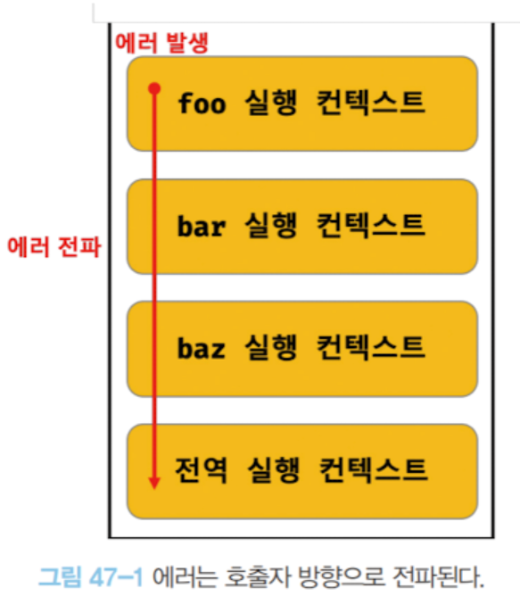

## 47장 에러처리

### try...catch...finally 문
1. 반환하는 값을 if 문이나 단축 평가 또는 옵셔널 체이닝 연산자를 통해 확인

- if 문
```js
const value = getValue(); // 어떤 함수에서 값을 반환 받음

if (value) {
    console.log("Value is truthy:", value);
} else {
    console.log("Value is falsy:", value);
}
```
- 단축 평가
```js
const value = getValue(); // 어떤 함수에서 값을 반환 받음

// value가 truthy인 경우에만 출력
value && console.log("Value is truthy:", value);

// value가 falsy인 경우 기본 값을 할당
const result = value || "Default value";
console.log(result);
```

- 옵셔널 체이닝
```js
const obj = getObject(); // 어떤 함수에서 객체를 반환 받음

// obj가 존재하고, obj.property가 존재하는 경우에만 접근
const value = obj?.property;
if (value) {
  console.log("Property exists and is truthy:", value);
} else {
  console.log("Property is falsy or does not exist.");
}

// 옵셔널 체이닝과 단축 평가를 함께 사용
const result = obj?.property || "Default value";
console.log(result);
```

2. try...catch...finally 문
```js
try {
} catch(err) {
} finally {
}
```

### Error 객체
Error 생성자 함수는 에러 객체를 생성한다. </br>
Error 생성자 함수에는 에러를 상세히 설명하는 에러 메시지를 인수로 전달할 수 있다.
```js
const error = new Error('invalid');
```

Error 생성자 함수가 생성한 에러 객체는 message 프로퍼티와 stack 프로퍼티를 갖는다.<br> 
message = Error 생성자 함수에 인수로 전달한 에러 메시지. <br>
stack =  에러를 발생시킨 콜스택의 호출 정보를 나타내는 문자열.<br>


### throw 문
```js
throw 표현식;
```

### 에러의 전파
에러는 호출자 방향으로 전파된다
