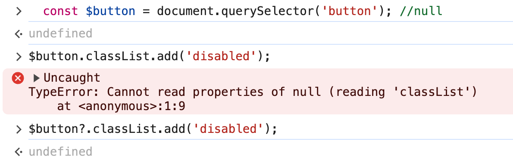
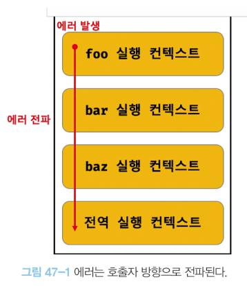

# `47.1` 에러 처리의 필요성

### `try...catch` 문

- `try...catch` 문을 사용해 발생한 에러에 적절하게 대응할 수 있다.

```javascript
console.log('[Start]');

try {
  foo();
} catch (error) {
  console.error('[에러 발생]', error);
  // [에러 발생] ReferenceError: foo is not defined
}

// 발생한 에러에 적절한 대응을 하면 프로그램이 강제 종료되지 않는다.
console.log('[End]');
```

### `DOM 요소`의 존재 여부 확인

- 직접적으로 에러를 발생하지 않는 예외(exception)적인 상황에 적절하게 대응하지 않으면 프로그램이 강제 종료될 수 있다.

```javascript
// button 요소가 존재하지 않아도 querySelector는 에러 없이 null을 반환.
const $button = document.querySelector('button'); //null

// ❌ $button이 null이므로 classList를 찾을 수 없어 TypeError 발생
$button.classList.add('disabled');

// ⭕️ Optional chaining을 사용하면 null, undefined 결과에 undefined를 반환
$button?.classList.add('disabled');
```



<br/>
<br/>

# `47.2` try...catch...finally 문

 <!-- 에러처리를 구현할 때 `querySelector`, `find` 메서드로 예외적인 상황에 발생하는 에러를 방지하는 방법이 있다. -->

### `try...catch...finally` 문은 `에러처리(error handling)`라고 한다.

- `try` 블록에서 에러가 발생하면 `catch` 블록으로 제어권이 이동하며 이 때 `err` 매개변수에 발생한 에러 객체가 전달된다.
- `finally` 블록은 에러 발생과 상관 없이 반드시 한 번 실행된다.

  ```javascript
  console.log('[Start]');

  try {
    // 실행할 코드
    // (에러가 발생할 가능성이 있는 코드)
    foo();
  } catch (err) {
    // try 코드 블록에서 에러가 발생하면 이 코드 블록의 코드가 실행된다.
    // err에는 try 코드 블록에서 발생한 Error 객체가 전달된다.
    console.error(err); // ReferenceError: foo is not defined
  } finally {
    // 에러 발생과 상관없이 반드시 한 번 실행된다.
    console.log('finally');
  }

  // try...catch...finally 문으로 에러를 처리하면 프로그램이 강제 종료되지 않는다.
  console.log('[End]');
  ```

<br/>
<br/>
<br/>

# `47.3` Error 객체

### `Error` 생성자 함수는 에러 객체를 생성하며 에러를 상세히 설명하는 에러 메시지가 포함되어 있다.

```javascript
const error = new Error('invalid');
```

<br/>

### 에러 객체는 `message` `stack` 프로퍼티를 갖는다.

- `message` 생성자 함수에 인수로 전달한 에러 메시지
- `stack` 에러를 발생시킨 콜스택의 호출 정보(디버깅 목적)

<br/>

### JS는 에러 객체를 생성하는 Error 생성자 함수를 7가지 제공. 이들은 `Error.prototype`을 상속받는다.

| 생성자 함수    | 인스턴스                                                                   |
| :------------- | :------------------------------------------------------------------------- |
| Error          | 일반적 에러 객체                                                           |
| SyntaxError    | JS 문법에 맞지 않아 발생하는 에러 객체                                     |
| ReferenceError | 참조할 수 없는 식별자를 참조할 때 발생하는 에러 객체                       |
| TypeError      | 데이터 타입이 유효하지 않을 때 발생하는 에러 객체                          |
| RangeError     | 숫자 값이 허용 범위를 벗어날 때 발생하는 에러 객체                         |
| URIError       | encodeURI, decodeURI 함수에 부적절한 인수를 전달했을 때 발생하는 에러 객체 |
| EvalError      | eval 함수에 부적절한 인수를 전달했을 때 발생하는 에러 객체                 |

```javascript
1 @ 1;    // SyntaxError: Invalid or unexpected token
foo();    // ReferenceError: foo is not defined
null.foo; // TypeError: Cannot read property 'foo' of null
new Array(-1); // RangeError: Invalid array length
decodeURIComponent('%'); // URIError: URI malformed
```

<br/>
<br/>
<br/>

# `47.4` throw 문

### 에러를 발생시키기 위해 `throw` 문으로 에러 객체를 던질 수 있다.

- Error 생성자 함수로 에러 객체를 생성한다고 에러가 방지되는 것은 아니기 때문.

```javascript
try {
  // 에러 객체를 던지면 catch 코드 블록이 실행되기 시작한다.
  throw new Error('something wrong');
} catch (error) {
  console.log(error);
}
```

<br>

### `throw` 문은 `try...catch` 문과 함께 사용한다.

```javascript
// 외부에서 전달받은 콜백 함수를 n번만큼 반복 호출한다
const repeat = (n, f) => {
  // 매개변수 f에 전달된 인수가 함수가 아니면 TypeError를 발생시킨다.
  if (typeof f !== 'function') throw new TypeError('f must be a function');

  for (var i = 0; i < n; i++) {
    f(i); // i를 전달하면서 f를 호출
  }
};

try {
  repeat(2, 1); // 두 번째 인수가 함수가 아니므로 TypeError가 발생(throw)한다.
} catch (err) {
  console.error(err); // TypeError: f must be a function
}
```

<br/>
<br/>
<br/>

# `47.5` 에러의 전파

- 에러는 콜 스택의 아래 방향(실행중인 컨택스트가 푸쉬되기 직전의 실행 컨텍스트 방향)으로 전파된다.
- `throw`된 에러는 호출자 방향으로 전파되므로 `catch`하여 처리하지 않으면 프로그램이 강제 종료된다.
- 비동기 함수인 `setTimeout`, `Promise` 후속처리 메서드의 콜백 함수는  
  이벤트 루프에 의해 콜 스택으로 푸시되어 실행되므로 에러를 전파할 호출자가 없으니 주의!

  ```javascript
  const foo = () => {
    throw Error('foo에서 발생한 에러'); // ④ throw한 에러는 호출자(baz)에게 전파된다.
  };

  const bar = () => {
    foo(); // ③ 함수 호출
  };

  const baz = () => {
    bar(); // ② 함수 호출
  };

  try {
    baz(); // ① 함수 호출
  } catch (err) {
    console.error(err);
  }
  ```

  
