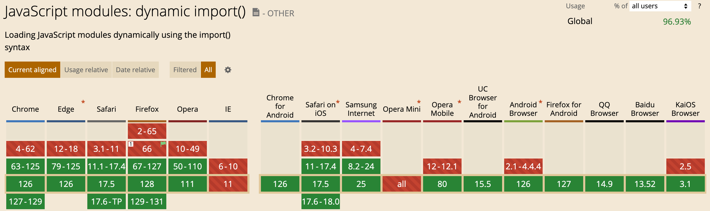

# `48.1` 모듈의 일반적 의미

### `module` 이란 애플리케이션을 구성하는 개별적 요소로서 재사용 가능한 코드 조각

- 모듈은 기능을 기준으로 파일단위로 분리한다.
- 모듈은 자신만의 파일 스코프(모듈 스코프)를 가질 수 있어야 한다.
- 모듈의 모든 자산은 캡슐화되어 애플리케이션과 분리되어 존재한다.
- 모듈은 코드의 단위를 명확히 분리하여 구성할 수 있어 개발 효율성과 유지보수성을 높인다.

<br/>

### `export`와 `import`

- 모듈은 재사용을 위해 명시적으로 선택적 공개가 가능하며 이를 `export`라고 한다.
- `export` 된 모듈을 재사용하는 모듈은 모듈 사용자(module consumer)가 되며 이를 `import`라고 한다.

  

<br/>
<br/>
<br/>

# `48.2` 자바스크립트와 모듈

- 모든 자바스크립트 파일을 분리하여 여러개의 script 태그로 로드해도 하나의 전역 스코프를 공유한다.
- 기존의 자바스크립트는 모듈 시스템을 지원하지 않아 [CommonJS](https://wiki.commonjs.org/wiki/CommonJS) 와 [AMD](https://github.com/amdjs/amdjs-api/wiki/amd) 를 구현한 모듈 로더 라이브러리를 사용해야 했다.
- 현재는 자바스크립트 런타임 환경인 Node.js에서 `CommonJS`와 `AMD`의 단점을 보완한 `ES6 모듈`을 지원하며 파일별로 독립적인 파일(모듈) 스코프를 가질 수 있게 되었다.

  <br/>
  <br/>
  <br/>

# `48.3` ES6 모듈(ESM)

### ES6 모듈 지원 현황

- IE를 제외한 대부분의 브라우저(Chrome61, Firefox60, Safari10.1, Edge16)이상에서 모듈을 지원한다.

  

<br/>

### ESM 사용법

- type="module"을 사용하여 외부 모듈을 로드한다.
- ESM의 확장자는 .msj를 사용할 것을 권장한다.
- `ESM`는 클래스와 마찬가지로 `strict mode`가 기본적으로 적용된다.

  ```html
  <script type="module" src="app.mjs"></script>
  ```

## `48.3.1` 모듈 스코프

### 2개의 자바스크립트 파일은 하나의 전역을 공유한다.

```html
<!DOCTYPE html>
<html>
  <!-- 전역 scope를 공유하므로 중복 선언된 변수가 있다면 값이 의도치 않게 갱신된다. -->
  <body>
    <script src="foo.js"></script>
    <script src="bar.js"></script>
  </body>
</html>
```

- foo.js

  ```javascript
  // x 변수는 전역 변수다.
  var x = 'foo';
  console.log(window.x); // foo
  ```

- bar.js

  ```javascript
  // x 변수는 전역 변수다. foo.js에서 선언한 전역 변수 x와 중복된 선언이다.
  var x = 'bar';

  // foo.js에서 선언한 전역 변수 x의 값이 재할당되었다.
  console.log(window.x); // bar
  ```

<br/>

### ESM은 독자적인 모듈 스코프를 가진다.

```html
<!-- 모듈 내에서 선언한 식별자는 scope가 다르기 때문에 외부에서 참조할 수 없다. -->
<!DOCTYPE html>
<html>
  <body>
    <script type="module" src="foo.mjs"></script>
    <script type="module" src="bar.mjs"></script>
  </body>
</html>
```

- foo.mjs

  ```javascript
  const x = 'foo';
  console.log(x); // foo
  ```

- bar.mjs

  ```javascript
  console.log(x); // ReferenceError: x is not defined
  ```

<br/>
<br/>
<br/>

## `48.3.2` export 키워드

### 특정 요소를 선택적으로 export

```javascript
// 변수 export
export const pi = Math.PI;

// 함수 export
export function square(x) {
  return x * x;
}

// 클래스 export
export class Person {
  constructor(name) {
    this.name = name;
  }
}
```

<br/>

### 하나의 객체로 구성하여 한번에 export

```javascript
const pi = Math.PI;

function square(x) {
  return x * x;
}

class Person {
  constructor(name) {
    this.name = name;
  }
}

// 변수, 함수 클래스를 하나의 객체로 구성하여 공개
export { pi, square, Person };
```

<br/>
<br/>
<br/>

## `48.3.3` import 키워드

### import 문으로 의존성 모듈 로드.

```javascript
// 1. 같은 폴더 내의 lib.mjs 모듈이 export한 식별자 이름으로 import
import { pi, square, Person } from './lib.mjs';

// 2. lib.mjs 모듈이 export한 모든 식별자를 lib 객체의 프로퍼티로 모아 import
import * as lib from './lib.mjs';

// 3. lib.mjs 모듈이 export한 식별자 이름을 변경하여 import
import { pi as PI, square as sq, Person as P } from './lib.mjs';

console.log(pi); // 3.141592653589793
console.log(square(10)); // 100
console.log(new Person('Lee')); // Person { name: 'Lee' }
```

<br/>

### 애플리케이션의 진입점에서는 script태그로 로드.

```html
<!DOCTYPE html>
<html>
  <body>
    <script type="module" src="app.mjs"></script>
  </body>
</html>
```

<br/>

### `default` 키워드를 사용하여 하나의 값만 export

- export

  ```javascript
  // default를 사용한 export
  export default x => x * x;

  // default와 함께 var, let, const 키워드 사용 불가
  export default const foo = () => {}; // => SyntaxError: Unexpected token 'const'
  ```

- import

  ```javascript
  import square from './lib.mjs';

  console.log(square(3)); // 9
  ```
