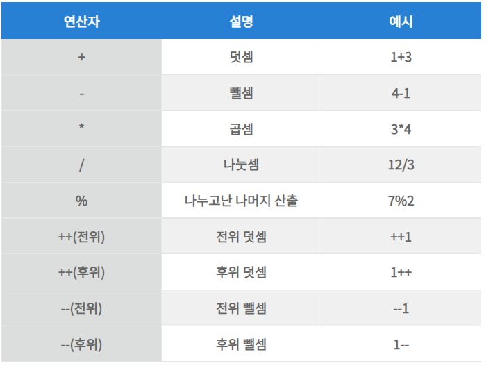

# 연산자

## 개요

### 연산자의 종류

#### 산술연산자
- 2개의 피연산자를 산술 연산하여 숫자 값 생성
- 
#### 할당연산자
- 피연산자의 평가 결과를 좌항에 있는 변수에 할당
  
#### 비교연산자
- 좌항 우항 비교후 결과를 불리언값 반환
-  
- 동등 비교 연산자는 암묵적인 타입 반환으로 타입을 일치시킨다 
  - 고로 사용을 지양하며 일치비교 연산자를 사용해야한다.
#### 삼항조건연산자
- 조건식의 평가 결과에 따라 반환 값 결정
- a ? true : false
#### 논리연산자
- 피연산자 논리 연산
- || : or , && : and , ! : not
#### 쉼표연산자
- 왼쪽 피연산자부터 차례대로 피연산자 평가
- 평가 종료시 평가 마지막 평가 결과 반환
```javascript
var x = 1 , y = 2 , z = 3; //undefined
x = 1 , y = 2 , z = 3; //3
```
#### 그룹연산자
- 피연산자를 감싸 가장높은 연산자 우선순위로 지정
#### type of 연산자
- 피연산자의 데이터 타입을 문자열로 반환
- null 값 연산시 object로 반환되는 버그가 존재하여 일치연산자를 사용해야함
#### 지수 연산자
- 좌항의 피연산자를 밑으로 , 우항의 피연산자를 지수로 거듭제곱한다.
```javascript
2 ** 2 // 4
2 ** 0 // 1
```
- 음수 사용시 괄호 사용
```javascript
(- 2) ** 2 // 4

```

### 연산자 우선순위
#### 우선순위
- 여러개의 연산자로 이뤄진 문이 실행될때 연산자가 실행되는 순서 
  


#### 결합순서
- 연산자의 어느쪽부터 평가를 수행할 것인지를 나타내는 순서
- 여러 연산자의 우선순위가 같은 경우 결합성을 고려한다.


#### 정리

```javascript
function echo(name, num) {
    console.log(name + " 항 평가함");
    return num;
}
console.log(echo("첫째", 2) ** echo("둘째", 3));
console.log((echo("첫째", 2) ** echo("둘째", 3)) ** echo("셋째", 2));
```


1. 단항과 대입제외 모든 진행방향은 왼쪽에서 오른쪽
2. 산술 > 비교 > 논리 > 대입 순서로 수행된다.
3. 단항 > 이항 > 삼항 순서로 우선순위가 진행된다.


#### reference
1. https://mgyo.tistory.com/227
2. https://developer.mozilla.org/ko/docs/Web/JavaScript/Reference/Operators/Operator_precedence
3. https://developer.mozilla.org/ko/docs/Web/JavaScript/Guide/Expressions_and_operators
4. https://velog.io/@bami/Javascript-%EC%82%B0%EC%88%A0-%EC%97%B0%EC%82%B0%EC%9E%90
5. https://jenny-daru.tistory.com/8